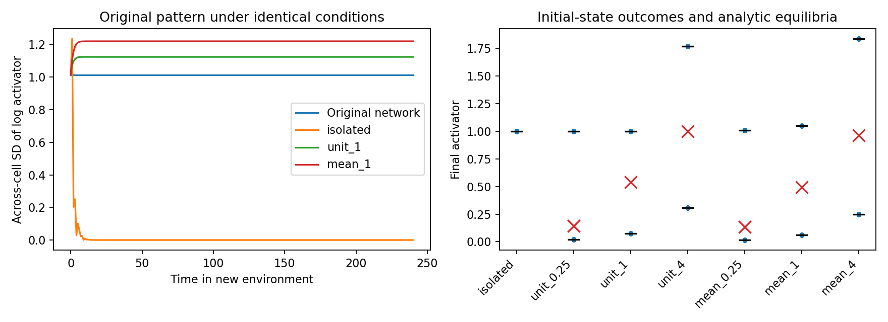

# Chemical persistence in a common environment

This assay separates autonomous chemical persistence from memory supported by the environment. It removes cell-specific transport contexts and asks whether different initial chemical states remain different under identical equations and external conditions. It tests chemical states only, not the complete shape/polarity attribute vector.

## Design

Initial states come from the original stationary no-feedback pattern and the final states of all 120 pair exchanges and twenty seeded uniform resets. Each contributes sixteen cells, giving 2256 chemical initial states. Repeated states are retained for traceability; these are not independent developmental or biological replicates.

Every cell evolves independently under the same equations. The **isolation** arm retains reactions but removes all chemical transport. Six **common-reservoir** arms expose all cells to the same fixed external activator and inhibitor levels. Reservoir levels are either the homogeneous reference (1,1) or the volume-weighted mean of the original pattern. Each reservoir is tested at exchange strengths 0.25, 1, and 4 times a reference transport rate.

A continuation of the original pattern on its original graph is a positive control. All assay arms hold geometry fixed, with no polarity, mechanical, division, or fate dynamics.

## Equations and their interpretation

For an isolated cell,

$$
\dot a=a^2/b-a,\qquad \dot b=\beta(a^2-b).
$$

For a cell exchanging chemicals with an infinite, fixed reservoir,

$$
\dot a=a^2/b-a+k_a(A-a),
\qquad
\dot b=\beta(a^2-b)+k_b(B-b).
$$

Here $A,B$ are reservoir concentrations, $\beta=2$, and $k_a,k_b$ are exchange rates. The reference rate is the median transport exit rate of the original graph, $r=\operatorname{median}_i[-(\Delta_V)_{ii}]$. At strength $s$,

$$
k_a=sD_ar,\qquad k_b=sD_br,
$$

where $D_a=0.02$ and $D_b=0.4$. This keeps the original relative exchange speeds while removing differences among cells. The median is a reference scale, not a derived replacement for the original heterogeneous network.

The reservoir can supply or remove chemicals, so the cell population is an open system and does not conserve chemical amounts under reservoir exchange. Cells do not change the reservoir or signal to one another. The isolation arm has $k_a=k_b=0$; chemical reactions still create and consume material.

Identical surroundings need not imply a single stable chemical state. Reservoir exchange changes the effective kinetics and may create bistability. This is why both isolation and shared-reservoir arms are necessary.

## Analytical and numerical checks

At a positive steady state,

$$
b=\frac{\beta a^2+k_bB}{\beta+k_b}.
$$

Substitution into the activator equation gives

$$
-\beta(1+k_a)a^3+
(\beta k_aA+\beta+k_b)a^2-
k_bB(1+k_a)a+k_aAk_bB=0.
$$

Only positive real roots are retained. Each root is checked for local stability using

$$
J=\begin{pmatrix}
2a/b-1-k_a & -a^2/b^2\\
2\beta a & -\beta-k_b
\end{pmatrix}.
$$

A negative largest real eigenvalue implies local asymptotic stability. With no exchange, the only positive equilibrium is $(a,b)=(1,1)$; zero is excluded because the original kinetics are singular at $b=0$. This equilibrium calculation alone is not a proof that every positive initial condition converges.

Each initial condition is integrated through t=240, sampled every unit. DOP853 runs at relative/absolute tolerances 1e-8/1e-10 and again at 1e-11/1e-13. The maximum absolute log difference between corresponding concentrations must remain below 1e-5. Results use the tighter solution. Endpoint maximum derivative must be below 1e-6, and every endpoint must lie within log RMS distance 1e-5 of an analytically identified stable equilibrium. Change during t=200–240 is also reported.

The criteria, inputs, configuration, and source hashes are saved before execution. Analytic equilibria are used as dynamical diagnostics, not supplied cell labels. Counts near equilibria describe attraction basins among these particular initial states, not frequencies of cell types in development.

## Results

All 2256 tested initial chemical states converge to the same positive equilibrium in isolation. Their maximum endpoint log distance from (1,1) is below 9.9e-12. The original network control retains its patterned state, with log-activator SD 1.01453.

Under each tested common-reservoir condition, the equilibrium polynomial instead has **two positive locally stable roots separated by an unstable root**. Both stable states are reached from the supplied initial conditions:

| Reservoir | Relative exchange strength | Stable activator values | Initial states reaching the lower / upper equilibrium |
|---|---:|---|---:|
| Unit (1,1) | 0.25 | 0.01851, 1.00000 | 626 / 1630 |
| Unit (1,1) | 1 | 0.07458, 1.00000 | 626 / 1630 |
| Unit (1,1) | 4 | 0.30775, 1.76925 | 1096 / 1160 |
| Original volume-weighted mean | 0.25 | 0.01567, 1.00836 | 626 / 1630 |
| Original volume-weighted mean | 1 | 0.06269, 1.04890 | 626 / 1630 |
| Original volume-weighted mean | 4 | 0.24873, 1.83732 | 1086 / 1170 |

The mean reservoir concentrations are approximately (0.85905, 0.93958). The median graph exit rate is approximately 3.27684. These counts include repeated states from one developmental history and must not be interpreted as independent replicate frequencies.



The two-state outcomes were not supplied as fate labels or by a separate bistable fate equation. They arise from the activator–inhibitor reaction equations combined with reservoir exchange. Their number and locations were found by solving the steady-state polynomial. The reservoir is nevertheless a prescribed, sustained environmental input.

### Accuracy assessment

Six of seven arms pass the original trajectory-refinement check. Unit reservoir at strength 4 initially has maximum log error 1.136e-5, narrowly above the unchanged 1e-5 threshold; this failure remains recorded in `results.json`.

The follow-up `embryo/attribute_common_verification.py` compares the reported tight trajectories with a further DOP853 refinement at relative/absolute tolerances 1e-13/1e-15 for every initial state and condition. It also checks the most refinement-sensitive initial state in each condition independently with Radau at 1e-11/1e-13. All follow-up checks pass:

- Maximum further-refinement discrepancy across all arms: 1.07e-8.
- Maximum discrepancy from the selected independent Radau references: 4.40e-9.
- All assignments to the analytically stable equilibria remain unchanged.

The reported tight solutions are therefore supported without relaxing the original threshold. Independent Radau checks cover one selected initial state per arm, not all 2256 states. Every arm also meets the endpoint derivative and equilibrium-distance checks. Very small endpoint differences are numerical agreement, not physically meaningful precision.

## Interpretation and next experiment

**The tested chemical states have no autonomous persistence in isolation, but they can remain distinct under identical sustained surroundings.** Thus the earlier network pattern is not simply an assembly of independently bistable isolated cells. Nor does a common environment inevitably erase differences: chemical history selects among multiple stable states when reservoir exchange changes the effective reactions.

This is evidence for environment-supported chemical memory within this model. It remains narrower than emergent biological cell identity: there is no gene-regulatory memory, inheritance test, or demonstrated persistence of the full shape/polarity phenotype. Failure of autonomous persistence is not a general requirement that biological identities must survive removal from their tissue environment.

The [completed finite-reservoir test](attribute_finite_reservoir.md) lets the shared composition respond to cells with amount-conservative exchange. It supports sustained chemical differences, and at strong exchange formation from small perturbations, without clamping the reservoir. Release outcomes remain dependent on initial conditions and reservoir size. Moving-geometry recovery and independent developmental seeds remain necessary after this chemical test.

## Reproduce

```bash
OPENBLAS_NUM_THREADS=1 OMP_NUM_THREADS=1 python -m embryo.attribute_common_environment \
  --source outputs/attribute-exchange \
  --development outputs/attribute-development \
  --output outputs/attribute-common-environment-repeat
```

The runner refuses to overwrite an existing output directory. It saves `protocol.json`, `results.json`, sampled `trajectories.npz`, and `common-environment.png`. Tests check independent-cell dynamics, the isolated equilibrium, and analytical reservoir equilibria including an example with two stable roots and one unstable root.

Run the additional numerical verification with:

```bash
OPENBLAS_NUM_THREADS=1 OMP_NUM_THREADS=1 python -m embryo.attribute_common_verification \
  --output outputs/attribute-common-environment
```

The additional checks are saved separately in `verification.json`; the original failed coarse-to-tight comparison is preserved.
