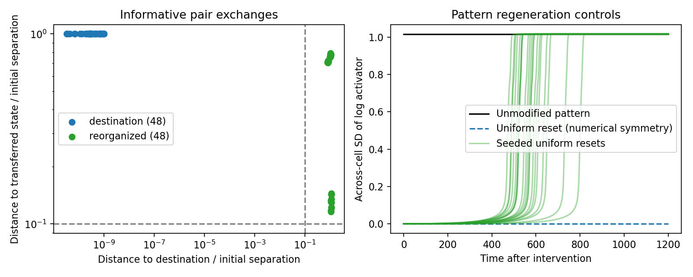

# Chemical-state exchange between geometric contexts

This experiment tests whether the patterned chemical state returns to the original destination-cell values after a chemical-state exchange, stays near the transferred values, or reorganizes. It operates on the no-feedback branch's fixed final geometry. The direct-feedback branch is excluded because its frozen-context continuation became chemically uniform, leaving no appreciable state contrast to exchange.

## Intervention and controls

The starting state is the end of the previous 120-unit chemical continuation, following development to t=90. It is close to a stationary patterned state. All 120 unordered pairs of the sixteen cells are tested independently, starting from that same state. Geometry, transport conductances, cell volumes, cell IDs, and all other cells' initial activities remain unchanged. Both activator and inhibitor states are exchanged together.

For either chemical species, a pair with concentrations $x_i,x_j$ and measured volumes $V_i,V_j$ is exchanged using

$$
s=\frac{V_ix_i+V_jx_j}{V_ix_j+V_jx_i},
\qquad x'_i=sx_j,\qquad x'_j=sx_i.
$$

The correction $s$ preserves the pair's molecular amount. It is positive, equals one for equal volumes, and is calculated separately for activator and inhibitor. Applying this exchange twice restores the original concentrations. It is a conservative chemical-state transplant, not a literal physical relocation of whole cells: shape, polarity, and lineage stay at their original locations. Unequal volumes mean the concentrations cannot both be exchanged exactly and conserve total amount; the rescaled transferred state is the explicit comparison target.

Each intervention is followed for 1200 time units under the same Gierer–Meinhardt reactions and fixed conservative transport as the recovery assay. The controls are:

- Unmodified continuation of the patterned state.
- Uniform reset to each species' volume-weighted mean, preserving its total amount.
- Twenty such uniform resets with small positive, amount-preserving perturbations of log-noise scale 0.001.

An exactly uniform state cannot spontaneously break mathematical symmetry on a constant-preserving graph without perturbations. The nominally uniform numerical control may contain roundoff disturbances; it is not a test of noise-free spontaneous pattern initiation. The seeded resets ask whether the graph and reactions select the same pattern from another initial condition.

## Context and outcome definitions

Each cell's context vector consists of its exposed surface fraction, transport exit rate $-(\Delta_V)_{ii}$, and measured volume. Each feature is standardized across the sixteen cells. A pair is designated as having contrasting context if its Euclidean context distance is at least the median over all pairs. This descriptive subset is specified before evolution; all pairs are retained. It does not isolate exposure, volume, or contact structure as individual causal factors.

The chemical distance is the volume-weighted log RMS from the preceding recovery assay, restricted to the two exchanged cells. Pair restriction prevents fourteen unchanged cells from masking a failed exchange. The initial distance between the exchanged state and the original pair must exceed 0.1 for an informative trial.

Two time-matched reference trajectories are used: the unmodified destination values, and the conservatively exchanged values of that same unmodified trajectory. Distances to these references are divided by the initial pair separation. Outcomes use the maximum sampled ratio over t=1000–1200:

- **Destination:** distance to original destination values is below 0.1.
- **Transferred:** distance to transferred values is below 0.1.
- **Reorganized:** neither criterion holds at an approximately stationary final state.
- **Unsettled:** the final maximum absolute chemical derivative is at least 1e-6.
- **Uninformative:** initial chemical contrast is at most 0.1.

These are perturbation outcomes, not inferred cell types. The full-embryo distance is also saved to detect changes outside the exchanged pair. Pairwise return alone does not prove that the whole pattern has returned.

Every trajectory is integrated with DOP853 at relative/absolute tolerances 1e-8/1e-10 and again at 1e-11/1e-13. Maximum trajectory discrepancy must remain below 1e-5 in full-embryo log RMS. Results use the tighter trajectory. This checks solver tolerance sensitivity, not mesh convergence or an independent integration method. Sampling is every two time units; the protocol, source/input hashes, and thresholds are saved before evolution.

## Results

| Outcome | All 120 pairs | 60 pairs with contrasting contexts |
|---|---:|---:|
| Return to destination values | 48 | 30 |
| Retain transferred values within the declared tolerance | 0 | 0 |
| Reorganize into another stationary pattern | 48 | 30 |
| Unsettled | 0 | 0 |
| Insufficient initial chemical contrast | 24 | 0 |

The maximum solver-refinement discrepancy is 2.71e-6, below the 1e-5 limit. Every exchanged trajectory has a final maximum chemical derivative below 5.39e-11. The unmodified pattern drifts by only 1.91e-7 in log RMS. The mass-preserving exchange correction factors range from 0.99826 to 1.01363.

For the 48 destination-return outcomes, the entire pattern also returns: final whole-embryo distances from the control are below 7.88e-12. These precise tiny distances are below the solver error scale; the conclusion is numerical agreement, not twelve-digit biological accuracy. For the 48 reorganized outcomes, whole-pattern distances remain substantial, ranging from 0.456 to 0.937.



None of the informative exchanges retains its transferred concentrations within the declared 10% distance criterion. This **does not mean chemical history is erased**. A post-run diagnostic finds that all 48 reorganized pairs reverse their activator ordering relative to the original pair and are closer to the transferred reference than the destination reference. They preserve an aspect of the intervention while changing the actual concentrations and the larger pattern. Ordering is a continuous comparison, not a new high/low identity classification.

The nominally uniform reset remains effectively uniform (final log-activator SD 1.70e-10), as expected without an appreciable symmetry-breaking seed over this horizon. All twenty seeded uniform resets regenerate strong heterogeneity: final log-activator SD ranges from 1.01453 to 1.01636. Seven return within 1e-5 of the original pattern; thirteen reach different patterns. Similar dispersion therefore does not imply the same arrangement of chemical states.

A further post-run analysis of the full chemical Jacobian at all 120 exchange endpoints and twenty seeded-reset endpoints finds negative largest real eigenvalues, ranging from −0.61305 to −0.01789. Combined with the small residual derivatives, this supports multiple locally stable chemical patterns on this particular fixed graph. It does not count every possible attractor, establish global stability, or test structural robustness to changing the graph. The reproducible post-run diagnostics are implemented in `embryo/attribute_exchange_assessment.py` and saved in `assessment.json`; they were not predeclared classification criteria.

## Interpretation and next test

**Both the contact environment and chemical history matter.** Some transferred differences disappear and the original pattern returns; other exchanges redirect the network into a different stable pattern. The same geometry can support multiple arrangements, so it does not uniquely specify each cell's state. Conversely, a chemical state is not simply carried unchanged into a new context.

These results support history-dependent organization of the coupled chemical network. They do not yet show cell-intrinsic identity: only two chemical variables were transplanted, the surrounding network continued interacting, and cell shape, polarity, and lineage were not moved. The 120 exchanges share one developed embryo and are interventions, not independent developmental replicates. The arbitrary live contact-geometry approximation and unresolved developmental refinement issues remain limitations.

The [completed common-environment test](attribute_common_environment.md) finds that all tested isolated states converge to one equilibrium, whereas identical sustained reservoirs can support two stable states. It distinguishes autonomous persistence from environment-supported chemical memory. A subsequent moving-geometry exchange should then assess the complete attribute vector. Additional developmental seeds are needed before estimating how often these outcomes arise.

## Reproduce

```bash
OPENBLAS_NUM_THREADS=1 OMP_NUM_THREADS=1 python -m embryo.attribute_exchange \
  --source outputs/attribute-persistence \
  --development outputs/attribute-development \
  --output outputs/attribute-exchange-repeat
```

The runner refuses to overwrite an existing output directory. `protocol.json` records the design; `results.json` contains every pair and reset outcome; `trajectories.npz` retains complete sampled trajectories, cell IDs, context features, operator, and volumes. The exchange tests verify positivity, amount conservation, unchanged nonparticipants, reversibility, and the equal-volume limit. Classification tests require both contrast and stationarity before assigning an outcome.

Recompute the post-run ordering and local-stability diagnostics with:

```bash
python -m embryo.attribute_exchange_assessment --output outputs/attribute-exchange
```
