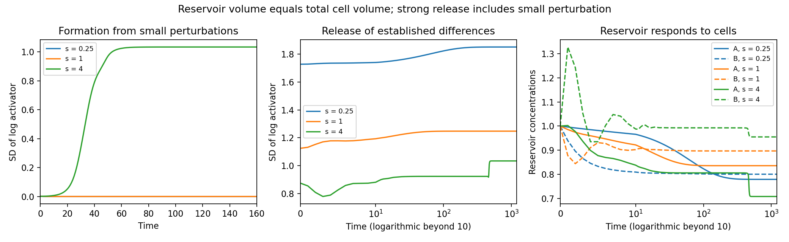

# A finite reservoir that evolves with the cells

This experiment removes the externally fixed chemical concentrations of the common-environment assay. All sixteen cells exchange activator and inhibitor with one well-mixed reservoir of finite volume. The reservoir responds to their uptake and release, without external replenishment or chemical reactions of its own.

The experiment asks two separate questions: do already differentiated chemical states persist after the reservoir is released, and can small differences grow into a sustained pattern when cells and reservoir start near the homogeneous state?

**Methodological scope:** this is a separate chemical-compartment assay with fixed cell volumes, no direct cell-contact transport, and no evolving geometry. The reservoir is globally well mixed. It is not part of the live phase-field embryo or the resident GPU state. See [the current moving identity assays](cell_response_moving.md) for experiments with local contact transport and mechanics.

## Equations and amount balance

For cell $i$ of fixed measured volume $V_i$,

$$
\dot a_i=\frac{a_i^2}{b_i}-a_i+k_a(A-a_i),
\qquad
\dot b_i=\beta(a_i^2-b_i)+k_b(B-b_i).
$$

Here $a_i,b_i$ are intracellular activities and $A,B$ are the reservoir activities. The reservoir volume is $V_R$, and its equations are

$$
V_R\dot A=\sum_iV_i k_a(a_i-A),
\qquad
V_R\dot B=\sum_iV_i k_b(b_i-B).
$$

The opposite exchange terms ensure that transport conserves each species' total amount across cells and reservoir. In particular,

$$
\frac{d}{dt}\left(\sum_iV_i a_i+V_RA\right)
=\sum_iV_i\left(\frac{a_i^2}{b_i}-a_i\right),
$$

and analogously for inhibitor with reaction term $\beta(a_i^2-b_i)$. Total chemical amounts need not remain constant because the intracellular reactions create and consume chemicals. This is closed to *external exchange*, not a thermodynamically closed biochemical model: the phenomenological reaction sources do not track nutrients or energy.

Exchange coefficients are identical for all cells. They use the previous common-environment scale,

$$
k_a=sD_ar,\qquad k_b=sD_br,
$$

where $D_a=0.02$, $D_b=0.4$, $\beta=2$, and $r$ is the median exit rate of the original conservative cell-contact operator (approximately 3.27684). The original graph determines this reference rate and the starting states only. There is no direct cell-to-cell transport in this assay. A shared reservoir provides global chemical coupling, so this is not a test of spatial pattern wavelength or realistic extracellular diffusion.

## Conditions and controls

Reservoir volume relative to total cell volume is 0.1, 1, 10, or 100. Exchange strength $s$ is 0.25, 1, or 4.

- **Release:** start from the sixteen original cells' endpoints under each of the two previously clamped reservoir compositions and three exchange strengths. Set the finite reservoir to that former composition, then let it evolve. This gives 24 conditions.
- **Formation:** start all activities at one, add independent small positive cell perturbations with log-noise scale 0.001, and rescale each species to preserve its initial total cell amount. The reservoir starts at one. Five perturbation seeds per volume/strength pair give 60 trials.
- **Uniform controls:** twelve exactly homogeneous starts, one per volume/strength pair. These assess symmetry preservation over the numerical horizon; roundoff can eventually seed unstable modes.
- **Clamped controls:** six continuations of the former fixed-reservoir equilibria, verifying that the original states remain supported when concentrations stay fixed.
- **Isolated control:** the original patterned cells with no exchange, checking loss of chemical contrast under the isolated reaction equations.

The sixteen measured cell volumes are retained. These are perturbations and chemical interventions based on one developed embryo, not independent developmental replicates. Geometry, cell division, shape, polarity, and fate dynamics remain absent.

## Duration and acceptance checks

Let $R=V_R/\sum_iV_i$. Each finite-reservoir condition runs for

$$
T=\max(1200,20R/k_a).
$$

Thus a large reservoir is observed for at least twenty nominal slow-species reservoir exchange times. This avoids treating slow depletion of a large reservoir as indefinite persistence. This timescale is a design heuristic; final derivatives are checked separately because reaction–exchange dynamics can have slower collective modes.

Trajectories are sampled densely through the first 240 units and across the full horizon. Sustained chemical variation requires across-cell log-activator SD above 0.1 throughout the final fifth of the trajectory. Approximate stationarity requires maximum absolute derivative below 1e-6. The full coupled cell–reservoir Jacobian is evaluated at the endpoint to distinguish locally stable stationary states from transient or unstable ones. Neutral reservoir coordinates in clamped and isolated controls should not be interpreted as unstable chemistry.

Radau integrates each trajectory twice, at relative/absolute tolerances 1e-8/1e-10 and 1e-10/1e-12. Maximum sampled absolute log difference must be below 1e-5. The algebraic total-amount balance residual must be below 1e-10. Positive, finite output is required. Results retain these separate tests rather than equating numerical agreement with scientific persistence.

Tests compare reaction-free exchange with exact matrix-exponential evolution, verify conservation with unequal compartment volumes, check the analytic Jacobian by finite differences, verify the full reaction amount budget, and test both the homogeneous equilibrium and the large-reservoir limit.

## Why a finite reservoir can still amplify differences

At the homogeneous equilibrium all cell and reservoir activities equal one. Consider cell perturbations with volume-weighted mean zero for each species. They do not initially perturb the reservoir, and identical exchange coefficients preserve this contrast subspace in the linearized dynamics. Their growth is governed by

$$
J_{\mathrm{contrast}}=
\begin{pmatrix}
1-k_a & -1\\
2\beta & -\beta-k_b
\end{pmatrix}.
$$

Its largest real eigenvalue is −0.67203, −0.47720, and +0.20046 at exchange strengths 0.25, 1, and 4, respectively. These contrast-mode rates are independent of reservoir volume. Reservoir size still changes collective relaxation, nonlinear transients, and possibly the final arrangement. This calculation explains why the strong-exchange condition can amplify small differences even though the reservoir responds dynamically. It is a reaction–exchange instability in a globally coupled compartment system, not evidence of a resolved spatial wavelength.

## Results

**A finite, evolving reservoir can support stable chemical differences without externally clamped concentrations.** Maintenance and formation have different requirements in this test:

| Exchange strength | Stable patterned releases at reservoir ratios 0.1, 1, 10, 100 | Formation from small perturbations |
|---|---|---|
| 0.25 | 8/8 original release conditions | 0/20; returns to homogeneous chemistry |
| 1 | 8/8 original release conditions | 0/20; returns to homogeneous chemistry |
| 4 | Original unperturbed releases require qualification; see below | 20/20; stable patterned endpoints |

Each release count includes two initial reservoir compositions per size. At strengths 0.25 and 1, the released reservoir adapts to the cells and the system approaches a stable patterned state. Late log-activator SD is approximately 1.8511 and 1.2472, respectively. Reservoir concentrations approach approximately (0.77935, 0.80072) and (0.83595, 0.89708). Within each tested strength, both release compositions reach essentially the same endpoint for all four reservoir sizes; the larger reservoirs relax more slowly.

At strength 4, all five near-uniform perturbation seeds at every reservoir size produce stable patterns. Independent checks give late minimum log-activator SD between 0.98266 and 1.10216. Each endpoint has a small residual derivative and a negative largest real eigenvalue of the full coupled Jacobian. The weak and intermediate regimes show coexistence of stable uniform and patterned states, while the strong regime destabilizes uniform cell-to-cell contrast.

All twelve exactly uniform controls remain uniform in the computed trajectories. This does not imply their stability: at strength 4 the homogeneous state has a positive contrast growth rate. Small nonzero perturbations are required to probe that instability.



### Strong-release caveat and follow-up

The six original strength-4 releases at reservoir ratios 0.1, 1, and 10 appear stationary but have a positive largest Jacobian eigenvalue, approximately +0.01322. They are not accepted as stable patterns. Precisely matched concentrations can remain on an unstable symmetric trajectory, and implicit numerical integration can also obscure slow instability.

The two original strength-4 releases at reservoir ratio 100 do not settle by the endpoint. The unit-composition release additionally fails the original trajectory-refinement check (maximum log error 0.00290, above 1e-5). The mean-composition release passes the numerical check but loses contrast and remains nonstationary. These original exceptions remain in `results.json`.

The follow-up adds amount-preserving cell perturbations of log-noise scale 1e-4, seed 7, to all eight strength-4 release starts. Reservoir concentrations are unchanged. DOP853 and Radau independently integrate these interventions with relative/absolute tolerances 1e-10/1e-12 and maximum step two. **Seven of eight settle into stable patterned states.** The mean-composition release into the largest reservoir loses contrast and is still evolving at the endpoint (maximum derivative approximately 0.00652). No claim about its infinite-time outcome is made.

The follow-up also checks all twenty original strength-4 formation trials independently with DOP853 against the stored Radau trajectories. All 28 comparisons pass the unchanged 1e-5 error threshold; maximum log discrepancy is 2.90e-7. Thus the successful formation result does not depend on accepting the problematic unperturbed releases.

### Numerical accounting

The initial study contains 103 trajectories: 24 releases, 60 perturbed formation trials, twelve uniform controls, six clamped controls, and one isolated control. Of these, 102 pass the initial numerical agreement check; the exception is retained above. The maximum algebraic combined-amount budget residual is 7.11e-15. This measures implementation of the exchange/reaction budget, not conservation of the reaction-driven total amounts.

The six clamped controls retain their supported chemical differences, while the isolated control loses them. Finite-reservoir durations range from 1200 to approximately 122069 model time units; a long horizon alone is not evidence of convergence, hence the derivative and coupled-Jacobian checks. Sixteen relevant unit/regression tests pass. No mesh refinement or independent developmental-seed study is performed here.

## What this establishes

The modeled activator–inhibitor feedback can sustain distinct chemical states through reciprocal exchange with a finite shared environment. At sufficient exchange strength it can also generate differences from small perturbations. This goes beyond persistence maintained by externally fixed reservoir concentrations.

It remains a globally coupled chemical-compartment model with assumed reaction sources. It does not demonstrate autonomous isolated-cell memory, nutrient/energy self-sufficiency, a spatial tissue pattern, inherited cell identity, or shape symmetry breaking. The transient reservoir composition and chemical history still affect the outcome; one tested release does not sustain differences despite using the same exchange strength that supports formation from other starts.

For this reservoir branch, a remaining test is robustness across cell number and compartment size while holding physical volume and exchange conductance conventions fixed. The current spatial research sequence instead tests moving exchange/response across developmental histories; it does not yet couple the reservoir to the embryo. A spatial environmental extension would require an explicitly resolved extracellular field or justified local extracellular compartments, followed by mechanical feedback and convergence checks. Simply attaching a global reservoir to the 3D simulation would not validate spatial signaling.

## Reproduce

```bash
OPENBLAS_NUM_THREADS=1 OMP_NUM_THREADS=1 python -m embryo.attribute_finite_reservoir \
  --output outputs/attribute-finite-reservoir-repeat
```

The runner requires the completed common-environment and exchange outputs, refuses to overwrite an existing output directory, and records its design and source/input hashes before evolution. It saves a trajectory for every condition, `results.json`, and an incremental `status.json`.


Reproduce the independent formation checks, perturbed releases, and figure with:

```bash
OPENBLAS_NUM_THREADS=1 OMP_NUM_THREADS=1 python -m embryo.attribute_finite_verification \
  --output outputs/attribute-finite-reservoir
python -m embryo.attribute_finite_summary --output outputs/attribute-finite-reservoir
```

Follow-up trajectories have the prefix `verified_`; `verification.json` and `summary.json` preserve their separate outcomes. The original results are not overwritten by the follow-up.
