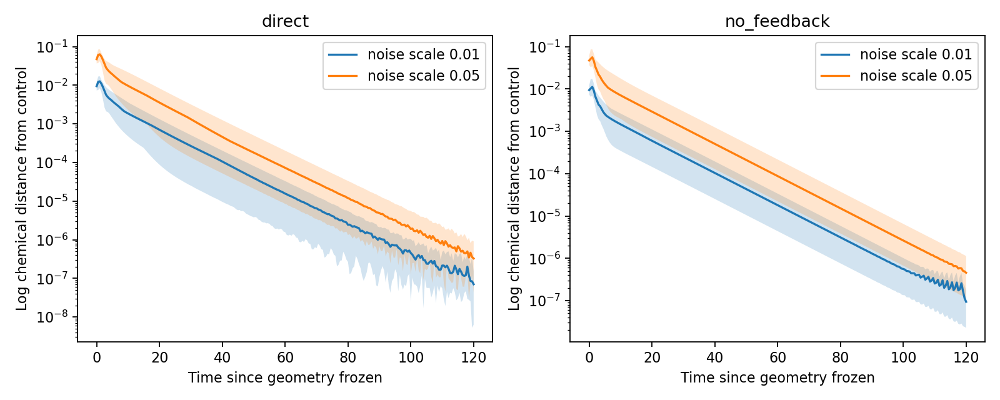

# Chemical persistence after development

The first recovery assay finds a stable chemical pattern on the no-feedback branch's final geometry. On the direct-feedback branch's geometry, chemical variation decays toward the uniform state. Recovery from perturbations alone is therefore insufficient evidence of differentiated identities: a uniform state also recovers.

## Protocol

`embryo/attribute_persistence.py` restores both completed attribute-development checkpoints at t=90. It freezes measured cell volumes, contacts, and the resulting conservative transport operator. Chemical reactions and transport continue for another 120 time units. Mechanics, polarity, division, and geometry do not evolve; no fate variable is integrated.

The unchanged chemical equations are

$$
\dot a_i = a_i^2/b_i-a_i+D_a(\Delta_Va)_i,
\qquad
\dot b_i = \beta(a_i^2-b_i)+D_b(\Delta_Vb)_i.
$$

Here $a_i$ and $b_i$ are continuous activities, $\beta=2$, $D_a=0.02$, and $D_b=0.4$. The fixed operator $\Delta_V=-M^{-1}K$ exchanges material between contacting cells; $M$ contains their measured volumes and $K$ is the conductance Laplacian. No dilution term is needed because these volumes are held fixed.

For each branch, an unperturbed continuation provides a matched reference. Each species is independently multiplied by positive lognormal noise and rescaled to retain its original total amount:

$$
x'_i=x_i e^{\sigma z_i}
\frac{\sum_j V_jx_j}{\sum_j V_jx_j e^{\sigma z_j}},
\qquad z_i\sim N(0,1).
$$

The log-noise scales are 0.01 and 0.05, with twenty seeds per scale. These are forty perturbations of one developed embryo per branch, not forty independent developmental replicates. The same seeds pair the directions across branches and amplitudes. Random perturbations are small basin probes, not a complete exploration of all possible disturbances.

Distance from the matched control retains cell IDs and weights by cell volume:

$$
d(t)=\left[\frac{\sum_iV_i\{[\log(a_i/a_i^c)]^2+
[\log(b_i/b_i^c)]^2\}}{2\sum_iV_i}\right]^{1/2}.
$$

The superscript $c$ denotes the unperturbed continuation. The declared recovery criterion is that the maximum sampled distance over t=100–120 is less than 10% of the initial distance. Sampling is every 0.5 time units. Comparing with the continuing control avoids counting ordinary drift away from the t=90 checkpoint as perturbation failure.

DOP853 integrates every control and perturbed trajectory twice: relative/absolute tolerances 1e-8/1e-10 and 1e-11/1e-13. The maximum log-RMS discrepancy must be below 1e-5. This is a tolerance-refinement check using the same solver, not an independent solver validation. Source and input hashes, thresholds, and seeds are recorded before the assay. The runner refuses to overwrite an existing output directory.

## Results

| Measurement | Direct feedback history | No-feedback history |
|---|---:|---:|
| Recovered, noise scale 0.01 | 20/20 | 20/20 |
| Recovered, noise scale 0.05 | 20/20 | 20/20 |
| Largest late/initial distance ratio | 0.0000975 | 0.0001195 |
| Final across-cell SD of log activator | 0.000000673 | 1.01453 |
| Final activator range | 0.999999–1.000001 | 0.10296–1.29332 |
| Final maximum absolute chemical derivative | 9.59e-8 | 3.41e-8 |
| Largest real Jacobian eigenvalue at final state | −0.09002 | −0.08766 |
| Largest spatial growth rate at uniform equilibrium | −0.09002 | +0.00968 |
| Maximum tolerance-refinement discrepancy | 5.11e-7 | 6.12e-7 |

All eighty perturbation trials meet recovery criteria, and both numerical checks pass. Very small plotted distances near 1e-7 overlap the solver error scale; their precise magnitudes should not be interpreted. They are far below the declared recovery threshold.



The no-feedback branch retains substantial chemical variation and approaches a stationary state whose full two-species Jacobian has strictly negative real eigenvalues. This supports local asymptotic stability on that fixed graph, reinforced by finite perturbation recovery. The homogeneous state on the same graph has a growing spatial mode. Together these findings support stable chemical organization through the modeled reaction–transport dynamics without supplied A/B identities.

The direct branch's frozen graph instead stabilizes uniform chemistry. Its modest developmental heterogeneity does not persist under this change of dynamical context. The branch names here describe their developmental histories; neither recovery assay allows mechanics to respond. This comparison does not isolate a single mechanical mechanism or prove that all direct chemical–mechanical coupling suppresses patterns.

## What this does not establish

The persistent pattern may depend on cell position and contact environment. This original assay freezes one history's geometry; it does not test relocation, evolving mechanics, inheritance, or independent developmental histories. No discrete type count was inferred, and it does not establish persistence of shape or polarity. Live contact-geometry approximation and developmental refinement limitations remain.

The [completed chemical-state exchange experiment](attribute_exchange.md) tests all 120 pairs, with unmodified and uniform-reset controls. Among 96 informative exchanges, 48 return to the original pattern and 48 select another stationary pattern. This reveals both context dependence and chemical history dependence.

Subsequent [moving survival and timestep/history checks](feedback_survival_validation.md) retain developed patterns in all three planned histories (seeds 7, 8, and 9). [Frozen-endpoint assays](feedback_endpoint_bistability.md) support locally stable uniform and patterned chemistry on all six resulting endpoint graphs. These are different starting states and protocols from this original recovery assay, not additional replicates of its eighty perturbation trials.

The [moving exchange/response method](cell_response_moving.md) then tests prepared chemistry on mature moving geometry, including matched pulse responses. Seed-7 results, selected response-timestep checks, and seed-8/9 replication are complete; all 24 moving exchanged-cell comparisons within three histories favor the donor. All eighteen [new-history formation/response timestep continuations](exchange_response_refinement.md) pass. The [neighbor-context assay](neighbor_context.md) tests changes in surroundings while holding target initial chemistry fixed. Persistent or donor-nearer chemistry alone does not establish a persistent full attribute vector, autonomy, inheritance, or biological function. Frozen ODE tolerance checks, coupled timestep checks, and CPU/GPU validation address separate numerical questions.

## Reproduce

```bash
OPENBLAS_NUM_THREADS=1 OMP_NUM_THREADS=1 python -m embryo.attribute_persistence \
  --source outputs/attribute-development \
  --output outputs/attribute-persistence-repeat
```

Local artifacts are in `outputs/attribute-persistence`: the frozen protocol, results, complete sampled chemical trajectories with volumes/operators/cell IDs, and recovery plot. Eight relevant tests pass, including species-amount preservation under perturbation, diffusion amount conservation, the homogeneous equilibrium, and the developmental subclass regression tests.
