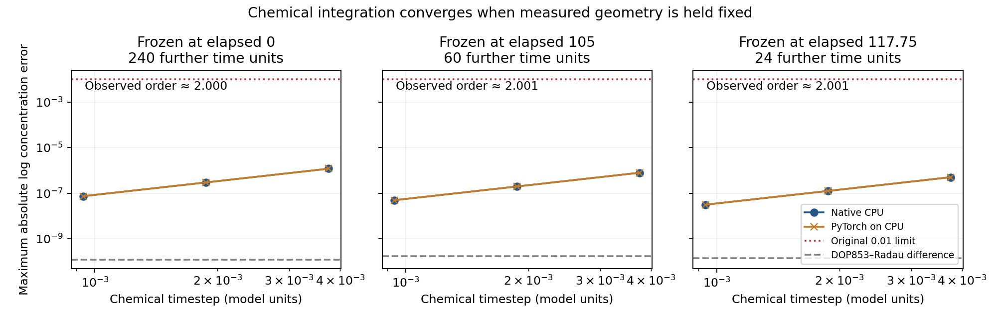

# Frozen-geometry chemical integration diagnosis

**Completed: all 18 runs pass the unchanged 0.01 maximum absolute log-state error limit.** Chemical errors decrease at second order under timestep halving. This isolates chemical stepping from the unresolved moving-geometry formation error; it does not validate the coupled trajectory.



## Why this test

The [completed history-9 moving refinement](polarity_refinement_assessment.md) retained persistent contrast at three timesteps but failed quantitative formation agreement. Its largest adjacent-pair discrepancy was 0.037503, near elapsed 117.75. Before halving again, this assay tests whether the actual chemical routines have a large error even when their geometry inputs do not change.

## Matched design

Use the exact chemical states, cell volumes and conservative transport matrices saved in the fine history-9 trajectory at elapsed 0, 105 and 117.75 (physical times 150, 255 and 267.75). Evolve chemistry for another 240, 60 and 24 model time units, respectively. Within each case, freeze transport and volumes: no mechanical update, polarity evolution or dilution.

Run the unchanged native `transport.integrate_gm` and PyTorch `gpu_backend.gm_step` functions at timesteps 0.00375, 0.001875 and 0.0009375. Parameters are beta=2, D_a=0.02 and D_b=0.55. Both chemical routines use float64; the PyTorch routine runs on CPU for this small 32-ODE check. This is not a GPU arithmetic validation. The separate spatial controls use resident PyTorch GPU tensors and custom CUDA.

Compare every 0.15 time units against independent DOP853 and Radau solutions, with relative tolerance 1e-12, absolute tolerance 1e-14 and an analytic Jacobian. The reference disagreement must remain below 1e-8. Estimate order only if the finest production error exceeds 100 times this disagreement. The declared order interval is 1.7–2.3.

This reuses **one developmental history (9)**; the 18 numerical cases are not 18 histories. No new zygote trajectories or identities are introduced.

## Completed results

| Frozen elapsed time | Duration | Coarse error | Fine error | Finer error | Estimated orders |
|---|---:|---:|---:|---:|---|
| 0 | 240 | 1.193e-06 | 2.982e-07 | 7.456e-08 | 2.0002, 1.9999 |
| 105 | 60 | 7.94e-07 | 1.984e-07 | 4.959e-08 | 2.0007, 2.0004 |
| 117.75 | 24 | 5.051e-07 | 1.262e-07 | 3.152e-08 | 2.0014, 2.0007 |

Maximum production error: **1.19312e-06**. Maximum DOP853–Radau discrepancy: **1.7387e-10**. Maximum native/PyTorch log-state difference: **1.05105e-12**. Both routines pass all contexts and all timesteps; all six refinement comparisons have resolvable order estimates.

The error measure is the largest value of `abs(log(c_numerical / c_reference))` over both chemicals, all cells and all sampled times. For small errors, 0.01 corresponds approximately to a 1% concentration difference. Each halving reduces the observed error by about four, as expected for second-order integration on a fixed operator.

## Interpretation and next diagnostic

These results rule out a large isolated chemical-stepping error in the three measured fixed contexts. They leave changing transport, volume dilution, first-order splitting, spatial precision and nonlinear amplification as possible contributors. They do not separate those mechanisms and do not erase the original 0.02574 and 0.03750 failed moving comparisons.

The [short moving precision controls](geometry_precision.md) compare the unchanged baseline with accumulation of lost phase increments, double-precision contact accumulation, and their combination. These interventions retain the equations, physical parameters and starting state. Early-window improvement alone will not establish accuracy through nonlinear formation.

## Reproduction

The protocol, references, 18 trajectories and summary are in `outputs/chemistry-accuracy/`. Source and input hashes were pinned before execution. This assessment independently recomputes errors from saved paths, verifies clocks and hashes, and compares the result to the saved summary without rewriting it.

```bash
OPENBLAS_NUM_THREADS=1 OMP_NUM_THREADS=1 MKL_NUM_THREADS=1 \
MPLCONFIGDIR=/tmp/embryo-mpl python -m embryo.chemistry_accuracy_assessment
```

The [verification record](chemistry_accuracy_verification.json) records this completed diagnostic separately from the previous long study. The consolidated results ledger and manuscript remain earlier snapshots.
