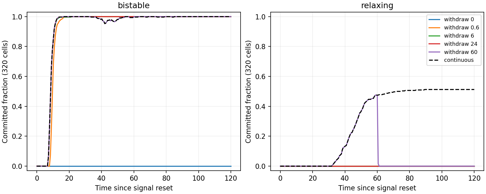

# Signal withdrawal and intrinsic fate memory

This experiment separates the effect of signal exposure from memory supplied by the fate equation. It uses one frozen resolved 16-cell geometry and twenty paired chemical perturbation seeds (0–19), matching the earlier causal screen. It is a chemical/fate experiment, not a new 3D developmental simulation or twenty independent embryos.

## Matched fate laws

Both laws begin at zero, receive the same activator trajectory, and use the same response rate and signal gain:

$$
\dot f_{\mathrm{bistable}}=r_f\left(f_{\mathrm{bistable}}-f_{\mathrm{bistable}}^3+g_a(a-1)\right),
$$

$$
\dot f_{\mathrm{relaxing}}=r_f\left(-f_{\mathrm{relaxing}}+g_a(a-1)\right).
$$

The first has two stable unforced states. The second has one stable unforced state, zero, and serves as a diagnostic control with no intrinsic bistable memory. It is not fitted as a competing biological model. Here $r_f=0.8$, $g_a=1$, and the reporting thresholds are $f>0.55$ and $f<-0.55$.

At exposure duration $T$, replace the activator input **to the fate equation only** by its neutral value 1. Do not reset fate and do not reset the activator/inhibitor equations. Thus underlying chemical patterning may continue, but it no longer drives the fate variable. This intervention is a neutralized downstream input, not physical depletion of activator from the whole model.

The protocol samples $T=0,0.6,3,6,12,24,48,60$, together with continuous exposure, and observes through time 120 after signal reset. These times are relative to the reset on the mature checkpoint; they are not zygote developmental times. The common activator/inhibitor history is evolved jointly with both fate laws at shared SSP-RK2 stages. Since this frozen experiment has no fate-to-chemistry feedback, a shared chemical trajectory is the exact intended comparison.

## Exact recovery after withdrawal

For $\tau=t-T$ and $f_T=f(T)$, the unforced solutions are

$$
f_{\mathrm{bistable}}(T+\tau)=
\frac{f_T}{\sqrt{\exp(-2r_f\tau)+[1-\exp(-2r_f\tau)]f_T^2}},
$$

$$
f_{\mathrm{relaxing}}(T+\tau)=f_T\exp(-r_f\tau).
$$

We evaluate these formulas directly after withdrawal. They preserve the fate value at withdrawal and avoid adding numerical error during recovery. The first is also well defined for exactly zero initial fate at the finite observation horizon. Independent DOP853 checks cover zero, tiny positive/negative states, and magnitudes above one.

These equations predict an important limitation before seeing the result: **any nonzero unforced bistable state eventually approaches the stable state of the same sign**, whereas the relaxing state decays to zero. There is therefore no strictly positive universal exposure threshold in this noiseless mathematical switch. An apparent minimum exposure depends on the observation horizon, reporting threshold, signal history, and numerical precision. The sweep estimates outcomes at a specified horizon, not a biological commitment threshold.

## Measurements and validation

The protocol is saved before execution in `outputs/fate-memory/protocol.json`. Initial chemical perturbations have volume-weighted zero mean and RMS 0.001. Continuous fate trajectories are recorded every 0.6 units, along with counts of A, B, and uncommitted cells per seed. Summaries distinguish:

- Cells already labeled at withdrawal and retaining that label at the final observation.
- Cells crossing a label threshold only after withdrawal despite no further input.
- Trials containing both labels at the final observation.
- Sampled first threshold-crossing times, which need not represent permanent commitment.

The two chemical timesteps are 0.0075 and 0.00375. Acceptance requires maximum signal RMS discrepancy below 0.01, maximum continuous-fate discrepancy below 0.05 for every law/exposure pair, and matching final labels cell by cell. The zero-exposure control must stay uncommitted. A predeclared descriptive screen of at least 16/20 trials with both labels can summarize sampled exposure durations; it is not a universal threshold. Signal and fate arrays and checkpoint/source hashes are retained.

```bash
OPENBLAS_NUM_THREADS=1 OMP_NUM_THREADS=1 python -m embryo.fate_memory \
  --output outputs/fate-memory-repeat
```

Outputs include `comparison.json`, `RESULTS.md`, a committed-fraction plot, the common driven histories, and eighteen paired fate trajectories. Counts pooled across 320 cells describe twenty trials on the same geometry; the cells are not independent biological replicates. Signal reversal, noise robustness, moving geometry, and lineage-specific biological calibration remain outside this experiment.

## Completed result

All numerical and neutral-control checks pass. Maximum chemical timestep discrepancy is **6.90e-7**; maximum continuous-fate discrepancy across all conditions is **0.0009524**, below the unchanged 0.05 tolerance. Final labels agree cell by cell between timesteps. Six relevant regression tests pass, including analytic recovery checked against independent DOP853 integration.

| Condition | Bistable law at time 120 | Relaxing law at time 120 |
|---|---|---|
| No exposure | All uncommitted; no trial has both labels | All uncommitted |
| Withdraw after 0.6 | All 320 cells labeled; both labels in 20/20 trials | All uncommitted |
| Withdraw after 3, 6, 12, 24, 48, or 60 | All 320 cells labeled in each condition; both labels in 20/20 trials | All uncommitted in each condition |
| Continuous input | All 320 cells labeled; both labels in 20/20 trials | 164/320 cells labeled; both labels in 20/20 trials |

At exposure 0.6, **none** of the bistable cells has yet crossed a label threshold. All subsequently cross a threshold with neutral input, showing that post-withdrawal commitment is amplification of an already seeded continuous state, rather than continued chemical instruction. For every withdrawal time, cells already labeled retain their label at the final observation. The shortest positive exposure tested meets the descriptive 16/20 screen, but this is not a resolved minimum exposure duration; zero exposure and arbitrarily small positive exposures have qualitatively different asymptotic behavior in the noiseless switch.

The relaxing control can display differentiated labels during sustained input, but loses them after withdrawal. Thus persistence after withdrawal depends on the intrinsic memory law in these tests. This strengthens the distinction between signals selecting a state and a downstream circuit storing that selection. It does not show that the initial signal must be a mature Turing pattern, that the same final spatial assignment is obtained across exposure durations, or that identities resist opposite signals or noise.



The documentation includes a copy of the result figure. Raw trajectories remain in the ignored output directory; repeat the command above to regenerate them.

The follow-up [reversal and noise study](fate_robustness.md) is complete for the isolated switch at ideal equilibria. It demonstrates finite-pulse reversibility and amplitude-dependent noise sensitivity; coupled-embryo robustness remains a separate test.
