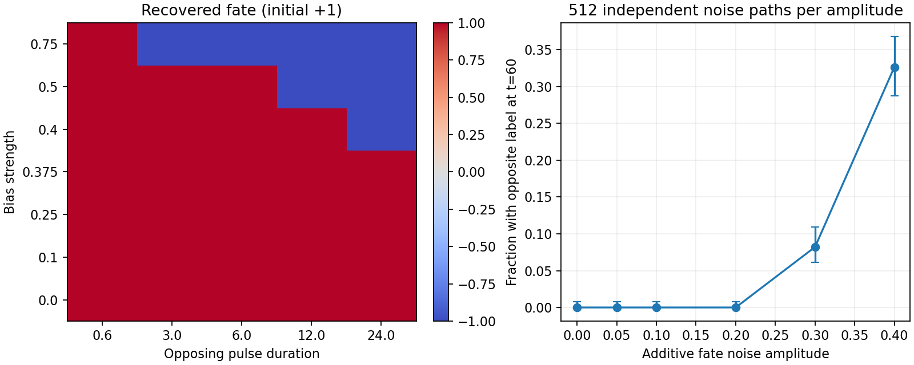

# Reversing fate and testing noise robustness

The withdrawal assay showed memory in the assumed bistable fate equation. This next experiment asks whether that memory can be overwritten and how often stochastic forcing changes labels over a fixed horizon. It isolates the fate switch; it does not evolve the embryo geometry or the activator–inhibitor network.

## Opposing signal pulses

Start at ideal committed equilibria $f_0=+1$ and $f_0=-1$. During a pulse of duration $T$, prescribe an opposing signal bias of magnitude $B$:

$$
\dot f=r_f\left[f-f^3-\operatorname{sign}(f_0)B\right].
$$

Here $r_f=0.8$ and signal gain is one. The equivalent imposed activator input is $a=1-\operatorname{sign}(f_0)B$. All tested inputs are positive because $B\le0.75$. The reference sign is fixed at pulse onset; it does not flip when fate crosses zero. After the pulse, set the input to its neutral value and recover for 40 time units using the exact unforced solution from the [withdrawal assay](fate_memory.md).

Biases are 0, 0.1, 0.25, 0.375, 0.4, 0.5, and 0.75. Durations are 0.6, 3, 6, 12, and 24. A successful reversal ends beyond the opposite label threshold, with magnitude greater than 0.55, after recovery. Initial states are ideal equilibria, not an ensemble of developmental histories.

For the positive state, a stationary point under opposing input satisfies $f-f^3=B$. The local maximum of this function occurs at $f=1/\sqrt{3}$, giving the saddle-node threshold

$$
B_{\mathrm{critical}}=\frac{2}{3\sqrt{3}}\simeq0.38490018.
$$

Below this threshold a positive stable equilibrium survives. Above it, sufficiently long forcing can move the state into the negative basin. Close to the threshold, escape can be slow: exceeding the constant-bias threshold does not imply that every finite pulse switches fate. The negative initial state has the symmetric result. For a nonunit signal gain, the corresponding activator deviation threshold is divided by that gain.

Pulse integration uses SSP-RK2 at steps 0.0075 and 0.00375 and independent DOP853 references tightened from relative/absolute tolerances 1e-10/1e-13 to 1e-12/1e-15. Fate discrepancies must remain below 0.05 at pulse termination and after recovery, final labels must agree, and tightened references must agree within 1e-6. These are switch-integration checks, not a refinement of the full moving embryo.

## Additive noise under neutral signaling

The second arm uses the Itô stochastic equation

$$
\mathrm df=r_f(f-f^3)\,\mathrm dt+\sigma\,\mathrm dW_t.
$$

The Wiener increment has mean zero and variance $\mathrm dt$. Noise amplitude $\sigma$ therefore controls fluctuations per square root of model time. It represents an explicit diagnostic forcing of fate, not a measured molecular-noise level. The default live model still has zero independent fate noise.

Test amplitudes are 0, 0.05, 0.1, 0.2, 0.3, and 0.4, over time 60. Each amplitude has 256 paths starting at +1 and 256 at −1, with independent increments across paths. Paths are paired across amplitudes. Euler–Maruyama timesteps 0.0075 and 0.00375 share exactly the same Brownian path: each coarse increment is the sum of its two fine increments. This pairing distinguishes timestep error from a different random realization.

Report final original/opposite/uncommitted labels and whether each trajectory ever crossed zero on the integration grid. Crossing zero need not produce a persistent opposite label, and a trajectory can cross back. The check requires maximum sampled paired RMS discrepancy below 0.05, final opposite-label disagreement at most 2% of paths, and an ever-crossing fraction difference at most 2%. Zero noise must preserve all initial labels.

Approximate 95% Wilson intervals describe Monte Carlo uncertainty in the final opposite-label fraction under this mathematical SDE. They do not estimate biological uncertainty or a universal switching rate. A zero observed count does not imply zero probability. Continuous-time crossings between numerical steps are not directly observed; crossing statistics retain a temporal-resolution limitation.

## Reproduce

```bash
OPENBLAS_NUM_THREADS=1 OMP_NUM_THREADS=1 python -m embryo.fate_robustness \
  --output outputs/fate-robustness-repeat
```

The fixed protocol, source hashes, pulse endpoints and recovered states, noise trajectories, timestep comparisons, and decisions are stored separately from the source withdrawal study. Five relevant tests verify pulse sign symmetry, subcritical persistence, supercritical reversal, shared Brownian increments, exact neutral recovery, and agreement of that recovery with an independent ODE solver.

## Completed results

All predeclared checks pass. Maximum pulse discrepancy against the tightened independent reference is **9.69e-6**. The largest sampled paired noise RMS discrepancy is **0.01121**, below 0.05; no final opposite-label classifications differ between the two tested timesteps.

| Opposing bias | Shortest tested pulse producing reversal after recovery |
|---|---:|
| 0, 0.1, 0.25, 0.375 | None through duration 24 |
| 0.4 | 24 |
| 0.5 | 12 |
| 0.75 | 3 |

These are sampled durations, not exact minimum switching times. Both signs give symmetric deterministic responses. The near-threshold delay at bias 0.4 illustrates why removing a stable equilibrium is not equivalent to immediate commitment to the other state.

| Noise amplitude | Final opposite label / 512 | Ever crossed zero / 512 | Final uncommitted / 512 |
|---|---:|---:|---:|
| 0 | 0 | 0 | 0 |
| 0.05 | 0 | 0 | 0 |
| 0.1 | 0 | 0 | 0 |
| 0.2 | 0 | 0 | 1 |
| 0.3 | 42 (8.2%) | 117 | 34 |
| 0.4 | 167 (32.6%) | 399 | 71 |

At amplitudes 0.3 and 0.4, approximate 95% intervals for final opposite-label fractions are 6.1–10.9% and 28.7–36.8%, respectively. At nonzero amplitudes with zero observed opposite labels, the finite sample does not exclude rare switching; the Wilson upper bound is approximately 0.7% for this observation horizon. Zero-noise persistence also follows directly from the equilibrium equation.

The assumed fate switch therefore stores transient input but is **reversible**, and its finite-window noise tolerance depends on forcing strength. This is a characterization of the supplied bistable equation, not independent evidence that a real lineage uses it or that a sustained activator–inhibitor pattern is necessary. Robustness in the moving embryo, under alternative initial histories and biologically calibrated noise, remains open.


