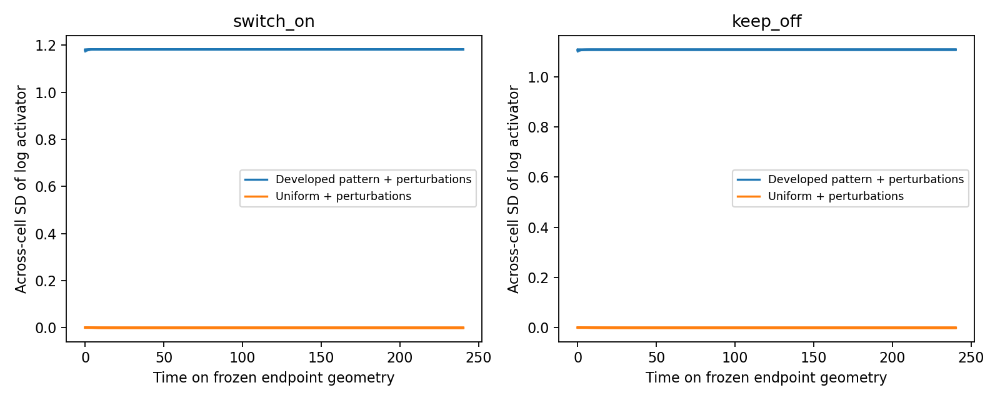

# Chemical attractor coexistence after moving-geometry survival

The t=90–150 switch experiment retains the developed chemical pattern with both feedback on and feedback off. Both final graphs nevertheless stabilize homogeneous chemistry. This follow-up tests whether each final geometry supports **at least two locally stable chemical attractors**: a uniform state and a patterned state.

## Controlled test

The experiment restores each completed t=150 checkpoint, verifies that the moving study completed with passing quality checks, and freezes its measured geometry and conservative operator. The original Gierer–Meinhardt reactions and diffusivities are retained. There is no change of parameters between the two initial-state families on a given graph.

Each endpoint graph has 42 trajectories:

- The actual developed chemical state, continued without perturbation.
- The exact homogeneous reference (1,1).
- Twenty positive perturbations of the developed state, with log-noise scale 0.01.
- Twenty positive perturbations of the homogeneous state, with log-noise scale 0.001.

Perturbations are separately rescaled to preserve each species' initial total amount. The uniform and patterned families themselves may have different amounts; reaction dynamics do not conserve these totals. These are repeated interventions on two endpoints of one developmental history, not independent embryos. No labels or population count are supplied.

Every trajectory runs for 240 chemical time units. The declared criteria require maximum chemical derivative below 1e-6 at the endpoint, negative largest real eigenvalue of the complete two-species chemical Jacobian, and numerical agreement. Patterned trajectories must retain log-activator SD above 0.1 and return within volume-weighted log RMS 1e-4 of the unperturbed patterned continuation. Uniform starts must return within maximum absolute log deviation 1e-4 of (1,1).

The patterned-state Jacobian is evaluated directly, rather than applying the homogeneous Turing dispersion relation to a nonuniform state:

$$
J_{\mathrm{chem}}=
\begin{pmatrix}
\operatorname{diag}(2a_i/b_i-1)+D_a\Delta_V &
-\operatorname{diag}(a_i^2/b_i^2)\\
2\beta\operatorname{diag}(a_i)&-\beta I+D_b\Delta_V
\end{pmatrix}.
$$

This matrix contains all cell-to-cell chemical coupling on the frozen graph. It excludes derivatives with respect to phase fields, geometry, and polarity, so it is not the stability matrix of the complete moving simulation.

## Results

| Endpoint graph | Patterned control: final log-activator SD | Patterned-state largest real eigenvalue | Uniform-state largest real eigenvalue | Perturbed patterned starts returning | Perturbed uniform starts returning |
|---|---:|---:|---:|---:|---:|
| Feedback switched on | 1.18186 | −0.30409 | −0.18052 | 20/20 | 20/20 |
| Feedback kept off | 1.10734 | −0.16378 | −0.08755 | 20/20 | 20/20 |

All 84 trajectories pass the declared criteria. The small derivative residuals and negative chemical Jacobian eigenvalues support locally stable uniform and patterned equilibria on both endpoint graphs. This establishes numerical evidence for at least two attractors; it does not show that exactly two exist or determine their complete attraction basins.



DOP853 at relative/absolute tolerances 1e-8/1e-10 is compared with 1e-11/1e-13 for every trajectory. Maximum absolute log discrepancy is 1.83e-6, below the unchanged 1e-5 threshold. An independent Radau integration checks the most tolerance-sensitive initial state on each graph; maximum discrepancy is 1.22e-9. Maximum endpoint chemical derivative across all trajectories is below 4.36e-11. A finite-difference test validates the patterned Jacobian and checks its homogeneous limit against the dispersion relation.

## Mechanistic interpretation

The results distinguish **loss of a linear pattern-initiation mechanism** from **loss of an existing nonlinear patterned state**. When the uniform state becomes stable, small perturbations can no longer grow by that linear instability, but another stable chemical state can remain available. Initial chemical history then determines which state the system approaches on the same fixed graph.

This explains why spectral stabilization can coexist with the observed moving-geometry survival. It also narrows the earlier feedback-suppression conclusion: the tested feedback suppresses formation in one developmental history, but does not universally erase established organization. A cyclic parameter sweep would be required to demonstrate hysteresis explicitly; coexistence alone is not such a sweep.

The moving experiment supplies finite-horizon persistence evidence, while this frozen-endpoint experiment identifies a chemical mechanism consistent with it. Neither proves stability of the full moving system, autonomous single-cell identity, or generality across developmental seeds. The next validation priority is timestep refinement of the completed moving switch experiment, followed by additional developmental histories. The remaining component controls should finish before assigning a dominant mechanical cause to the full trajectory.

## Reproduce

```bash
OPENBLAS_NUM_THREADS=1 OMP_NUM_THREADS=1 python -m embryo.feedback_endpoint_bistability \
  --output outputs/feedback-endpoint-bistability-repeat
```

The runner requires completed, quality-passing switch-study outputs and refuses to overwrite an existing directory. It records source/input hashes and thresholds before evolution. `results.json` contains every trajectory's checks; the per-graph NPZ files retain starting states, complete sampled chemical trajectories, operator, volumes, and cell IDs. The production moving trajectories remain unchanged.
