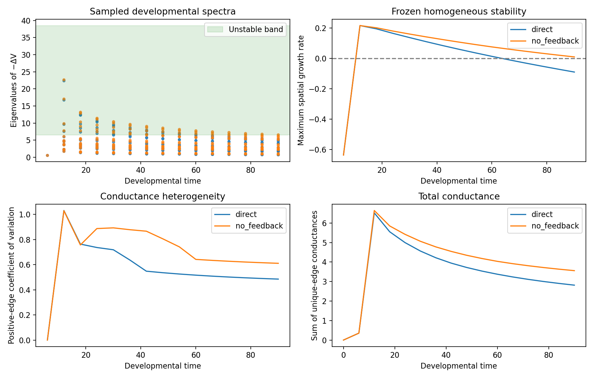
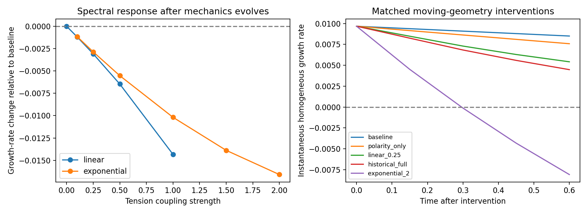

# Why direct mechanical feedback suppresses signaling in the pilot

This investigation separates a transport-spectrum mechanism from the still-open question of which mechanical constitutive term causes it. The completed developmental histories support a loss of transport-supported linear instability in the direct branch. They do not yet prove that activity-dependent tension alone causes this loss, because the original branch comparison also switches polarity-dependent tension and changes the developmental history.

## Developmental spectra

For each saved checkpoint at t=0,6,...,90, the analysis reconstructs the production conservative transport operator from the actual phase fields, contacts, centroids, and volumes. It uses

$$
\Delta_V=-M^{-1}K,\qquad
L=M^{-1/2}KM^{-1/2}.
$$

The symmetric matrix $L$ has the same nonnegative eigenvalues as $-\Delta_V$. A chemical perturbation in a mode with eigenvalue $\lambda$ grows according to the largest real eigenvalue of

$$
J-\lambda\operatorname{diag}(D_a,D_b),
\qquad J=\begin{pmatrix}1&-1\\2\beta&-\beta\end{pmatrix}.
$$

At the current parameters ($\beta=2$, $D_a=0.02$, $D_b=0.4$), the homogeneous reference is unstable to modes with eigenvalues between 6.49219 and 38.50781. This is a frozen-geometry homogeneous-state calculation. It does not by itself account for changing eigenvectors, nonlinear chemistry, division, or dilution in the developmental trajectory.

Both developmental branches have unstable modes at t=12 through t=60. The direct branch loses its last unstable sampled mode between t=60 and t=66. At t=90:

| Measurement | Direct feedback | No feedback |
|---|---:|---:|
| Largest transport eigenvalue | 5.41025 | 6.63631 |
| Number of unstable spatial modes | 0 | 1 |
| Maximum spatial growth rate | −0.09002 | +0.00968 |
| Total unique-edge conductance | 2.81436 | 3.55781 |
| Positive-edge conductance coefficient of variation | 0.48534 | 0.61106 |

The direct spectrum falls **below the lower edge** of the instability band. Suppression here corresponds to insufficient transport eigenvalues for the differential-diffusion instability, rather than excessively large eigenvalues above the upper edge. The direct branch has about 21% lower total conductance and less relative variation among positive edge weights. However, it has 28 retained edges versus 32, and *greater* weighted-degree variation (CV 0.192 versus 0.161). Therefore, “more homogeneous geometry” is too broad a conclusion: the specific edge-weight statistic decreases while other network properties do not homogenize. The independent frozen-context chemical continuation already showed relaxation to uniformity on this final direct graph and persistence on the no-feedback graph, consistent with these spectra.



## Graph counterfactuals

The t=90 graph calculations test specific operator changes:

| Counterfactual | Maximum spatial growth rate |
|---|---:|
| Direct conductances, no-feedback volumes | −0.09011 |
| No-feedback conductances, direct volumes | +0.00974 |
| No-feedback conductances uniformly scaled to direct total conductance | −0.10672 |
| No-feedback positive edge weights replaced by their mean, preserving support and total conductance | −0.04288 |

Swapping capacities has little effect. Uniformly reducing conductance scale is sufficient to stabilize the no-feedback graph, even without changing its edge-weight coefficient of variation. Equalizing positive conductances at unchanged total conductance also stabilizes it. Consequently, the proposed homogenization mechanism is plausible, but not the only sufficient graph-level change: the conductance scale also matters.

These are algebraic operator interventions, not realizable deformations of the tissue. The two branches retain matching array cell IDs but their division histories and spatial positions can differ. Hybrid matrices do not establish physically identical cell correspondence. Also, diffuse contact conductance combines overlap-derived interface area and centroid separation; a decrease does not by itself show that high-activator cells contracted or pulled apart. The live contact-geometry approximation remains a limitation.

### Cutoff sensitivity

Rebuilding both t=90 graphs with relative cutoffs 0, 0.005, 0.01, 0.02, 0.04, and 0.08 preserves the stability distinction. Direct growth rates range from −0.08800 to −0.09009; no-feedback rates remain positive, from +0.00916 to +0.01152. The result is not caused by the particular cutoff 0.02 within this tested range. It still does not validate the underlying diffuse contact closure or spatial resolution.

### Instantaneous mechanical force decomposition

Separate mechanical-only steps start from the same no-feedback t=90 checkpoint. Chemicals and polarity are held at their initial values during this one-step probe; no chemical integration or dilution is applied. Subtracting the constant-material baseline estimates each term's initial contribution to the rate of change of spectral growth. Halving the mechanical step from 0.0075 to 0.00375 preserves the signs:

| Intervention | Excess growth-rate derivative, smaller probe step |
|---|---:|
| Activity-dependent tension only | +0.005779 |
| Activity-dependent adhesion only | −0.005410 |
| Tension and adhesion together | +0.000362 |
| Polarity tension only | −0.001520 |
| Historical full coupling | −0.001187 |

The tension-only intervention strongly anticorrelates initial activity with volume-change rate (approximately −0.999), consistent with high-activity cells tending to contract relative to low-activity cells in this probe. Nevertheless it *raises* the spectral growth rate initially. The proposed contraction story therefore does not automatically imply chemical stabilization. Adhesion and polarity push the instantaneous spectrum in the opposite direction. This force decomposition is local to one already-patterned geometry; it is not a causal reconstruction of the entire developmental history.

The original direct branch includes a polarity-driven mechanical effect even when activator is nearly uniform. At t=12, its maximum activity-dependent baseline-tension change is only about 0.20%, whereas the polarity directional-modulation bound is about 2.60%. These coefficient scales are not direct force measurements, but underscore why the historical branch comparison cannot be called a pure activity-tension/adhesion intervention.

## Why a frozen-geometry mechanical-coupling sweep cannot test hypothesis (b)

If geometry and volumes are fixed, changing tension or adhesion coefficients does not change the signaling operator or chemical reaction equations. Such a sweep would give identical chemical evolution for every coupling strength. It cannot locate a feedback resonance.

There is a related linear fact: conservative transport annihilates a constant concentration field, so

$$
\delta\Delta_V\,\mathbf{1}=0.
$$

Thus the direct contribution of an infinitesimal operator change acting on a uniform chemical background vanishes. Feedback can still alter the evolving background geometry, affect nonuniform chemicals, and couple through changing-volume dilution or other mechanical terms. This identity is not a proof that the complete moving system lacks linear mechanical feedback.

The matched response screen therefore starts all arms from the same no-feedback t=90 checkpoint and allows mechanics, chemistry, polarity, and dilution to evolve. It measures early changes in conductance and homogeneous-state spectral growth, rather than pretending that a mechanically frozen sweep can reveal them.

## Coupling laws and the short matched screen

The original constitutive laws are

$$
r_i=\tanh(a_i-1),\qquad
\gamma_i=\gamma_0(1+c_\gamma r_i),\qquad
A_{ij}=A_0(1+c_A r_i r_j).
$$

For positive activator, $r_i$ can approach $-\tanh(1)$; tension can become negative when $c_\gamma>1/\tanh(1)\approx1.313$. Indeed, $c_\gamma=2$ makes tension negative in the supplied patterned state. Matched adhesion coefficients can also produce negative attraction for sufficiently opposite responses. Increasing the existing parameters through the entire requested interval would therefore change a physical coefficient's sign, not simply strengthen the same admissible mechanics.

The screen uses $c_A=1.4c_\gamma$, matching the historical 0.35/0.25 ratio. It tests the original linear law at $c_\gamma=0.1,0.25,0.5,1$, checking tension and adhesion positivity during the run. For a positive extension through 2, a separate family uses

$$
\gamma_i=\gamma_0\exp(c_\gamma r_i),\qquad
A_{ij}=A_0\exp(c_A r_i r_j),
$$

at strengths 0.1,0.25,0.5,1,1.5,2. The exponential family agrees to first order in the modulation around zero but is a different constitutive law at finite contrast. Results cannot be described as a high-strength test of the unchanged original equation.

The thirteen arms include a constant-material baseline, polarity-only mechanical action, and the historical full coupling. Activity-only sweeps turn off polarity's mechanical tension contribution while retaining polarity dynamics. All use the same initial geometry, chemicals, and polarity. They run for 0.6 time units at dt=0.0075 and sample every 0.15 units. No division occurs. Volume error, cell resolution, clipping, boundary occupancy, and material positivity are checked.

This is a short response screen, not a completed long-time coupling phase diagram. A change in homogeneous-state growth rate does not establish that the existing nonlinear chemical pattern is amplifying or stable. Finding or excluding a resonant regime requires longer matched continuations, nonlinear diagnostics, and timestep refinement.

## Completed short coupling sweep

All thirteen response arms pass the volume, resolution, clipping, boundary, and coefficient-positivity checks. The initial homogeneous-state growth rate is +0.009678 in every arm. After 0.6 time units:

| $c_\gamma$ | Original linear law, no polarity mechanics | Positive exponential law, no polarity mechanics |
|---:|---:|---:|
| 0.1 | +0.007303 | +0.007337 |
| 0.25 | +0.005419 | +0.005641 |
| 0.5 | +0.002041 | +0.002977 |
| 1 | −0.005823 | −0.001678 |
| 1.5 | Not tested with original law | −0.005376 |
| 2 | Negative tension in initial patterned state; excluded | −0.008086 |

These are homogeneous-state growth rates on the resulting instantaneous graphs. Relative to the evolving constant-material baseline (+0.008505 at the endpoint), increasing coupling is monotonically more suppressive in both tested families. No amplification window is seen in this short screen. This cannot exclude a delayed response, a different tension/adhesion ratio, another initial state, or a long-time resonant regime.



The starting state already has a strong chemical pattern. For the historical full coupling, mean centroid separation over original edges increases by approximately 0.000539, versus 0.000246 in the constant-material baseline. Summed overlap over those edges falls to 99.28% of its initial value, versus 99.84% in the baseline. The activity-only original coupling at 0.25 has much less extra centroid separation (mean increase 0.000260) but overlap falls to 99.47%. Thus reduced diffuse contact overlap is directly observed; a large-scale pulling-apart explanation is not needed to obtain suppression.

The endpoint *chemical* Jacobian evaluated at the actual patterned concentrations has a negative largest real eigenvalue in the assessed arms (approximately −0.08 in the illustrated controls). Those states are evolving, so this is a local diagnostic, not proof that each endpoint is an equilibrium. In particular, stabilizing the homogeneous state does not automatically erase an existing nonlinear pattern. A full moving-system stability calculation would also include geometry and polarity variables.

### Selected timestep verification

The historical full-coupling arm was repeated at dt=0.00375 over the same 0.6-unit interval. Maximum sampled growth-rate discrepancy is 5.89e-6, and maximum endpoint chemical log discrepancy is 1.11e-5. Both pass the preselected 1e-4 limits. This verifies the selected short response, not every coupling strength or spatial resolution. Across the thirteen primary arms, maximum individual volume error is below 1.94%, minimum equivalent radius exceeds 5.09 grid spacings, and clipping is zero. Eight relevant unit/regression tests pass.

## Matched component continuations

Separate 0.6-unit continuations isolate tension and adhesion while retaining evolving chemistry and dilution. All start from the same no-feedback t=90 geometry and chemical state; polarity mechanics is disabled in these two arms. Both pass the declared quality checks.

| Intervention | Change in maximum homogeneous growth rate | Change beyond constant-material baseline |
|---|---:|---:|
| Constant-material baseline | −0.001173 | 0 |
| Tension only, $c_gamma=0.25$ | −0.002086 | −0.000913 |
| Adhesion only, $c_A=0.35$ | −0.003299 | −0.002126 |
| Polarity tension only | −0.002094 | −0.000921 |
| Joint activity-dependent tension/adhesion | −0.004259 | −0.003086 |
| Historical full coupling | −0.005199 | −0.004026 |

Adhesion has the largest suppressive excess contribution in this local experiment. The tension-only sign changes between the instantaneous force probe and the finite continuation: it initially promotes spectral growth, then produces a net reduction as mechanics and chemical concentrations respond. Coupled contributions are approximately, but not exactly, additive over this short interval. This is evidence for a time-dependent force balance, not a universal sign rule for tension.

These interventions establish a short-term causal effect from the specified starting state. They do not establish which term dominates the complete zygote-to-sixteen-cell history. That requires full matched developmental component ablations, preferably with independent seeds.

## Reproduce

```bash
OPENBLAS_NUM_THREADS=1 OMP_NUM_THREADS=1 python -m embryo.feedback_spectrum \
  --output outputs/feedback-spectrum-repeat
OPENBLAS_NUM_THREADS=1 OMP_NUM_THREADS=1 python -m embryo.feedback_response \
  --output outputs/feedback-response-repeat
```

The spectral outputs retain all sampled spectra and operator counterfactuals. The response output contains its frozen protocol, per-arm histories and checks, and experimental final-state arrays. These arrays include their constitutive law and are not ordinary development checkpoints. The core/dashboard mechanics and historical outputs are unchanged.


Additional endpoint cutoff checks, force probes, component continuations, and the response assessment can be reproduced with:

```bash
OPENBLAS_NUM_THREADS=1 python -m embryo.feedback_contact_checks
OPENBLAS_NUM_THREADS=1 python -m embryo.feedback_force_split
OPENBLAS_NUM_THREADS=1 OMP_NUM_THREADS=1 python -m embryo.feedback_components \
  --output outputs/feedback-components-repeat
OPENBLAS_NUM_THREADS=1 python -m embryo.feedback_response_summary
```

The first two supplementary analyses write separate JSON files under the existing spectral output directory. The component runner uses a fresh output directory.


## Mechanistic conclusion and remaining work

The strongest supported explanation is **a mechanically altered contact operator that leaves the Turing band too early to sustain the same pattern-forming opportunity**. Lower conductance scale and altered conductance distribution each suffice to stabilize the final no-feedback graph in separate algebraic interventions. The developmental spectra, frozen-context chemical outcomes, and matched short mechanical interventions agree on this direction.

The evidence does not support attributing suppression to contraction alone. Tension initially increases spectral growth, adhesion and polarity initially decrease it, and tension's net effect changes sign over the short moving continuation. Positive-edge weights become less variable across the historical branches, but degree variation and edge count do not support a general geometry-homogenization claim.

Stronger matched tension/adhesion coupling is more suppressive in the tested short screen; it does not reveal a resonant amplification regime. The upper-strength positive extension is a distinct constitutive law. A strictly frozen-geometry sweep would not test mechanical feedback at all.

The remaining decisive experiments are long matched tension-only, adhesion-only, polarity-only, and full developmental continuations, followed by independent seeds and appropriate timestep/spatial refinement. They should measure both growth from near-uniform chemistry and persistence of established nonlinear patterns, and vary tension and adhesion independently. The present results explain the observed transport-level stabilization and identify causal short-term contributors without claiming a complete developmental phase diagram.


The next stage is now executing as the [long matched feedback-component study](feedback_long.md), with both formation and persistence initial conditions on one common sixteen-cell geometry. It addresses longer mature-tissue dynamics before the full developmental ablations described above. Results are pending.


The [completed t=90–150 moving switch test](feedback_survival.md#completed-moving-geometry-survival-assessment) now demonstrates retention of the developed pattern despite homogeneous-state stabilization. [Frozen endpoint tests](feedback_endpoint_bistability.md) confirm coexistence of locally stable uniform and patterned chemical states. The spectral mechanism above therefore explains suppression of linear initiation, not universal destruction of nonlinear patterns. Explicit cyclic hysteresis tests and full moving-system refinement remain separate tasks.
