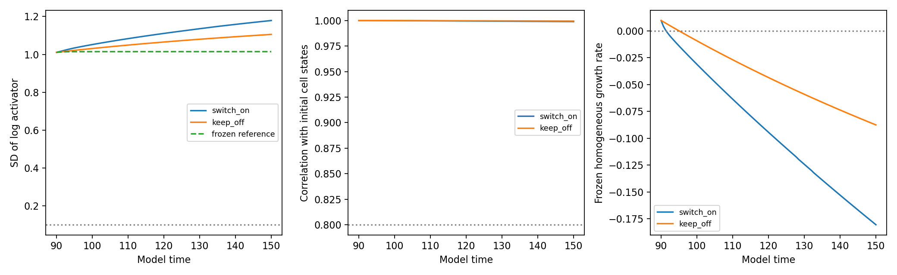

# Does a developed pattern survive switching on mechanical feedback?

This experiment starts from the **actual no-feedback developmental checkpoint at t=90** and switches on direct-feedback mechanics. It does not reset signals, replace the developed pattern with a frozen-graph equilibrium, or transplant it to an earlier geometry. The production study has completed through t=150 in `outputs/feedback-survival`. The developed chemical pattern survives in both moving arms, with all declared quality checks passing.

## The controlled intervention

The two moving arms are exact copies of the same checkpoint:

| Arm | Change at t=90 | Subsequent dynamics |
|---|---|---|
| `switch_on` | Enable the original direct-feedback flag/mode | Chemicals, polarity, geometry, contact transport, and volume dilution all evolve |
| `keep_off` | No intervention | Exact continuation of the no-feedback developmental equations, with moving geometry |

No chemical activity, polarity vector, phase field, target volume, cell ID, lineage value, timer, or random state is reset. The coefficients stored in the original checkpoint are retained: activity–tension contrast 0.25, activity–adhesion contrast 0.35, and polarity–tension contrast 0.35. The original linear constitutive law is used. No externally maintained signal or prescribed fate switch is introduced.

The sixteen cells remain at the existing cell-count cap; no new divisions occur. The grid is 72³ with domain half-width 2.24, interface width 0.085, and dt=0.0075. The runs cover t=90–150, sampled every 0.6 units, with restart checkpoints every six units.

A third, inexpensive reference evolves only chemistry on the frozen t=90 contact operator and fixed cell volumes. It starts with the exact same checkpoint chemistry. Standard and tightened DOP853 integration must agree to within 1e-5 maximum absolute log concentration difference before production starts. This reference diagnoses whether changes require moving geometry; it is not a substitute for either moving arm.

## What “survival” means in this experiment

The primary criterion is across-cell SD of log activator above 0.1 at every sampled point in the final fifteen-unit window, t=135–150. This matches the previous chemical-contrast threshold and is declared before the outcome. The result is finite-horizon survival of chemical heterogeneity, not proof of permanent stability.

To distinguish survival of contrast from preservation of cell-associated states, the assay also records:

- The volume-weighted correlation between current and original log activator across the same cell IDs, using fixed t=90 volume weights.
- The two-species volume-weighted log-RMS distance from the original chemical state.
- Every cell's chemical, polarity, and shape attributes and geometric context.
- Instantaneous conservative-operator spectra and aggregate shape.

Initial-state association is considered retained if the log-activator correlation stays at least 0.8 throughout the final window. This threshold is a descriptive screen, not an established biological criterion. A high Pearson correlation is not exact rank preservation or equality of cell concentrations. Correlation is reported as undefined when contrast is effectively zero; that is not counted as retention. The internal output name `initial_ordering_retained` refers to this correlation screen.

The combined report distinguishes sustained contrast with retained association, sustained contrast with weaker association, and contrast not sustained. No A/B identities or discrete population count are assigned. Shape and polarity histories remain continuous observations rather than automatically inferred identities.

## Interpretation of the paired outcome

- **Switch loses contrast, moving no-feedback retains it:** supports feedback-specific loss of an already-developed chemical pattern under this intervention.
- **Both moving arms retain contrast:** feedback can coexist with an established pattern over this horizon. In combination with suppression during development, this supports a distinction between pattern initiation and maintenance, but does not alone prove the reason for the developmental difference.
- **Both moving arms lose contrast:** loss cannot be attributed uniquely to switching feedback. Continued mechanical relaxation or other shared moving-geometry effects require investigation, with the frozen reference as a control.
- **Only the switched arm retains contrast:** supports a maintenance-promoting effect of the switch in this state, even if feedback previously suppressed formation.

Any of these outcomes can coexist with rearrangement among individual cell states. Changes in the homogeneous-state instability band do not by themselves establish loss or stability of a nonlinear pattern. Likewise, this chemical survival test is necessary evidence toward emergent identity but cannot establish persistence of the complete cell phenotype by itself.

## Numerical and workflow checks

Every step audits maximum individual volume error below 5%, equivalent cell radius at least four grid spacings, and zero clipping. Boundary occupancy must remain below 1% at observations. An arm stops and is marked failed if a quality limit is exceeded; numerical failure is not classified as pattern loss.

The protocol freezes source/input hashes, coefficients, horizon, and thresholds. Checkpoints atomically bundle the full simulation with its matching observations, audit, experiment/arm identity, and protocol hash. Restarting the driver reuses completed arms and resumes unfinished arms from their latest consistent checkpoint. The core model and earlier running experiments are not modified.

Ten relevant tests pass, including verification that the switch changes only the feedback configuration, preserves the complete initial cell state, and that the feedback-off arm matches untouched continuation bitwise. Existing checkpoint tests cover exact replay and rejection of mismatched experiment metadata. A two-step production-grid smoke run verifies export and comparison only; it is not a scientific survival test.

## Reproduce and monitor

```bash
OPENBLAS_NUM_THREADS=1 OMP_NUM_THREADS=1 python -m embryo.feedback_survival prepare \
  --output outputs/feedback-survival-repeat
OPENBLAS_NUM_THREADS=1 OMP_NUM_THREADS=1 python -m embryo.feedback_survival run \
  --output outputs/feedback-survival-repeat
```

Both arms run in parallel. `switch_on/status.json` and `keep_off/status.json` report current time and quality audits. Per-arm `history.json` retains attributes and spectra, and `latest_state.npz` supports exact restart. The driver automatically writes `comparison.json`, `RESULTS.md`, and `comparison.png` after both arms finish successfully. The production launch log is `outputs/feedback-survival/run.log`.

This is distinct from the [t=18 component study](feedback_long.md), whose persistence state was chemically preconditioned on a frozen earlier graph. Here, survival is tested on the pattern and geometry actually produced by development through t=90. It is still a single developmental history and requires subsequent replication and refinement before a general claim.


The source log-activator SD is 1.01091. The frozen-reference tolerance discrepancy is 8.11e-7, below the 1e-5 gate. Both moving arms completed the two-step 72³ smoke run with passing quality checks and automatic comparison export. The completed production assessment follows below.


## Archived interim matched assessment at t=92.4

This archived assessment predates completion. The switched graph first has negative sampled homogeneous-state growth at t=91.8. At the matched t=92.4 observation, however, the established chemical pattern remains strong:

| Quantity | Feedback switched on | Feedback kept off |
|---|---:|---:|
| Across-cell log-activator SD | 1.02246 | 1.01600 |
| Correlation with original cell log activator | 0.999994 | 0.999997 |
| Instantaneous homogeneous growth rate | −0.004426 | +0.005016 |
| Aggregate axis ratio | 1.33571 | 1.33557 |

This is short-term retention after the uniform state's linear instability disappears. It demonstrates that leaving the Turing band does not immediately erase the existing nonlinear chemical pattern. It does not establish bistability of the complete moving system or long-term survival: the predeclared t=135–150 assessment window has not yet been reached.

Sampled individual volume errors through this matched time remain below 1.14%, and sampled boundary occupancy is below 4.6e-11. The running every-step audits also report zero clipping; final audits are pending. The comparison uses the same physical time for both arms even though their wall-clock progress differs.

Immutable history prefixes, numerical summaries, and a plot are saved under `outputs/feedback-survival/interim-92.4`. The helper `embryo.feedback_survival_assessment` can capture subsequent matched assessments without modifying the ongoing experiment or its frozen code dependencies. It refuses to overwrite an existing assessment directory.

```bash
OPENBLAS_NUM_THREADS=1 python -m embryo.feedback_survival_assessment \
  --until 92.4 --output outputs/feedback-survival-assessment-repeat
```


## Completed moving-geometry survival assessment

Both arms reach t=150. The predeclared t=135–150 window gives:

| Measurement | Feedback switched on | Feedback kept off |
|---|---:|---:|
| Minimum log-activator SD | 1.14762 | 1.08683 |
| Minimum correlation with original cell log activator | 0.998965 | 0.999485 |
| Final log-activator SD | 1.17895 | 1.10555 |
| Final maximum homogeneous-state spatial growth | −0.18052 | −0.08755 |
| Maximum individual volume error | 1.139% | 1.063% |
| Minimum cell radius in grid spacings | 5.108 | 5.108 |
| Clipping | 0 | 0 |

Sampled boundary occupancy stays below 1.5e-10. Both arms meet the sustained-contrast and cell-association criteria. The frozen-geometry reference also retains contrast, with late minimum log-activator SD 1.01453.



**Switching on direct-feedback mechanics does not erase the developed pattern over the tested sixty-unit interval.** Chemical differences remain strong and closely associated with the original cells while geometry, transport, polarity, and dilution evolve. The switched arm has greater contrast than the matched control in this trajectory, despite a more strongly stabilized homogeneous chemical state. This is not evidence that every cell's concentrations remain fixed or that its complete phenotype is an invariant identity.

The [endpoint attractor-coexistence test](feedback_endpoint_bistability.md) then confirms that each final graph supports both a locally stable uniform chemical state and a locally stable patterned chemical state. All twenty small perturbations around each state return to the corresponding state on each graph. This supports a nonlinear, history-dependent explanation for the distinction between initiating and maintaining organization.

The original claim must therefore be qualified: feedback suppressed pattern formation in the developmental comparison, but did not universally suppress established patterns. Long-horizon timestep refinement and independent developmental histories remain necessary. The earlier 0.6-unit timestep check and numerical-quality screens do not certify convergence of this sixty-unit survival result.
