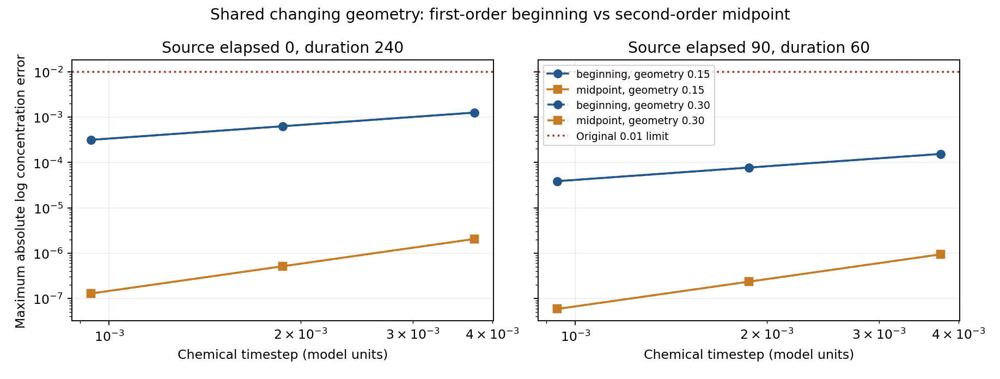

# Prescribed geometry–chemistry time coupling

This diagnostic holds **one changing geometry schedule fixed** while varying the chemical time update. It separates transport/dilution timing from mechanical evolution and phase-update precision. The [full phase-carry formation pair](phase_carry_formation.md) runs separately with co-evolving chemistry and mechanics.

The unchanged chemical routine [passes fixed-geometry accuracy tests](chemistry_accuracy.md). That does not guarantee the coupled step has the same order when cell volumes and contacts change during a timestep.

## Prescribed inputs and histories

Use the saved fine history-9 no-carry trajectory at dt=0.001875, with conservative transport and beta=2, D_a=0.02, D_b=0.55. Two contexts test complementary parts of the process:

| Source elapsed time | Further duration | Purpose |
|---|---:|---|
| 0 | 240 | Near-uniform start, onset, nonlinear formation and late pattern |
| 90 | 60 | Developing pattern through the original discrepancy near 118 and growth crossing near 137 |

Each context starts from its exact saved chemical state and cell volumes. Physical source time is 150 plus elapsed time. There is no new perturbation or division. All cases reuse **one existing history (9)**; they are not additional developmental histories.

Two prescribed schedules use source spacing 0.15 and coarsened spacing 0.30. Within each interval, linearly interpolate positive volumes and symmetric nonnegative conductances. Extract conductance from the saved operator using `g_ij = V_i Delta_ij` off the diagonal, averaging its symmetric pair to remove floating-point asymmetry; record the maximum correction. Reconstruct the operator at every requested time.

Writing G for the off-diagonal conductance matrix and M for the diagonal matrix of volumes:

$$
M(t)=\operatorname{diag}(V_1(t),\ldots,V_N(t)),\qquad
K(t)=\operatorname{diag}(G(t)\mathbf{1})-G(t),\qquad
\Delta_V(t)=-M(t)^{-1}K(t).
$$

Here g_ij measures exchange capacity, K is the symmetric graph stiffness, and M stores compartment capacities. This preserves zero net diffusive amount exchange while geometry changes. Directly interpolating Delta entries with separately changing volumes can violate that conservation identity.

This is prescribed recorded geometry, **not a live mechanics replay**: chemistry cannot change its contact/volume schedule. Coarsening checks sensitivity to interpolation, but two sampled schedules cannot prove fidelity to the unsaved every-step mechanical trajectory or contact-cutoff events.

## Independent amount reference

Define amounts Q_ai=V_i a_i and Q_bi=V_i b_i. The reference solves:

$$
\frac{dQ_a}{dt}=M(t)\left(\frac{a^2}{b}-a\right)-D_a K(t)a,
\qquad
\frac{dQ_b}{dt}=M(t)\beta\left(a^2-b\right)-D_b K(t)b,
\qquad
a=M(t)^{-1}Q_a,\quad b=M(t)^{-1}Q_b.
$$

Products, division and squares in the reaction terms act cell by cell. Reaction production/decay can change total chemical amount; diffusion and volume conversion conserve it. Volume changes alter concentration through Q/V, so the reference needs no separately stepped dilution term. This is the same compartment model underlying the production method, expressed in variables suited to changing capacities.

DOP853 and Radau solve amounts independently, with relative tolerance 1e-12 and absolute tolerance 1e-14, stopping at every geometry knot. An analytic Jacobian is transformed from concentration to amount coordinates as M J_c M^-1, with M repeated for the two species. Require maximum absolute log concentration disagreement at most 1e-8. Save both solver trajectories and amounts; do not accept a lone reference solution.

## Two time updates

Both methods call the **unchanged production `gpu_backend.gm_step` SSP-RK2 routine**, with identical parameters and timestep. For this small 32-ODE test it runs with float64 PyTorch tensors on CPU. Moving mechanics remains on the GPU in the separate confirmation.

| Method | Geometry used for chemical step | Volume handling |
|---|---|---|
| Beginning | Beginning-of-step volumes and conductances | Advance chemistry, then multiply concentrations by old volume / ending volume; matches current live time order |
| Midpoint | Midpoint volumes and conductances | Convert starting amounts to midpoint concentrations, advance chemistry, then convert amounts to ending concentrations |

The midpoint scheme changes timing only in this diagnostic. It is not installed in the production mechanics kernel. Both schemes check conservation of amount across each volume conversion to 2e-14. SSP-RK2 can be second order on a frozen graph while beginning-of-step geometry sampling makes the full nonautonomous update first order. Manufactured examples verify first-order beginning sampling and second-order midpoint sampling before launch.

## Cases and decision rules

Cross two contexts, two source spacings, two methods and three timesteps (0.00375, 0.001875, 0.0009375): **24 numerical replay cases**. Four independent reference cases each use two solvers, giving **eight reference solver paths**. Run at most four CPU workers alongside the two serial GPU continuations.

Record maximum absolute log-state errors against the corresponding exact-input reference, endpoint errors, positivity, dilution conservation and refinement order. Retain the original **0.01** chemical-error limit. Estimate order only when the finest production error exceeds 100 times the dual-solver discrepancy. Test the midpoint order against 1.7–2.3 when resolvable; report the beginning order descriptively, allowing first order as the hypothesis rather than treating it as a software failure.

Compare the two independent reference schedules separately, with a prespecified **0.001** log-state sensitivity screen (one tenth of the original error limit). This new screen evaluates source-spacing sensitivity; it does not loosen the old numerical criterion. A failed spacing screen remains a limitation even if both time updates accurately integrate their own inputs.

The interpolation comparison and numerical integration checks answer different questions. Neither can establish that splitting explains the original live 0.03750 discrepancy, and no two-timestep replay result accepts a new scientific GPU backend or biological identity claim.

## Implementation and live status

The [separate runner](../embryo/geometry_chemistry_coupling.py) pins the sources, extracted context arrays, source history and numerical runtime before launch. References stop at interpolation knots, production cases save atomic small-state checkpoints, and an exclusive coordinator lock prevents duplicate runs. Saved-path assessment recomputes errors and verifies sample clocks and hashes.

```bash
OPENBLAS_NUM_THREADS=1 OMP_NUM_THREADS=1 MKL_NUM_THREADS=1 \
python -m embryo.geometry_chemistry_coupling run --workers 4
```

The protocol, references, trajectories, status, launch and log are in `outputs/geometry-chemistry-coupling/`. The final summary reports `reference_pass`, `time_stepping_pass` and `spacing_screen_pass` separately. Combined failures remain `completed_with_unresolved_checks`. Earlier formation failures, consolidated ledger and manuscript snapshots remain unchanged until completed evidence is assessed.

## Completed replay assessment

**All 24 integration cases and four independent reference pairs pass. The full-start geometry-spacing screen fails; the local formation-window screen passes.** Preserve `completed_with_unresolved_checks`.



| Context | Geometry spacing | Method | Coarse error | Fine error | Finer error | Observed orders |
|---|---:|---|---:|---:|---:|---|
| elapsed-0 | 0.15 | beginning | 0.0012598 | 0.000630431 | 0.000315348 | 0.999, 0.999 |
| elapsed-0 | 0.15 | midpoint | 2.05383e-06 | 5.13244e-07 | 1.28777e-07 | 2.001, 1.995 |
| elapsed-0 | 0.30 | beginning | 0.00125722 | 0.00062914 | 0.000314702 | 0.999, 0.999 |
| elapsed-0 | 0.30 | midpoint | 2.04849e-06 | 5.12079e-07 | 1.28185e-07 | 2.000, 1.998 |
| elapsed-90 | 0.15 | beginning | 0.000154057 | 7.72154e-05 | 3.86545e-05 | 0.997, 0.998 |
| elapsed-90 | 0.15 | midpoint | 9.38792e-07 | 2.34617e-07 | 5.86444e-08 | 2.000, 2.000 |
| elapsed-90 | 0.30 | beginning | 0.000154062 | 7.72183e-05 | 3.86559e-05 | 0.997, 0.998 |
| elapsed-90 | 0.30 | midpoint | 9.38794e-07 | 2.34617e-07 | 5.86447e-08 | 2.001, 2.000 |

Maximum DOP853/Radau discrepancy is 3.14733e-11. All order estimates are resolvable. Beginning sampling is first order (about 1.00); midpoint sampling is second order (about 2.00). At dt=0.001875 on the fine full-start schedule, midpoint reduces error from 0.000630431 to 5.13244e-7, about 1,228-fold. This validates a timing improvement on prescribed inputs, not a new live solver.

| Context | Reference spacing difference | Limit | Outcome | Source elapsed at maximum |
|---|---:|---:|---|---:|
| elapsed-0 | 0.00364878 | 0.001 | FAIL | 96.75 |
| elapsed-90 | 1.19127e-05 | 0.001 | PASS | 118.35 |

The full-start difference 0.00364878 peaks at elapsed 96.75; its endpoint difference is only about 4.1e-8. Endpoint agreement therefore cannot accept its transient spacing failure. The elapsed-90 context has spacing sensitivity 1.19127e-5 and passes. The initial history and local restart are different reference problems; do not use the local pass to erase the full-start failure.

## Interpretation and source fidelity

Current chemical–geometry time coupling is measurably first order on a shared prescribed path, even though its chemical step is second order on fixed geometry. Midpoint timing resolves this integration issue in both contexts and source spacings. Its live use would require consistent intermediate mechanical geometry and new coupled-backend validation; production mechanics is unchanged.

At dt=0.001875 versus 0.0009375, the beginning scheme differs by about 0.0003151 over the full-start replay and 3.8561e-5 over the local formation replay. Both are far below the original moving discrepancy 0.03750. Thus this test does not support attributing that whole failure to chemical timing on a shared smooth geometry alone. It excludes neither differences between the actual moving geometry paths nor amplification of earlier chemical differences.

A post hoc source-fidelity check compares the beginning replay at the original dt=0.001875 against the actual source chemistry. Maximum differences are 0.0025182 for the full start and 4.18758e-6 for the local restart. These descriptive checks add no acceptance rule and do not override the spacing failure. The local replay is well matched through the original nonlinear mismatch interval; the full-start replay needs denser saved geometry or a dedicated interpolation confirmation before stronger causal attribution.

The [full phase-carry formation pair](phase_carry_formation.md) remains the direct moving test. Its current progress is separate from this completed replay result. No broader identity claim, new developmental history or backend acceptance follows here.

## Completed verification

Independent assessment verifies all 24,024 production observations and 8,008 reference observations, reference amount/concentration consistency, conservative interpolated graphs, physical clocks, production starts and final small-state checkpoints. The initial amount multiplication/division differs from the stored initial concentration by at most 2.22045e-16, within float64 roundoff; later reference concentrations reconstruct exactly. It recomputes errors/orders/spacing decisions without rewriting the frozen summary.

```bash
OPENBLAS_NUM_THREADS=1 OMP_NUM_THREADS=1 MKL_NUM_THREADS=1 \
MPLCONFIGDIR=/tmp/embryo-mpl python -m embryo.geometry_chemistry_coupling_assessment
```

The [verification record](geometry_chemistry_coupling_verification.json) retains the failed full-start screen separately from passing integration checks. The consolidated ledger and manuscript remain older snapshots.
