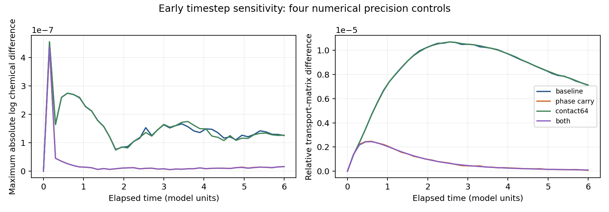

# Short moving-geometry precision diagnosis

The frozen chemical-integrator check [passes all 18 runs](chemistry_accuracy.md). The next diagnostic tests two numerical precision paths during changing geometry, while preserving the accepted production backend and the unresolved long formation result.

## Matched design

Reuse mature history 9 at physical time 150, with the exact geometry, polarity, cell IDs, lineage, random streams and near-uniform chemical start from the previous fine run. Keep 16 cells, a 72³ grid, beta=2, D_a=0.02, D_b=0.55, zero directional polarity-tension contrast, and activity-dependent tension/adhesion coefficients 0.25/0.35. The polarity variable still evolves; zero directional contrast removes its contribution to anisotropic surface tension.

Run a factorial comparison of four numerical controls at dt=0.001875 and 0.0009375. Each moves for six model time units, to physical time 156, with observations every 0.15 and atomic checkpoints every 3. There are **eight numerical trajectories within one existing history**, not eight independent histories.

| Control | Phase-field updates | Cell-contact accumulation |
|---|---|---|
| Baseline | Existing float32 storage | Existing float32 matrix product, then cast to float64 |
| Phase carry | Preserve lost update increments in a float64 residual; visible field remains float32 | Existing product |
| Contact64 | Existing float32 storage | Convert the existing float32 surface-shell values to float64 before the matrix product |
| Both | Phase carry | Contact64 |

PyTorch owns resident GPU arrays and matrix operations. Custom CUDA updates mechanics and computes spatial geometry and polarity. Jobs run sequentially on the scientific GTX 1080 Ti to avoid GPU contention. Four CPU workers were used only for the earlier small frozen ODE experiment.

## What the interventions change

For a visible phase value phi, mechanical increment d, and saved carry r, the phase-carry control stores the rounded value `phi_new = float32(float64(phi) + r + d)` and retains the remainder in float64. Geometry, derivatives, occupancy and surface-shell arrays still use the visible float32 field. The carry is part of the checkpoint state and is preserved exactly on restart. This isolates accumulation of small updates; it is **not a full float64 mechanics or geometry solver**.

Contact64 computes the contact matrix from the same surface-shell samples but sums their products in float64. Because contact weights feed both conservative chemical transport and polarity alignment, this control changes the rounding of both pathways. Other force and geometry arithmetic, graph cutoffs, interface width, constitutive laws and splitting order are unchanged.

The kernel additionally counts nonzero mechanical updates that would round back to the existing visible value without a carry. This is a diagnostic of the selected rounding path, not an error estimate: a tiny intended update need not be biologically consequential.

## Validation before launch

All 13 targeted GPU software tests pass, including the accepted backend checks, CUDA stream behavior, contact agreement with a float64 CPU matrix product, conservative graph identities, pointer contracts and bit-exact checkpoint restart for every arm. A deliberately tiny-step case verifies that the rounding counter detects updates below float32 precision. The main two-cell synthetic state need not have such updates at every tested step.

On the **actual history-9 starting state**, at both study timesteps, the new baseline matches the accepted kernel bit for bit over 16 steps, including phase fields, chemical state, polarity, geometry, transport and clocks. The first phase-carry step with zero residual is also bit identical. The combined-control checkpoint reproduces four further steps exactly, including its residual. These gates are recorded in `outputs/geometry-precision/implementation-gate.json`.

The original four full native/GPU validation trajectories remain the accepted backend evidence. The original exact-context native/GPU prefixes pass at both timesteps. Those gates validate the baseline and tested context; they do not establish full-horizon scientific equivalence of the numerical interventions.

## Quality and interpretation

Every step retains the original volume error below 5%, equivalent radius at least four grid spacings, no clipping, finite positive chemical state and dilution amount error at most 2e-14. Sampled boundary occupancy must remain below 0.01. Source, input, compiler binary, software/device and protocol hashes are checked; the original scientific source bytes and failed long-run results remain unchanged.

Compare the two timesteps within each control, and each intervention with its baseline at the same timestep. Report maximum absolute log chemical differences, volume/transport discrepancies, polarity and center differences, instantaneous uniform-growth differences, and endpoint phase-field differences. Record quality separately; no new short-window discrepancy threshold is used to accept the full formation trajectory.

This is an **early six-unit numerical diagnosis**, far before the original mismatch near elapsed 118. If one control reduces the early discrepancy, that is grounds for a longer matched confirmation, not proof that it resolves formation. A negative result also cannot exclude other float32 arithmetic, operator splitting or nonlinear sensitivity. The long history-9 quantitative gate remains unresolved. No new zygote development, spatial convergence, GPU cleavage or autonomous identity claim follows from this assay.

## Execution and artifacts

The separate experimental modules are [geometry_precision.py](../embryo/geometry_precision.py), [gpu_precision_control.py](../embryo/gpu_precision_control.py) and [gpu_precision_kernels.cu](../embryo/gpu_precision_kernels.cu). The accepted kernel is included unchanged by the experimental build; its binary is preserved under its own content hash. The precision build has a separate cache name.

```bash
CUDA_DEVICE_ORDER=PCI_BUS_ID CUDA_VISIBLE_DEVICES=1 \
OPENBLAS_NUM_THREADS=1 OMP_NUM_THREADS=1 MKL_NUM_THREADS=1 \
python -m embryo.geometry_precision run
```

The protocol, launch, status, histories and carry-preserving checkpoints are in `outputs/geometry-precision/`. An exclusive coordinator lock prevents duplicate runs; interrupted jobs resume from their last complete atomic checkpoint. Root and per-job status files give live progress. Completed results are assessed from saved physical checkpoints and aligned histories; the independent verification is recorded below.

## Completed short-control results

**All eight six-unit continuations completed and passed the original quality screens.** These are numerical interventions within one existing history.



| Control | Max log chemical difference | Relative transport difference | Endpoint relative phase L2 difference |
|---|---:|---:|---:|
| baseline | 4.55072e-07 | 1.06877e-05 | 9.19628e-06 |
| phase_carry | 4.37015e-07 | 2.47232e-06 | 6.27124e-08 |
| contact64 | 4.55069e-07 | 1.068e-05 | 9.1984e-06 |
| both | 4.37016e-07 | 2.44168e-06 | 6.269e-08 |

Values compare dt=0.001875 with 0.0009375 over the aligned early window. Transport discrepancy is the maximum Frobenius-norm difference divided by the finer matrix norm; phase discrepancy is the endpoint L2 norm divided by the finer field norm. Neither is an estimate of the full formation error.

| Intervention | Chemical discrepancy / baseline | Transport discrepancy / baseline |
|---|---:|---:|
| phase_carry | 0.9603 | 0.2313 |
| contact64 | 1.0000 | 0.9993 |
| both | 0.9603 | 0.2285 |

A ratio below one indicates a smaller adjacent-timestep discrepancy in this early window. Precision controls are interventions, not independent exact solutions; compare their effect size with the baseline and do not infer full convergence from two timesteps.

Phase carry gives 0.231 times the baseline transport discrepancy and 0.960 times its peak chemical discrepancy. Contact64 alone gives ratios 0.999278 and 0.999994, respectively. Double contact accumulation alone has little effect here.

**The peak chemical metric hides a timing distinction.** Every arm peaks at the first saved moving observation, elapsed 0.15. The phase-carry curves then fall well below the baseline curves. The following post hoc descriptive profile distinguishes that early peak from later behavior; it adds no acceptance threshold and does not replace the maximum-error metric.

| Control | Peak elapsed time | Endpoint chemical difference | Max chemical difference after elapsed 1 |
|---|---:|---:|---:|
| baseline | 0.15 | 1.25678e-07 | 2.2691e-07 |
| phase_carry | 0.15 | 1.60229e-08 | 1.60229e-08 |
| contact64 | 0.15 | 1.26724e-07 | 2.27759e-07 |
| both | 0.15 | 1.6173e-08 | 1.6173e-08 |

Phase carry reduces the endpoint chemical discrepancy by about 87.3% (ratio 0.127), despite reducing the full-window peak by only about 4%. Thus the rounding correction also materially changes later chemical agreement in this short window. It is a candidate for longer confirmation; the remaining early peak leaves geometry/time splitting and other precision paths open. These data do not identify the cause of the original nonlinear transient.

Both new baseline runs reproduce all saved chemical, volume, transport, polarity, center and uniform-growth observations from the original six-unit prefixes exactly. Independent assessment recomputes all 328 saved graph spectra and contrast values, and verifies physical checkpoints, their carry state, aligned clocks, and source/input hashes.

The original 240-unit formation-transient failures remain unresolved. Chemical stepping on fixed geometry is accurate, and these early controls quantify selected spatial rounding paths, but identifying the source of the nonlinear transient requires a longer matched confirmation and/or prescribed-geometry splitting test. No identity or biological conclusion is promoted from this numerical assay.

## Next diagnostic

Two complementary confirmations are now justified. Extend the matched phase-carry pair through nonlinear formation to test whether the improved field/transport agreement persists and whether the original 0.01 long chemical gate passes. In parallel, test chemical integration against one prescribed changing geometry from the saved fine trajectory. Interpolate cell volumes and symmetric nonnegative face conductances, then reconstruct the conservative operator; directly interpolating transport matrices while volumes vary can break conservation. Use compartment amounts (volume times concentration) for independent DOP853/Radau references, so dilution is handled through the prescribed volume without a separate numerical split. Compare the current beginning-of-step transport/dilution update with a midpoint-time alternative at the same three timesteps. Validate the reference and interpolation dependence before attributing an error to splitting. The latter isolates chemical–geometry time coupling while leaving production mechanics unchanged. Neither follow-up is launched by this assessment.

Reproduce the completed assessment with:

```bash
OPENBLAS_NUM_THREADS=1 OMP_NUM_THREADS=1 MKL_NUM_THREADS=1 \
MPLCONFIGDIR=/tmp/embryo-mpl python -m embryo.geometry_precision_assessment
```

The [completed verification](geometry_precision_verification.json) records the eight trajectories and independent checks. The consolidated ledger and manuscript remain their prior snapshots.
