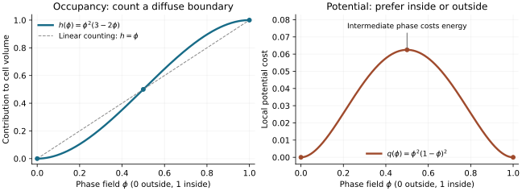

# Model definition

This document describes the historical core model and its prescribed fate switch. The newer [attribute-development branch](attribute_development.md) removes that switch and records continuous phenotypes; it is a separate experiment rather than a silent reinterpretation of earlier results.

The current conservative signaling equations, dilution, and spectral analysis are specified in [live_transport.md](live_transport.md). Historical normalized signaling and current polarity mechanics are specified in [graph_signaling.md](graph_signaling.md). The scalar activity below is the downstream fate variable, distinct from activator and inhibitor.

All coordinates, times, activities, energies, and coefficients are dimensionless. The model is generic. Parameters are illustrative rather than measured.

## Reading the equations

This document explains the mechanical and fate rules implemented in `embryo/model.py`; [conservative signaling](live_transport.md) and [polarity mechanics](graph_signaling.md#apicalbasal-polarity-and-mechanics) give the complementary rules. Read an equation first as a balance of competing effects, then use its coefficients to ask which effect acts most strongly or most quickly.

| Notation | How to read it |
|---|---|
| $i,j$; $\mathbf{x}$; $t$ | Cell labels; spatial position; time. A field depends on position within the box, whereas a cell-level variable has one value per cell. |
| $\int_\Omega u\,\mathrm d\mathbf{x}$ | Add the quantity $u$ over the 3D computational box; the code approximates this with voxel values times $\Delta x^3$. |
| $\nabla\phi$; $\lVert\nabla\phi\rVert^2$ | Spatial rate of change; its squared magnitude. Large values identify a sharp boundary. |
| $\nabla\cdot(\gamma\nabla\phi)$ | Divergence of a spatial flux; it includes variation of both $\phi$ and $\gamma$. |
| $\dot f$; $\partial_t\phi$ | Time rate of change of a cell variable; time rate of change of a spatial field. |
| $h'(\phi)$; $q'(\phi)$ | Ordinary derivatives of scalar functions. |
| $\delta E/\delta\phi$ | Functional derivative: the first-order change in total energy caused by changing the field locally. |
| $V_i^{\mathrm{target}}$ | Preferred volume, also written $V_i^\star$ in the README; it is distinct from measured $V_i$. |
| $A_{ij}$; $\mathcal A_{ij}$ | Adhesion energy coefficient; geometric contact area. These are different quantities. |

“Dimensionless” means the variables have been scaled by unspecified reference units. Model length, time, and energy still have distinct roles: $\epsilon$ and $\Delta x$ are lengths, diffusion coefficients scale as length squared per time, and a rate scales as inverse time. No conversion to micrometers, seconds, or measured cellular forces has been calibrated.

There are three different kinds of input. **Constitutive choices** specify how cells interact (for example, the adhesion law). **Rate and strength parameters** set their relative importance. **Numerical choices**, such as $\Delta x$ and $\Delta t$, determine how accurately those rules are solved. Changing a constitutive parameter is a different experiment from refining the grid or time step.

## Geometry

Cell $i$ has a diffuse indicator $\phi_i(\mathbf{x}) \in [0,1]$. Its occupancy and volume are

$$
h(\phi) = \phi^2(3-2\phi),
\qquad
V_i = \int_{\Omega} h(\phi_i)\,\mathrm{d}\mathbf{x}.
$$

Here $\Omega$ is the computational domain. The initial zygote is a radius-0.8 sphere with a smooth interface. Cell shapes are free to change. The finite computational box uses zero-normal-gradient boundary conditions and must be large enough to avoid affecting the embryo.

### Why occupancy is a cubic

The phase field is an indicator with a diffuse boundary, not a probability distribution or a physical material density. We choose a volume-counting function that satisfies

$$
h(0)=0,\qquad h(1)=1,\qquad h'(0)=h'(1)=0.
$$

Requiring these four conditions of a cubic determines $h(\phi)=3\phi^2-2\phi^3$. It increases monotonically on $[0,1]$, gives half occupancy at $\phi=1/2$, and makes volume insensitive to first-order field changes in uniform interior/exterior regions. Its derivative is

$$
h'(\phi)=6\phi(1-\phi).
$$

Thus volume-restoring forces mainly move the diffuse boundary. The volume integral counts fractional boundary voxels instead of abruptly counting only voxels above a threshold. Other smooth interpolations are possible; this one is a convenient assumption whose consequences still need resolution checks.

### Why the potential is a quartic

Define

$$
q(\phi)=\phi^2(1-\phi)^2,
\qquad q'(\phi)=2\phi(1-\phi)(1-2\phi).
$$

The potential is nonnegative and symmetric under $\phi\mapsto1-\phi$. It has minima at 0 and 1, and a maximum $1/16$ at $1/2$. In isolation, the restoring term $-q'(\phi)$ pushes values below $1/2$ toward zero and values above $1/2$ toward one. It therefore discourages a broad intermediate phase. The gradient cost opposes infinitely abrupt transitions, so the two terms together produce a smooth interface rather than either a step function or a spatially uniform intermediate value.

The squared factors are a simple way to give both pure phases zero energy and zero slope. Their use is a modeling convention, not evidence that cellular cortex energy literally follows a quartic polynomial. Notice also that $q=s^2$ for the interface-shell weight $s=\phi(1-\phi)$: this is why $q_iq_j$ can select contact between two diffuse boundaries.

The panels have different vertical scales: occupancy counts volume, whereas the potential contributes to interface energy. They are different functions with different jobs.

### Baseline energy: four competing costs

With fate, target volumes, cell centroids, and the spatial tension coefficient $\gamma_i(\mathbf{x})$ frozen during the mechanical update, the energy is:

$$
\begin{aligned}
E ={}&
\sum_i \int_{\Omega} \gamma_i(\mathbf{x})
\left[
\frac{\epsilon^2}{2}\lVert \nabla\phi_i \rVert^2
+ q(\phi_i)
\right]\,\mathrm{d}\mathbf{x}
\\
&+ \sum_i \frac{K_V}{2V_i^{\mathrm{target}}}
\left(V_i-V_i^{\mathrm{target}}\right)^2
\\
&+ \frac{R}{2}\sum_{i<j}
\int_{\Omega}\phi_i^2\phi_j^2\,\mathrm{d}\mathbf{x}
\\
&- \sum_{i<j} A_{ij}
\int_{\Omega}q(\phi_i)q(\phi_j)\,\mathrm{d}\mathbf{x}.
\end{aligned}
$$

The equation can be read as $E=E_{\mathrm{interface}}+E_{\mathrm{volume}}+E_{\mathrm{overlap}}+E_{\mathrm{attraction}}$. The first three contributions are nonnegative; attraction is negative. There is no global embryo template in these terms.

| Contribution | Interpretation of the mathematical form |
|---|---|
| Interface | A squared gradient penalizes steep spatial changes in every direction equally. The potential prefers pure phases. Their competition assigns a cost to cell boundary area. An isolated cell with constrained volume consequently tends toward a compact shape. |
| Volume | A quadratic is the simplest smooth penalty with zero value and zero derivative at the preferred volume. It penalizes equal positive and negative volume deviations equally. The normalization by target volume makes the restoring coefficient depend on fractional volume error. |
| Overlap | The product is large when both cells have interior values near one at the same location, and vanishes when either field is zero. It discourages interpenetration without imposing a hard geometric exclusion constraint. |
| Attraction | The two $q$ factors select overlapping interfaces; the minus sign rewards this contact. The term is small deep inside either cell, unlike a bulk-overlap attraction. |

The pair sum $i<j$ avoids counting interactions twice. The factor $1/2$ in the overlap term additionally defines the convention for $R$: differentiating with respect to either cell field gives $R\phi_i\phi_j^2$, not $2R\phi_i\phi_j^2$. Similarly, the volume factor $1/2$ cancels the derivative of the square. These factors set coefficient definitions rather than adding a separate biological mechanism.

For relative volume error $e_i^V=(V_i-V_i^{\mathrm{target}})/V_i^{\mathrm{target}}$, the volume cost becomes

$$
E_{\mathrm{volume},i}=\frac{K_V V_i^{\mathrm{target}}}{2}(e_i^V)^2,
\qquad
\frac{\partial E_{\mathrm{volume},i}}{\partial V_i}=K_V e_i^V.
$$

A larger cell pays proportionally more total energy for the same fractional error, but the derivative with respect to volume has the same magnitude. This is a soft penalty: it permits force balance at a small nonzero error. It is not a solved hydrostatic pressure or a fluid incompressibility equation.

| Symbol | Configuration field / state | Default | Role |
|---|---|---:|---|
| $\epsilon$ | `interface_width` | 0.085 | Diffuse-boundary length scale; also affects interface energy per area. |
| $\gamma_0$ | `surface_tension` | 1 | Baseline coefficient multiplying the interface energy. |
| $K_V$ | `volume_stiffness` | 12 | Restoring strength per relative volume error. |
| $R$ | `repulsion` | 3 | Strength of the bulk-overlap penalty. |
| $A_0$ | `adhesion` | 4 | Baseline strength of diffuse-interface attraction. |
| $V_i^{\mathrm{target}}$ | `sim.target[i]` | Initial measured zygote volume, then partitioned | Preferred cell volume, not a growth rate. |
| $\gamma_i(\mathbf{x}), A_{ij}$ | Computed from fate/polarity and baseline coefficients | State-dependent | Local interface cost and pair attraction coefficient. |

Increasing stiffness or repulsion strengthens the corresponding restoring force, but may require a smaller explicit time step. Increasing attraction favors contact, but cannot be interpreted independently of repulsion, tension, and diffuse width. Coefficient magnitudes are not directly comparable: $A_0=4$ versus $R=3$ does not mean adhesion wins, because they multiply different functions and spatial regions.

### How the energy generates shape change

For fixed coefficients and targets, the passive variational force is

$$
\begin{aligned}
-\frac{\delta E}{\delta\phi_i}
={}&\epsilon^2\nabla\cdot(\gamma_i\nabla\phi_i)-\gamma_i q'(\phi_i)\\
&+K_V\frac{V_i^{\mathrm{target}}-V_i}{V_i^{\mathrm{target}}}h'(\phi_i)\\
&-R\phi_i\sum_{j\ne i}\phi_j^2\\
&+q'(\phi_i)\sum_{j\ne i}A_{ij}q(\phi_j).
\end{aligned}
$$

This is the force assembled in `Simulation.mechanical_step`, before division forcing, clipping, and volume projection. If a cell is too small, the volume term is positive at its boundary, increasing occupancy; if it is too large, the sign reverses. The repulsion term reduces field values where another cell overlaps. The attraction term's sign depends on the side of the interface through $q'$: it reshapes interfaces to increase their overlap, rather than adding occupancy everywhere.

For variable tension, $\nabla\cdot(\gamma\nabla\phi)=\gamma\nabla^2\phi+\nabla\gamma\cdot\nabla\phi$. Retaining only $\gamma\nabla^2\phi$ would omit the spatial-tension-gradient contribution. The tension field is held fixed in this derivative; the code does not differentiate through its centroid or regulatory dependence.

Mechanics follows overdamped gradient descent with mobility set to one (outside active furrowing):

$$
\frac{\partial\phi_i}{\partial t}
= -\frac{\delta E}{\delta\phi_i}.
$$

A more general notation is $\partial_t\phi_i=-m_\phi\,\delta E/\delta\phi_i$, with positive mobility $m_\phi$. Setting it to one chooses the mechanical time scale. There is no inertial acceleration, velocity field, or fluid momentum equation in this update.

For the ideal continuous passive problem with all coefficients fixed and compatible reflecting boundaries,

$$
\frac{\mathrm dE}{\mathrm dt}
=-\sum_i\int_\Omega\left(\frac{\delta E}{\delta\phi_i}\right)^2\,\mathrm d\mathbf{x}\le0.
$$

This explains the minus sign. It does not prove monotone energy decrease for a finite explicit step, nor for the actual active system with changing coefficients, furrow forces, clipping, and constraints. Energy here is a mechanical construction, not an organism's fitness or metabolic expenditure.

### Interface width is not grid spacing

For an isolated flat interface, constant $\gamma$, and no other forces, stationarity gives

$$
\epsilon^2\phi''=q'(\phi),
\qquad
\frac{\epsilon^2}{2}(\phi')^2=q(\phi).
$$

The second relation follows by multiplying the first by $\phi'$ and using pure-phase limits. Integrating the energy through the interface gives its cost per area:

$$
\sigma_{\mathrm{flat}}
=\gamma\epsilon\int_0^1\sqrt{2q(\phi)}\,\mathrm d\phi
=\frac{\gamma\epsilon\sqrt{2}}{6}.
$$

Consequently, increasing $\epsilon$ at fixed $\gamma$ changes both interface thickness and interface energy. Some other phase-field conventions normalize the gradient and potential differently to hold this cost fixed; those conventions cannot be substituted silently here. $\Delta x$ is instead the numerical voxel spacing. Refining $\Delta x$ at fixed $\epsilon$ resolves the same diffuse model more accurately. Reducing $\epsilon$ changes the model and its contact calibration as well, and requires a separate study.

The production kernel reuses current-state occupancy/volume arrays and evaluates only the spatial operator selected by the tension model; [exact trajectory comparisons and timing](signal_patch.md#equation-preserving-kernel-optimization) document this optimization. The code uses a finite-difference Laplacian and explicit time integration. Values are clipped to $[0,1]$; `clipped_fraction` exposes this numerical safeguard. Check step-size sensitivity, especially after division, rather than assuming clipping makes the method accurate.

The attraction is a phenomenological attraction between diffuse interface regions, not a calibrated cadherin or junction model. The volume penalty is soft outside cytokinesis; a dividing mother additionally uses the volume constraint below. Changing fate, cleavage, and stochastic dynamics mean the full simulation is not a passive energy-minimization process.

## Regulatory activity

Each cell has a signed scalar $f$, a reduced normal form for competition between two possible identities. It is not a concentration, and need not lie in $[-1,1]$. The isolated deterministic switch

$$
\frac{\mathrm{d}f}{\mathrm{d}t}=r_f(f-f^3)
$$

has stable states at $-1$ and $+1$, with an unstable state at $0$.

The switch is the downhill dynamics of a separate local potential $U(f)=f^4/4-f^2/2$: $\dot f=-r_f U'(f)$. Its two minima express **assumed bistability**. They are not derived from the mechanical double-well potential $q(\phi)$, which separates inside from outside rather than A from B. Linearization gives growth rate $r_f$ at zero and decay rate $-2r_f$ at either unbiased stable state. Even a small transient signal bias can therefore choose a fate that persists after the bias disappears; two labels alone do not demonstrate a sustained Turing pattern.

After the configured competence cell count, the discrete update over a time step $\Delta t$ is:

$$
\begin{aligned}
\Delta f_i ={}&
r_f\left[
f_i-f_i^3
-k_n\,\overline{f}_{i,\mathrm{neighbor}}
+b_e(e_i-0.5)+g_a(a_i-1)
\right]\Delta t
\\
&+\sigma_f\sqrt{\Delta t}\,\xi_i,
\qquad \xi_i\sim\mathcal{N}(0,1).
\end{aligned}
$$

| Symbol | Configuration name (default) | Effect |
|---|---|---|
| $r_f$ | `fate_rate` (0.8) | Multiplies the deterministic response; larger values make commitment faster for the same forcing. |
| $g_a$ | `signal_fate_gain` (1) | Bias strength relative to the reference activator level 1. |
| $k_n$ | `neighbor_inhibition` (0) | Optional legacy bias against the contact-weighted mean neighbor fate. |
| $b_e$ | `exposure_bias` (0) | Optional legacy bias from exposure above or below 0.5; distinct from inhibitor $b_i$. |
| $\sigma_f$ | `fate_noise` (0) | Additive noise amplitude. The $\sqrt{\Delta t}$ scaling makes increment variance proportional to elapsed time. |
| Competence count | `competence_cells` (4) | Population gate for the core fate update, supplied as a developmental assumption. |
| Label threshold | `fate_threshold` (0.55) | Reporting threshold; it does not alter the drift equation. |

The activator activity is $a_i$, with homogeneous equilibrium $a_i=1$; $g_a$ is `signal_fate_gain`. The legacy neighbor inhibition, exposure bias, independent fate noise, and fate partition noise are zero by default, so graph signals provide the default bias.

Here $\overline{f}_{i,\mathrm{neighbor}}$ is the contact-weighted neighbor activity, $e_i$ is the exposure proxy, and $\xi_i$ is an independent standard normal draw for each cell and time step.

Neighbor weights are integrals of overlapping $\phi(1-\phi)$ interface shells. The exposure proxy is the shell-weighted mean of

$$
1-\operatorname{clip}\left(
2\sum_{j\ne i}h(\phi_j),\,0,\,1
\right).
$$

It is not an exact free-surface area fraction. The fixed exposure reference $0.5$ is an explicit model assumption, not calibrated biology.

The neighbor term is lateral inhibition: it can favor different activities among contacting cells. The exposure term biases externally exposed cells toward positive activity. Neither guarantees both identities in every run. The frozen activator–inhibitor subsystem has a discrete linear stability analysis, but it does not establish stability of this complete fate–geometry system on a growing graph.

Positive activity is called A and negative activity B. Counts use $f>0.55$ or $f<-0.55$; remaining cells are uncommitted. Stable commitment requires future persistence and perturbation assays.

The core dashboard solver uses the explicit fate update written above. The later [joint fate integration](joint_fate.md) experiment advances deterministic signal and fate variables at shared RK stages to resolve a documented integration sensitivity; its moving pilot has no additional cleavage. That experiment does not silently replace the core solver or validate the optional stochastic terms.

The completed [withdrawal assay](fate_memory.md) tests this distinction directly: short transient activator input seeds later bistable commitment, while a matched relaxing switch loses labels after withdrawal. The subsequent [isolated-switch reversal/noise assay](fate_robustness.md) characterizes reversibility and stochastic sensitivity; robustness within the moving embryo remains a separate test.

## Feedback

When enabled:

$$
\begin{aligned}
\gamma_i^0
&= \gamma_0\left[1+c_{\mathrm{tension}}\tanh(f_i)\right],
\\
A_{ij}
&= A_0\left[1+c_{\mathrm{adhesion}}\tanh(f_i)\tanh(f_j)\right].
\end{aligned}
$$

The feedback coefficients $c_{\mathrm{tension}}$ and $c_{\mathrm{adhesion}}$ correspond to `fate_tension` and `fate_adhesion` in the configuration.

The function $\tanh(f)$ is smooth, preserves the sign of fate, and stays between −1 and 1 even if $f$ goes outside that interval. This bounds tension between $\gamma_0(1-c_{\mathrm{tension}})$ and $\gamma_0(1+c_{\mathrm{tension}})$, and similarly bounds attraction. The same-sign product in $A_{ij}$ increases attraction; opposite signs decrease it. These are saturating constitutive choices, not consequences of the Gierer–Meinhardt equations. Setting a contrast to zero removes that coupling; it does not remove signaling or the fate switch.

These coefficients define the isotropic baseline. When apical–basal polarity is enabled, the spatial tension field and its flux-divergence force are given in [graph_signaling.md](graph_signaling.md#apicalbasal-polarity-and-mechanics). Thus A-like cells have higher baseline effective surface tension, and similarly biased cells have stronger interface attraction. These are hypotheses, not established effects of any named genes. Coefficients are bounded to retain positive tension/attraction. Geometry is measured anew before each regulatory step.

## Cleavage and progressive cytokinesis

The default division rule is Hertwig-style shape alignment. For the mother cell, form its occupancy-weighted covariance:

$$
\begin{aligned}
\mathbf{c}_i &= \frac{1}{V_i}\int_{\Omega}\mathbf{x}\,h(\phi_i)\,\mathrm{d}\mathbf{x},\\
\mathbf{C}_i &= \frac{1}{V_i}\int_{\Omega}
(\mathbf{x}-\mathbf{c}_i)(\mathbf{x}-\mathbf{c}_i)^{\mathsf T}
h(\phi_i)\,\mathrm{d}\mathbf{x}.
\end{aligned}
$$

The spindle follows the largest-eigenvalue eigenvector of $\mathbf{C}_i$; the cleavage plane is **perpendicular** to this direction. Eigenvalues within the configured relative tolerance (`axis_degeneracy`, default 0.03) of the largest form a nearly degenerate subspace. A random vector is projected into that subspace and normalized. Thus a sphere has an isotropic fallback, while an oblate cell selects an axis within its long-axis plane, without privileging grid eigenvectors. `division_orientation="isotropic"` is retained only as an explicit control. No calibrated tensile-stress tensor is currently available, so this rule uses shape, not a claimed stress estimate.

Cell-cycle durations are sampled around a configured mean. Reaching the scheduled time **starts** cytokinesis and reserves a future cell slot. It does not replace the mother, alter its occupancy, or create a new contact. The initial plane offset bisects the mother's occupancy. The axis and offset are held fixed relative to the moving cell centroid throughout the event.

### Mechanical furrow

Let $s$ be signed distance from the cleavage plane, $r_\perp$ the distance from the spindle axis, $t_0$ the onset time, and $T$ the configured constriction duration. The smooth ramp and contracting radius are

$$
\begin{aligned}
u &= \operatorname{clip}\left(\frac{t-t_0}{T},0,1\right),\\
S(u) &= u^2(3-2u),\\
R_{\mathrm{ring}}(t) &= R_0[1-S(u)].
\end{aligned}
$$

The dimensionless progress $u$ runs from zero to one over nominal duration $T$ (`cytokinesis_duration`, 0.9). $S$ is the same cubic smoothstep used for occupancy, but here its argument is progress rather than a phase field: $S(0)=0$, $S(1)=1$, and both endpoint slopes vanish. This avoids an abrupt onset or stop of the prescribed ramp. $R_{\mathrm{ring}}(t)$ is the ring radius, distinct from the repulsion coefficient $R$ in the baseline energy.

Here $R_0$ is the largest radial extent of the mother's $\phi_i\ge 0.5$ interior at onset. A contracting annular potential, confined near the equator, drives furrow ingression:

$$
\begin{aligned}
B(s) &= \exp\left(-\frac{s^2}{2\epsilon^2}\right),\\
H(r_\perp,t) &= \frac12\left[1+\tanh\left(\frac{r_\perp-R_{\mathrm{ring}}(t)}{\epsilon}\right)\right],\\
E_{\mathrm{furrow},i}(t) &= \kappa S(u)\int_{\Omega}
B(s)H(r_\perp,t)h(\phi_i)\,\mathrm{d}\mathbf{x},\\
F_{\mathrm{furrow},i} &= -\kappa S(u)B(s)H(r_\perp,t)h'(\phi_i).
\end{aligned}
$$

Read the product as three spatial/temporal selectors: $S(u)$ gradually turns forcing on; $B(s)$ localizes it near the cleavage plane; and $H$ selects the equatorial material outside the current ring radius. As that radius shrinks, the selected region moves inward. The positive energy cost discourages occupancy there, yielding the negative furrow force. $\kappa$ (`ring_strength`, 8) sets its amplitude. A larger $\kappa$ strengthens the drive but does not guarantee a resolved neck or accurate division at the current time step.

The spatial ring coordinates are held fixed during each mechanical substep and recomputed from the centroid at the next step. This is a **prescribed contracting-ring surrogate**, not a resolved actomyosin network or a calibrated line-tension/fluid model. The potential acts on the diffuse interface through $h'(\phi)=6\phi(1-\phi)$ and displaces cytoplasm from the advancing equatorial furrow. The ring strength is ramped from zero, avoiding a sudden force at onset.

A dividing mother retains its measured onset volume $V_i(t_0)$. After each explicit mechanical update to $\widetilde\phi_i$, a scalar interface-local correction enforces this constraint:

$$
\begin{aligned}
\phi_i^{n+1}
&=\operatorname{clip}\left(
\widetilde\phi_i+\alpha_i h'(\widetilde\phi_i),0,1\right),\\
\int_{\Omega}h(\phi_i^{n+1})\,\mathrm{d}\mathbf{x}
&=V_i(t_0).
\end{aligned}
$$

Here $\alpha_i$ is a per-step correction found by the constraint solve, not the fixed polarity response rate $\alpha$. Multiplication by $h'$ preferentially changes interface values, while the integral condition specifies how much occupancy must be restored. The scalar $\alpha_i$ is solved numerically, with relative volume tolerance $10^{-7}$ before float32 storage. `volume_projection_max` reports the largest correction coefficient per step. This is a numerical incompressibility constraint during cytokinesis, not an inferred hydrostatic pressure. Nondividing cells retain the original soft volume penalty. The measured onset volume can already differ slightly from the target, so the constraint preserves that existing error rather than causing a corrective jump at onset.

### Abscission and daughter inheritance

A completed timer alone cannot trigger abscission. After $T$, the mother remains active until both the maximum phase value in the resolved neck band and the normalized prospective daughter overlap fall below their configured thresholds (`neck_threshold=0.15`, `division_overlap_tolerance=0.002`). The neck band has half-width $\max(\epsilon/2,\Delta x/2)$. Both prospective lobes must carry more than 10% of the mother's volume. Unresolved events continue to constrict; `overdue_divisions` flags events older than $3T$, without forcing a cut.

Only then are daughter occupancies constructed:

$$
\begin{aligned}
w(s)&=\frac12[1+\tanh(s/\epsilon)],\\
h_1&=h(\phi_i)w(s),\qquad h_2=h(\phi_i)[1-w(s)],\\
\phi_1&=h^{-1}(h_1),\qquad \phi_2=h^{-1}(h_2).
\end{aligned}
$$

This final relabeling conserves occupancy pointwise; unlike the previous implementation, it happens after the mother has mechanically formed a thin neck. The overlap criterion uses $\int\phi_1^2\phi_2^2\,\mathrm{d}\mathbf{x}/V_i(t_0)$. The contact graph necessarily changes when two cell IDs appear, but overlapping daughter fields are no longer introduced into a full-width uncontracted mother.

Let $\theta=V_1/(V_1+V_2)$. Daughter target volumes follow the actual lobe fractions, preserving the mother's total target and each lobe's preexisting relative volume error:

$$
V_1^{\mathrm{target}}=\theta V_i^{\mathrm{target}},
\qquad
V_2^{\mathrm{target}}=(1-\theta)V_i^{\mathrm{target}}.
$$

There is no growth between divisions. A partitioning draw $\eta$ gives activities $f_1=f_i+2\eta(1-\theta)$ and $f_2=f_i-2\eta\theta$, preserving target-volume-weighted regulatory activity. This reduces to equal-and-opposite perturbations for equal lobes. Regulatory dynamics need not conserve this activity afterward.

Lineage records distinguish `division_start` from `division` (abscission), and store the spindle axis and neck/overlap diagnostics at completion. Daughter clocks begin at abscission. The cell cap includes reservations for active mothers, including non-power-of-two caps.

Independent mechanical and regulatory random streams remain separate. Coupled controls can nevertheless differ in cleavage orientation and completion timing because shape and mechanical relaxation now determine these events. Full active-event state is checkpointed. Checkpoint schema 3 includes signaling, polarity, and graph-event state. New checkpoints record `signal_transport`; historical schema-3 files lacking it explicitly restore `random_walk`, preserving their original dynamics; earlier checkpoints are rejected explicitly because their subsequent dynamics would differ.

## Shape diagnostics

The embryo's diffuse occupancy is

$$
\rho(\mathbf{x})=\min\left(\sum_i h(\phi_i(\mathbf{x})),\,1\right).
$$

Its volume-weighted covariance has eigenvalues $\lambda_1\le\lambda_2\le\lambda_3$. Define their mean as $\bar{\lambda}=(\lambda_1+\lambda_2+\lambda_3)/3$. The shape measures are

$$
\begin{aligned}
\text{Axis ratio}
&= \sqrt{\frac{\lambda_3}{\lambda_1}},
\\
\text{Asphericity}
&= \frac{3}{2}
\frac{\displaystyle\sum_{k=1}^{3}(\lambda_k-\bar{\lambda})^2}
{\displaystyle\left(\sum_{k=1}^{3}\lambda_k\right)^2}.
\end{aligned}
$$

Covariance eigenvalues measure squared spatial extents along principal directions, so the square root converts their ratio into a length ratio. Using the capped union $\rho$ avoids counting the same location more than once when diffuse cells overlap. Asphericity measures inequality among all three extents and is scale-independent. A sphere has ratio $1$ and asphericity $0$. Neither measure identifies the cause of asymmetry.

Fate separation is the distance between volume-weighted A and B cell centroids divided by embryo radius of gyration. It is undefined when either group is absent and cannot detect concentric inner/outer sorting on its own. Surface area and sphericity are not yet computed.

Boundary occupancy, minimum equivalent cell radius in grid spacings, aggregate/cell volume errors, and clipping are numerical diagnostics. Outputs sample them at `save_every`; unsampled transients may be larger.

See [cytokinesis validation and limitations](cytokinesis.md) for comparisons with the previous cleavage rule.

## References motivating the architecture

- [Maître et al., 2016](https://www.nature.com/articles/nature18958): contractility, positioning, and fate in mouse embryos.
- [Zhu et al., 2017](https://www.nature.com/articles/s41467-017-00977-8): cell polarization and early embryonic symmetry breaking.
- [MorphoSim](https://pmc.ncbi.nlm.nih.gov/articles/PMC9938209/): a multicellular phase-field framework for embryonic morphology.
- [Nissen et al., 2018](https://pmc.ncbi.nlm.nih.gov/articles/PMC6286147/): polarity interactions and emergent 3D tissue morphology.

- [A cytokinetic ring-driven cell rotation achieves Hertwig’s rule (2024)](https://pmc.ncbi.nlm.nih.gov/articles/PMC11194556/): cytokinetic ring mechanics and Hertwig-style orientation in early development.
- [Furrow Constriction in Animal Cell Cytokinesis (2014)](https://pmc.ncbi.nlm.nih.gov/articles/PMC3907238/): furrow constriction, cortical mechanics, and volume conservation.

This implementation is a simplified independent model, not a reproduction of these papers' equations or results.

