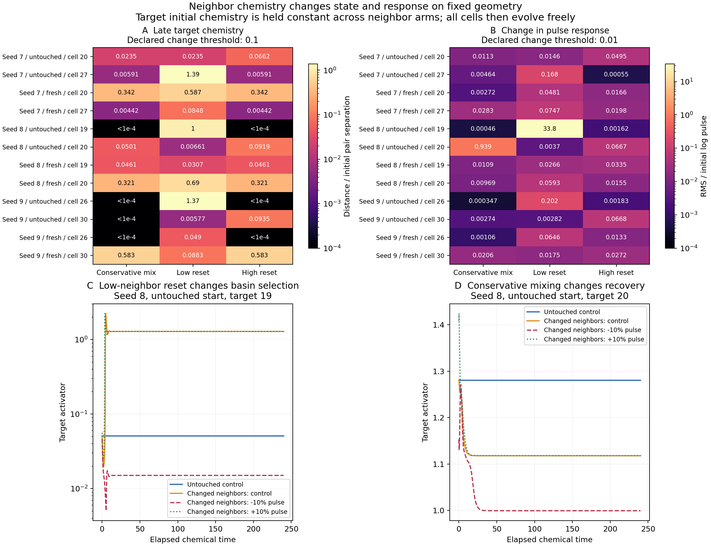

# Neighbor chemistry and cell-associated behavior

The moving exchange studies find donor-nearer pulse responses, but exchanging two cells can reorganize the whole chemical network. This assay asks a more specific question: **does a target retain its state and response when only its neighbors' initial chemistry changes?** It separates a cell-associated history from support by its interacting surroundings, without requiring a biological identity to be autonomous.

The frozen study was launched on **2026-10-03 at 19:19 EDT** with four CPU workers and completed all sixty arm jobs with numerical acceptance. Thirty-seven focused software checks passed before preparation, including conservative interventions with unequal volumes, changed target/dose rejection, weak challenges, recovery-metric verification, legacy-source validation, and a real parallel independent-solver run.

## Completed assessment

| Outcome | Result |
|---|---:|
| Arm jobs / chemical trajectories | 60 / 180 |
| Informative neighbor challenges | 36/36 |
| Late target chemistry shifted under the declared criterion | 11/36 |
| Local pulse-response comparisons shifted | 46/72 |
| Conservative mixing: late state shifts | 3/12 |
| Target and network pulse nonrecoveries | 2/72 each |
| Untouched target/network nonrecoveries | 0/24 |
| Maximum independent-solver log discrepancy | 1.73e-9 |
| Maximum sham discrepancy | 0 |

**Conservative averaging changes the low-state recipient's late concentrations in every fresh-exchange history.** These targets are IDs 20, 20, and 30 on seeds 7, 8, and 9. Their late state-distance ratios are 0.342, 0.321, and 0.583, exceeding the prespecified 0.1 criterion. The target itself was unchanged at the intervention, the contact graph remained fixed, and each species' amount was conserved. Thus surrounding chemical organization can change a cell-associated state without changing its initial chemistry or geometry. The twelve conservative interventions are nested within three histories; they are not twelve independent developmental replicates.

State proximity and response robustness are different. In seed 8's untouched background, conservative mixing around target 20 leaves its late state ratio at 0.0501, yet an immediate −10% pulse no longer recovers. A low-neighbor reset around target 19 also produces nonrecovery after an immediate negative pulse. Their untouched equivalents recover. Both negative-pulse endpoints have small chemical residuals (below 5.4e-13) and negative maximum real Jacobian eigenvalues (−0.336 and −0.601), and differ from their own unperturbed controls. This is **exploratory evidence of alternative stable network endpoints selected during reorganization**, rather than failed integration. All sixty unperturbed controls also settle to locally stable chemical endpoints.

The extra pulse-endpoint stability inspection was performed after observing nonrecovery and is identified as exploratory in `summary.json`. Immediate pulses act during neighborhood reorganization; these results do not establish loss of stability at a settled equilibrium. The [completed delayed-pulse follow-up](neighbor_context_delayed.md) now separates these questions: all 24 delayed pulses recover, including current ±10% pulses, original-amount-matched pulses, untouched references, and checks of both alternative endpoints. This supports basin selection during reorganization alongside robustness of the resulting equilibria. The follow-up is selected from two cases within seed 8, not independent cross-history replication. Distinct frozen chemical endpoints do not establish permanent memory or inherited cell identity.

All 72 descriptive nearest-reference comparisons still favor the target's own untouched response, even though 46 exceed the declared response-shift threshold. The most extreme response distance is 33.8 times the initial log pulse. This shows why nearest-reference labels alone cannot establish behavioral equivalence or autonomy. Continuous distances, state changes, and recovery must be examined together.



Figure: late chemistry ratios and maximum response RMS changes across both pulse signs; panels C/D show the two nonrecovery cases. Color scales are logarithmic and values below 1e-4 are displayed at the lower limit. All curves use the original 240-unit assay. Numerical thresholds are the ones specified before execution.

Evidence: `outputs/neighbor-context/results.json`, `summary.json`, the frozen protocol, and complete per-arm trajectories. A separate read-only reconstruction reproduces every saved comparison and verifies hashes. Reproduce the assessment/figure with `python -m embryo.neighbor_context_summary`. Delayed pulses are complete in their own preserved protocol; moving-geometry confirmation of the conservative and reset controls is next.

## Starting states and interventions

Use the original t=210 untouched and fresh-exchange physical starts from developmental histories 7, 8, and 9. These are the same starts used by the completed response refinements; newly refined formation endpoints are not substituted. Each background supplies its measured volumes and conservative contact operator. Shape, polarity, volumes, topology, and conductances remain frozen throughout this assay. The two original targets remain IDs 20/27, 19/20, and 26/30 respectively. They are not reselected by new response outcomes.

For target $i$, direct neighbors are the cells with positive off-diagonal entries $\Delta_{ij}>0$. Every intervention keeps both target species and every nonneighbor's initial chemistry exactly unchanged.

| Arm | Initial change | Chemical amount |
|---|---|---|
| Untouched | Original chemistry | Unchanged |
| Sham | Copy neighbor values back unchanged | Unchanged |
| Neighbor mixing | Replace neighbor values by their measured-volume weighted mean, separately for each species | Conserved for each species |
| Low-state neighbors | Copy both species from the cell with minimum initial activator into every neighbor | Externally added/removed amounts recorded |
| High-state neighbors | Copy both species from the cell with maximum initial activator into every neighbor | Externally added/removed amounts recorded |

Template selection uses the initial state in that physical background, with cell-ID tie breaking. “Low” and “high” describe chemical values, not prescribed identities. Averaging alone can be a weak intervention when neighbors already resemble each other, which motivates the reset arms. The resets do not isolate spatial arrangement from total chemical amount; the conservative arm addresses that distinction.

All interventions happen **once at assay time zero**. Afterwards, all sixteen cells evolve freely under the same Gierer–Meinhardt reactions and frozen conservative transport. No cell or external reservoir is held fixed. For species $s$, the conservative neighbor mean is

$$
\overline c_N^s=\frac{\sum_{j\in N(i)}V_jc_j^s}{\sum_{j\in N(i)}V_j}.
$$

Here $V_j$ is measured compartment volume, so averaging preserves molecular amount rather than the unweighted sum of concentrations. Because the target's own initial chemistry is identical, its initial reaction term is identical. Its initial derivative difference is exactly the changed incoming transport:

$$
\delta\dot c_i^s(0)=D_s\sum_{j\in N(i)}\Delta_{ij}\delta c_j^s(0).
$$

The assay records this quantity to connect the intervention to the earliest response. Subsequent differences include nonlinear feedback and propagation through the entire network.

## Persistence and pulse responses

Each arm has a 240-unit unperturbed chemical continuation and independent immediate −10%/+10% target activator pulses. Every pulse is compared with that arm's own unperturbed continuation. Since target initial chemistry and volume are identical across arms, each pulse sign delivers the same absolute target dose across arms. Pulse amounts are external and recorded separately from neighbor-intervention amounts.

The signed two-species local response is the log pulse/control ratio divided by the absolute log pulse. Response differences are time RMS distances over the matched 240-unit horizon. References are the untouched response of the same target and the other prespecified target **on this same frozen graph**. They are descriptive comparisons, not identities, and cannot be substituted by the earlier 60-unit moving response curves.

State persistence uses the target's two-species log RMS difference from its untouched continuation, maximized over the final 24 units. Divide by the initial log separation between the two selected targets to express the change relative to their original differences. Report raw distances, ratios, endpoint derivatives, full chemical Jacobian growth rates, recovery times, and network effects.

Decision rules are frozen before execution:

- Neighbor challenge log RMS at least 0.05 and initial target-pair separation above 0.1 are required for an informative state comparison. Weak interventions remain explicit outcomes.
- A late state-distance ratio at most 0.1 describes proximity to the untouched target state. It does not establish an attractor or autonomous identity.
- Local response RMS change above 0.01 describes a response shift. A nearest-reference comparison additionally needs untouched target/other response separation above 0.01.
- Recovery uses the existing sustained 10%-of-initial-displacement rule with at least 24 subsequent units observed.
- Frozen endpoint stationarity requires maximum chemical derivative below 1e-6; local chemical stability additionally requires negative maximum real Jacobian eigenvalue. Failure to settle is a valid scientific outcome.

## Numerical checks and execution

There are **60 arm jobs**: three histories × two backgrounds × two targets × five arms. Each contains its control and two pulse trajectories, independently integrated with DOP853 and Radau using the existing analytic Jacobian, relative tolerance 1e-12 and absolute tolerance 1e-14. Maximum cross-solver log discrepancy must be below 1e-5, with positive finite chemistry. Sham/control discrepancies must be at most 1e-10. Conservative intervention amount error must be at most 2e-14. Recomputed numerical metrics allow only roundoff (relative 1e-12, absolute 1e-14); recovery classifications and sampled times must agree exactly.

Four CPU workers handle these small, 32-variable frozen ODE systems, with BLAS threads limited to one per worker. This stage has no mechanics kernel. Moving follow-ups will retain the validated resident PyTorch/custom-CUDA architecture and require checks for their new starting contexts.

```bash
OPENBLAS_NUM_THREADS=1 OMP_NUM_THREADS=1 MKL_NUM_THREADS=1 \
python -m embryo.neighbor_context prepare

OPENBLAS_NUM_THREADS=1 OMP_NUM_THREADS=1 MKL_NUM_THREADS=1 \
python -m embryo.neighbor_context run --workers 4

python -m embryo.neighbor_context assess
```

Default output: `outputs/neighbor-context/`. The frozen protocol hashes source code, original evidence/checkpoints, and graph snapshots. Root and per-job status files report progress. Each arm retains complete control/pulse trajectories, solver errors, intervention amounts, and response metrics. Completed results are verified on restart. A numerical failure stops aggregate acceptance; a scientific loss of memory is reported rather than treated as a failed computation.

This is a frozen-context screen conditional on prepared mature states. The twelve target/background contexts and their interventions are nested within three developmental histories. It does not establish moving-context persistence, inheritance, autonomous cell identity, a new shape axis, or biological function. General geometric transport closure and developmental convergence remain separate limitations. The next moving-geometry experiment should include the informative reset and conservative controls, selected by predeclared rules rather than only retaining favorable outcomes.
