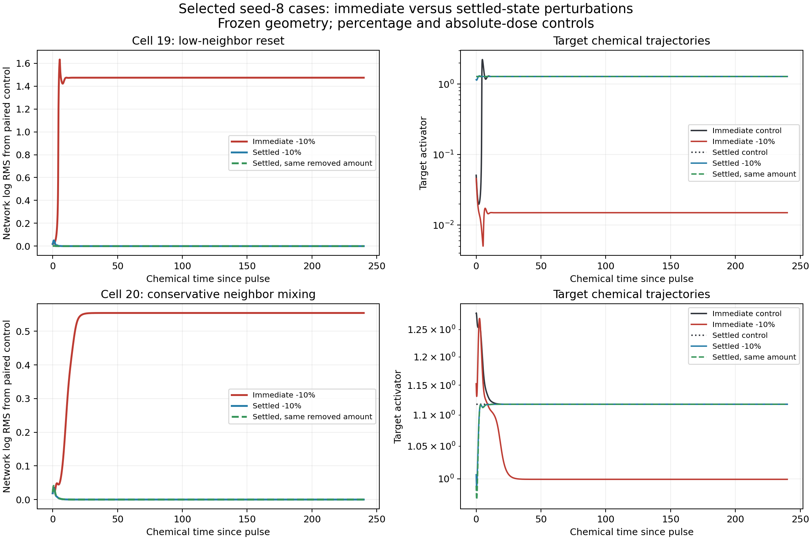

# Pulse timing and robustness after chemical settling

The neighbor-context screen found two seed-8 negative-pulse nonrecoveries: cell 19 after a low-neighbor reset and cell 20 after conservative neighbor mixing. Each pulse and its unperturbed control reached different, locally stable chemical endpoints. Those pulses occurred while the network was reorganizing. This follow-up asks **whether the same interventions still cause nonrecovery after that reorganization has finished**.

This is a follow-up selected from the previous results, within one developmental history. It is not a new independent replication or a test of autonomous cell identity.

## Completed results

All six endpoint jobs completed on 2026-10-03. **Every delayed pulse recovered to its own settled network: 24/24 target recoveries, 24/24 network recoveries, and 24/24 returns to the same locally stable endpoint.** This includes eight pulses from the challenged controls, eight from untouched controls, and eight from the alternative endpoints selected by the earlier immediate pulses. The two untouched endpoint jobs share the same chemical network and test different targets.

| Check | Result |
|---|---:|
| Endpoint jobs / chemical trajectories | 6 / 30 |
| Independent solver integrations | 60 |
| Maximum DOP853/Radau log discrepancy | 4.05e-10 |
| Maximum unperturbed control network log drift | 5.43e-11 |
| Delayed pulses reaching a different stable endpoint | 0/24 |

The primary challenged-equilibrium measurements are below. Each recovery-time pair lists the negative then positive pulse, in chemical time units after the pulse.

| Case | Delayed dose | Target recovery times | Network recovery times |
|---|---|---|---|
| Cell 19, low-neighbor reset | Current ±10% | 4.0 / 4.0 | 4.5 / 4.6 |
| Cell 19, low-neighbor reset | Original absolute amount, now ±0.397% | 4.0 / 4.0 | 4.5 / 4.5 |
| Cell 20, conservative mixing | Current ±10% | 3.0 / 2.9 | 6.3 / 6.5 |
| Cell 20, conservative mixing | Original absolute amount, now ±11.458% | 3.0 / 2.9 | 6.3 / 6.5 |

Untouched controls also recover under both dose definitions. The alternative endpoints recover under both definitions, with network recovery times between 2.9 and 8.7. Amount matching at cell 19's alternative low-activator endpoint corresponds to approximately ±34%, because that endpoint contains less activator than the original target. This is one tested amplitude, not a measurement of its basin boundary.

**The earlier nonrecoveries depend on the network state during reorganization.** An immediate negative pulse can select a different attractor, while applying either the same fractional perturbation or the same removed amount after settling returns to the unperturbed attractor. The dose controls exclude changed absolute amount as the sole explanation for this contrast. Both selected attractors resist the tested later perturbations. This does not locate a critical pulse-delay window or isolate which changing concentrations cause the sensitivity.



The horizontal axis is time **since each pulse**, so immediate and delayed curves have different starting chemical networks. Left panels show the full-network distance from each pulse's own control; right panels show target activator concentrations. The delayed curves start from the original control's settled endpoint. Positive pulses, untouched controls, and alternative-endpoint checks are included in the numerical tables and complete saved trajectories, rather than this figure.

Evidence: `outputs/neighbor-context-delayed/protocol.json`, `results.json`, `status.json`, and per-job snapshots/trajectories. Protocol SHA-256: `9e012f0a13c4b9535b8ae956d68b0d094885b5e30900dc09340366ae85e2c64a`. Read-only reassessment independently reproduces the saved measurements without altering the accepted screen or the new aggregate. Focused software checks cover dose matching, whole-network copying, unsettled-source rejection, both independent solvers, parallel execution, corrupted evidence, and exact recovery-metric verification.

The next test is to restore moving mechanics and ask whether neighbor-induced reorganization and its timing sensitivity survive evolving geometry. Use matched untouched controls, conservative averaging, and reset interventions on the original mature backgrounds, retain all histories and unfavorable outcomes, and check the new GPU starting contexts before their scientific continuations.

## Starting networks and dose controls

For each case, copy the entire two-species, sixteen-cell chemical state at the end of the original 240-unit frozen continuation. Test three starting networks:

| Starting network | State copied | Purpose |
|---|---|---|
| Untouched | Original untouched control endpoint | Matched settled-state reference |
| Challenged | Neighbor-challenged unperturbed control endpoint | Primary test of the resulting equilibrium |
| Alternative | Endpoint selected by the original immediate negative pulse | Secondary test of the alternative equilibrium |

Keep the original volumes, cell IDs, and conservative contact operator fixed. Do not repeat the neighbor intervention, reset the target, or transplant an isolated endpoint concentration into an earlier network. Every cell subsequently evolves freely. Initial stationarity and the full chemical Jacobian are checked again; maximum derivative must be below 1e-6 and maximum real eigenvalue must be negative. Chemical local stability does not establish stability when mechanics is restored.

Each network has an unperturbed continuation and four target activator pulses. The first pair multiplies the **current** target activator by 0.9 or 1.1. The second pair adds or removes the same **absolute amount** as the original immediate ±10% pulse.

For original target concentration $a_i^0$, settled concentration $a_i^*$, volume $V_i$, and nominal original pulse factor $f\in\{0.9,1.1\}$, the original amount change is

$$
\delta A_i=(f-1)a_i^0V_i.
$$

The amount-matched delayed factor is

$$
f_{\mathrm{amount}}=1+\frac{\delta A_i}{a_i^*V_i}
=1+(f-1)\frac{a_i^0}{a_i^*}.
$$

Thus equal percentages generally deliver unequal amounts, and equal amounts generally produce unequal percentages. Both comparisons are needed because cell 19's activator rises substantially during the challenged control continuation. Pulse normalization and recovery use the **actual** factor in each trajectory, rather than calling every amount-matched pulse a 10% pulse. Negative factors, zero pulses, and nonpositive chemistry are rejected.

All inhibitor concentrations and all other cells' initial concentrations remain unchanged by the pulse. Pulse amounts are external interventions, not amount-preserving redistribution. The earlier conservative neighbor mixing and the later target pulse are separate operations.

## Measurements and numerical acceptance

Follow each control/pulse pair for another 240 chemical time units using the original 291 observation times. Time zero now means the delayed pulse at the settled endpoint; the preceding frozen 240-unit delay is **not** an additional developmental age or an interval of moving mechanics.

- Report the target's two-species response and the measured-volume weighted network log RMS from its own paired control.
- Recovery is the first sampled time after which all remaining samples lie within 10% of the initial displacement, with at least 24 subsequent units observed. Target and network recovery are distinct measurements. Nonrecovery is censored at the 240-unit horizon.
- A returned endpoint additionally has network log RMS below 1e-4, maximum chemical derivative below 1e-6, and a negative maximum real chemical Jacobian eigenvalue. A distinct stable endpoint is a scientific result, not an integration failure.
- Every control and pulse is independently integrated using DOP853 and Radau, with relative tolerance 1e-12, absolute tolerance 1e-14, and the analytic Jacobian for Radau. Maximum solver log discrepancy must be below 1e-5. The maximum unperturbed control drift must be below 1e-7 in network log RMS.
- Assessment verifies source/trajectory hashes, exact target-only pulse starts, dose definitions, complete observation grids, paired response waveforms, and recomputed recovery/stability metrics. Floating metrics allow only relative 1e-12/absolute 1e-14 roundoff; sampled recovery times and classifications must match exactly.

There are six endpoint jobs, thirty chemical trajectories, and sixty independent solver integrations. Four CPU workers handle these small frozen systems with one BLAS thread each. No mechanics kernel is exercised here. Moving follow-ups retain resident PyTorch arrays and custom CUDA mechanics/geometry/polarity, with checks for their new starting contexts.

## Reproduction and interpretation

```bash
OPENBLAS_NUM_THREADS=1 OMP_NUM_THREADS=1 MKL_NUM_THREADS=1 \
python -m embryo.neighbor_context_delayed prepare

OPENBLAS_NUM_THREADS=1 OMP_NUM_THREADS=1 MKL_NUM_THREADS=1 \
python -m embryo.neighbor_context_delayed run --workers 4

python -m embryo.neighbor_context_delayed assess

MPLCONFIGDIR=/tmp/embryo-delayed-mpl \
python -m embryo.neighbor_context_delayed plot
```

Default output: `outputs/neighbor-context-delayed/`. Preparation independently reconstructs the entire accepted neighbor screen in a temporary directory and requires all and only its two nonrecoveries. It leaves the previous evidence unchanged. The new protocol hashes the source code, relevant original evidence, and full endpoint snapshots before running. Completed jobs are checked before reuse.

If delayed pulses recover while immediate pulses select another endpoint, the network's state during reorganization matters for basin selection. Recovery under both dose conventions rules out changed absolute pulse amount as the sole explanation for that contrast. It does not identify one responsible cell or reaction, determine basin boundaries, prove permanent memory, or establish identity inheritance. Moving-geometry confirmation and cross-history replication remain separate tests.
