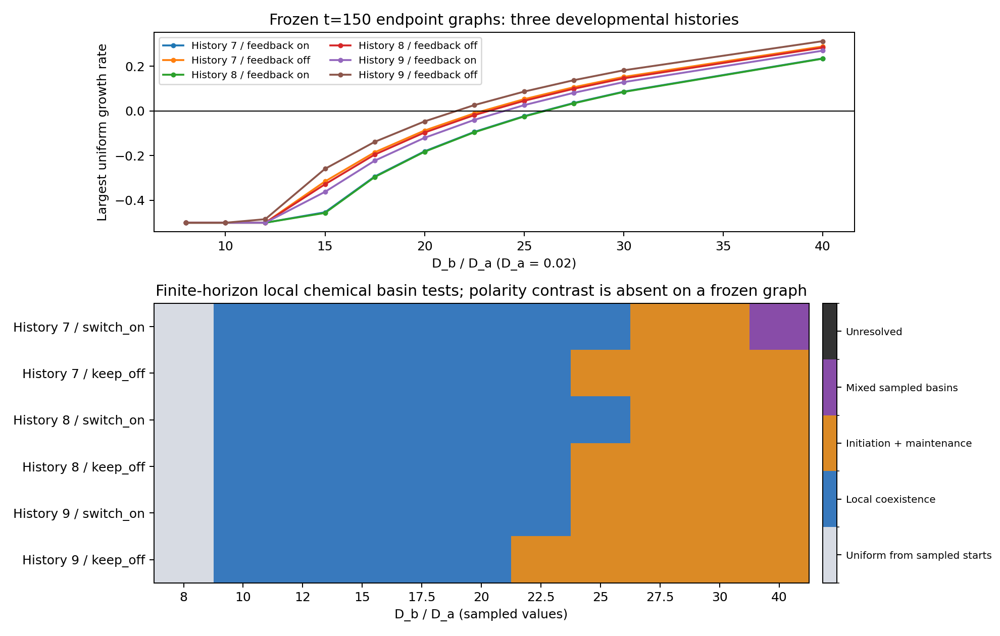

# Parameter robustness: initiation versus maintenance

The frozen endpoint sweep is complete: **66 parameter–graph cases, 330 chemical trajectories, three developmental histories** (7, 8, 9), with two independent solvers for every trajectory. All numerical checks pass and all endpoints settle within the declared horizons. The [moving follow-up is also complete](parameter_robustness_assessment.md): all 18 continuations, context checks and endpoint assays pass. Developed patterns persist at all three points in all histories, while the tested near-uniform starts remain weak. This is an extension of the [consolidated evidence](results_ledger.md), whose snapshot remains unchanged.

The strongest finding so far is a broad separation between **being able to sustain a pattern** and **being able to generate it from small perturbations**. On all six frozen endpoint graphs, both uniform chemistry and developed patterns are locally stable at every sampled diffusivity ratio from 10 to 20. Uniform-state growth begins at a larger, geometry-dependent ratio. These are local chemical basin results on mature geometries, not new zygote histories or proof of committed cell identities.



## Why the two parameter axes need different tests

Let $r=D_b/D_a$ denote inhibitor diffusivity relative to activator diffusivity, and let $\chi$ denote directional polarity-tension contrast. We fix $D_a=0.02$ and $\beta=2$ and vary $D_b=0.02r$. Holding $D_a$ fixed is essential: a ratio alone does not specify transport rates or their relationship to reaction and mechanics timescales.

On a fixed contact graph, chemistry follows

$$
\dot a_i=\frac{a_i^2}{b_i}-a_i+D_a\sum_j\Delta_{ij}a_j,
\qquad
\dot b_i=\beta(a_i^2-b_i)+D_b\sum_j\Delta_{ij}b_j,
\qquad
\Delta=-M^{-1}K.
$$

Here $a_i,b_i$ are positive concentrations, $M=\operatorname{diag}(V_i)$ contains cell volumes, and $K$ is the symmetric conductance Laplacian. Amount conservation is checked through $V^T\Delta=0$, and constant concentrations satisfy $\Delta\mathbf1=0$. The same conservative contact operator used by the live simulation is retained; there is no random-walk normalization.

The mechanical coefficient $\chi$ enters the directional tension field:

$$
\gamma_i(\mathbf x)=\gamma_0[1+c_\gamma\tanh(a_i-1)]
\left[1-\chi\,\mathbf p_i\cdot
\frac{\mathbf x-\mathbf c_i}
{\sqrt{\lVert\mathbf x-\mathbf c_i\rVert^2+\epsilon^2}}\right].
$$

$\mathbf p_i$ is polarity, $\mathbf c_i$ the cell center, and $\epsilon$ the interface width. The activity–tension coefficient $c_\gamma=0.25$ and activity–adhesion coefficient $c_A=0.35$ stay fixed. Setting $\chi=0$ removes **directional tension**, while keeping polarity evolution and activity-dependent tension/adhesion. It does not remove all mechanical feedback. Since $\lVert\mathbf p_i\rVert\le1$ and $0\le\chi<1$, this factor remains positive.

There is no $\chi$ in the frozen chemistry equations. Varying it while retaining the same $\Delta$ gives an identical chemical calculation. We therefore do not fabricate a continuous two-dimensional phase diagram by rescaling graph weights or duplicating a one-dimensional result along the polarity axis. The frozen map is conditional on measured geometry. Moving runs create the actual $\chi$ dependence; their endpoints then receive separate frozen chemical assays. The present study samples three points in the two-parameter plane, rather than claiming a dense map over untested mechanics.

## Exact finite-graph initiation analysis

The spatially uniform chemical equilibrium is $a_i=b_i=1$. The conservative operator has real nonnegative eigenvalues $\lambda_k$ for $-\Delta$, computed using the symmetric matrix

$$
L_s=-M^{1/2}\Delta M^{-1/2}.
$$

For each graph mode, the linear chemical dynamics are governed by

$$
J_k=
\begin{pmatrix}
1-D_a\lambda_k & -1\\
2\beta & -\beta-D_b\lambda_k
\end{pmatrix},
\qquad
s_k=\max\operatorname{Re}\operatorname{eig}(J_k).
$$

A positive $s_k$ for a nonconstant mode means small spatial perturbations can grow. It does not guarantee a unique pattern or its stability once geometry moves. We evaluate the **actual discrete eigenvalues**, rather than assuming that a continuous wavelength fits the tissue.

The determinant is

$$
\det J_k=\beta+(\beta D_a-D_b)\lambda_k+D_aD_b\lambda_k^2.
$$

With $\beta>1$, the trace is negative. A continuous instability interval exists only if the determinant has two positive roots; a finite tissue additionally needs at least one graph eigenvalue inside that interval. At $\beta=2$, the continuous necessary diffusivity-ratio threshold is $6+4\sqrt2\approx11.657$. Stable finite-amplitude patterns observed below that value are not evidence of a linear Turing instability.

## Frozen sweep and endpoint criteria

The source geometries are the accepted $t=150$ feedback-on and feedback-off endpoints from histories 7, 8 and 9. These six graphs are nested within **three histories**. Feedback-on/off geometries differ in several constitutive couplings; their comparison does not isolate polarity alone.

The sampled ratios are

$$
r\in\{8,10,12,15,17.5,20,22.5,25,27.5,30,40\}.
$$

At each ratio on each graph, start from the same accepted baseline-ratio developed equilibrium, two amount-preserving 1% log perturbations of that state, and two amount-preserving 0.1% log perturbations of uniform chemistry. The perturbation seeds are 0 and 1, paired across ratios. Changing ratio is an intervention on the same prepared chemical state; we do not substitute a newly preconditioned favorable pattern at each parameter value.

Every trajectory is checked using DOP853 and Radau at `rtol=1e-12`, `atol=1e-14`, with an analytic chemical Jacobian for Radau. The horizon is 240; cases with unresolved stationarity/classification are restarted from the identical initial condition to 960. Eight of 330 trajectories required the extension. The maximum solver log difference was **3.10e-9**, and the maximum final RHS magnitude was **4.84e-7**. No case remains unresolved.

The full $2N\times2N$ chemical Jacobian at an endpoint is

$$
J(a,b)=
\begin{pmatrix}
\operatorname{diag}(2a/b-1)+D_a\Delta & \operatorname{diag}(-a^2/b^2)\\
\operatorname{diag}(2\beta a) & -\beta I+D_b\Delta
\end{pmatrix}.
$$

All products and quotients in the diagonal terms are componentwise. Unlike $J_k$, this Jacobian is evaluated about the actual nonuniform endpoint.

| Decision | Required evidence |
|---|---|
| Stationary stable endpoint | RHS maximum below $10^{-6}$; full Jacobian largest real part below $-10^{-8}$ |
| Patterned endpoint | Stationary stable endpoint and across-cell SD of $\log a$ above 0.1 |
| Uniform endpoint | Stationary stable endpoint and maximum absolute $\log(a,b)$ below $10^{-4}$ |
| Local maintenance | Patterned control and both patterned-start perturbations settle to the same endpoint within volume-weighted two-species log RMS $10^{-4}$ |
| Local bistability/coexistence | Local maintenance plus linearly stable uniform equilibrium |
| Initiation supported | Positive uniform-state modal growth plus both near-uniform trials settling to stable patterned endpoints |

Failed solvers, nonpositive states, unsettled endpoints, and mixed basins remain explicit outcomes. Two finite perturbations support local robustness of a sampled basin; they do not enumerate all attractors or establish global basin size.

## Completed frozen results

The linear threshold is calculated by finding the ratio where the largest homogeneous growth rate crosses zero on each fixed graph:

| Developmental history | Feedback-on geometry | Feedback-off geometry | Threshold increase on feedback-on geometry |
|---|---:|---:|---:|
| 7 | 25.9343 | 22.8874 | 3.0469 |
| 8 | 25.9968 | 23.1836 | 2.8132 |
| 9 | 23.9602 | 21.5401 | 2.4201 |

These thresholds are for this transport calibration, $D_a$, and mature geometry. In all three histories, feedback-on endpoint geometry raises the inhibitor-diffusion ratio needed for linear initiation. This is consistent with geometrically restricted formation opportunity; it does not by itself establish the cause during the earlier moving developmental trajectory.

| Sampled ratio(s) | Outcome across the six graphs |
|---|---|
| 8 | All five starts per graph relax to uniform chemistry; other untested patterned basins are not excluded |
| 10, 12, 15, 17.5, 20 | Uniform/patterned local coexistence on all six graphs |
| 22.5 | History 9 feedback-off graph supports initiation; the other five retain coexistence |
| 25 | Four graphs support initiation; histories 7 and 8 feedback-on graphs retain coexistence |
| 27.5, 30 | All six support initiation and local maintenance |
| 40 | Five support initiation and local maintenance; history 7 feedback-on gives multiple sampled patterned endpoints |

The ratio-40 exception is a basin-return failure, not a numerical failure or pattern disappearance: one developed-state perturbation settles to a different stable pattern, with log RMS distance 0.691 from the control. Both near-uniform starts also develop stable patterns. Stronger inhibitor diffusion therefore does not imply stronger memory of a particular chemical arrangement. A full multistability/bifurcation study would require more starts and continuation.

## Moving GPU spot checks — complete

Selection was declared before the frozen trajectories were assessed: baseline, directional-tension ablation, and a combined challenge at the smallest sampled ratio above 20 with uniform growth above 0.02 and supported maintenance on all six graphs. That rule selected 27.5.

| Point | $D_b/D_a$ | $D_b$ | $\chi$ | Purpose |
|---|---:|---:|---:|---|
| Baseline | 20 | 0.40 | 0.35 | Repeat initiation/maintenance on matched mature geometry |
| Polarity-tension ablation | 20 | 0.40 | 0 | Isolate directional tension at unchanged chemistry and activity–material coupling |
| Initiation challenge | 27.5 | 0.55 | 0.70 | Test whether stronger inhibitor transport enables initiation under stronger directional tension |

The third point changes two parameters; it tests their combined regime and does not individually estimate either parameter's effect. At each point, all three histories start from their same feedback-on $t=150$ geometry/polarity, once with the original developed baseline-ratio equilibrium and once with a seeded 0.1% near-uniform perturbation. There are **18 moving interventions**, not 18 independent histories. They evolve to $t=210$ at $dt=0.00375$, with observations every 0.15 and restart checkpoints every 3 units.

The resident backend uses **PyTorch GPU arrays/matrix products plus custom CUDA mechanics, geometry, and polarity**. The accepted four full-horizon baseline validation replays are reverified without modifying their evidence. Each new point/history/chemical start must additionally pass a **0.6-unit native CPU/GPU comparison** before continuing. Its thresholds remain chemical log error $10^{-5}$, polarity error $10^{-5}$, relative transport/volume error $10^{-5}$, relative axis error $10^{-4}$, and phase-field absolute error $2\times10^{-5}$. This new-parameter gate has a short horizon: it is not a new full-horizon backend or timestep-convergence result.

Every moving step checks chemical positivity/finiteness, volume error below 5%, effective radius at least four voxels, no clipping, and dilution amount error below $2\times10^{-14}$. Sampled boundary occupancy must remain below 0.01. Failures are retained without stopping unrelated points or weakening criteria.

We record instantaneous graph spectra during motion, contrast over the final 12 model-time units, and a separate dual-solver local chemical assay on each **actual** moving endpoint graph. Late contrast above 0.1 is a persistence observation; it is not sufficient to claim chemical equilibrium, autonomous identity, or full-system stability. If a moving endpoint is uniform, its assay does not recreate a lost pattern and infer that no other patterned basin exists.

The live point plot marks only sampled parameter points and completed histories, without interpolating untested regions. A dense polarity-conditioned phase diagram would next require additional matched mechanical trajectories at intermediate $\chi$, with numerical acceptance at each regime. Subsequent divisions and fresh zygote-to-endpoint formation remain separate tests.

### Matched observation horizons

A second, separately hashed frozen reference uses **the exact chemistry, starting graph, parameters and 60-unit observation window of every moving job**. All 18 reference trajectories pass independent-solver checks (maximum log difference $5.92\times10^{-10}$). This prevents comparing moving observations at 60 units to frozen patterns that required 240 or 960 units to settle.

All three near-uniform ratio-27.5 references have positive linear growth, but none meets the **full final-12-unit persistence criterion** within 60 units. Histories 7 and 8 remain below 0.1 throughout; history 9 exceeds 0.1 only near the end. Therefore, a weak moving endpoint in histories 7 or 8 cannot on its own demonstrate suppression of initiation: the observation window is too short even when geometry is frozen. During this screen, compare contrast trajectories and spectral growth opportunities; extend the moving/frozen matched horizon before claiming established initiation across all histories. Late maintenance of previously developed patterns is still measurable at 60 units. This timing limitation was established by a reference calculation, not by changing a moving acceptance threshold after observing its outcome.

| History, ratio 27.5 near-uniform frozen start | Contrast at 60 | Minimum contrast over final 12 units |
|---|---:|---:|
| 7 | 0.00116 | 0.000764 |
| 8 | 0.00236 | 0.00159 |
| 9 | 0.12664 | 0.03875 |

The [completed moving assessment](parameter_robustness_assessment.md) finds retention of all nine developed-state patterns and no persistent strong contrast from any of the nine near-uniform starts. In the combined challenge, each changing graph leaves the linear instability band while its developed-pattern branch retains a locally stable patterned endpoint. History 9's near-uniform moving contrast ends about 262 times below its matched frozen reference, which develops large contrast near the end of the window. All nine pattern-derived endpoint graphs support local uniform/patterned coexistence; uniform-derived assays do not establish absence of other patterned basins. All eighteen exact-context native/GPU checks and endpoint numerical checks pass. This is three-history mature-state robustness, not new zygote initiation or full convergence at the changed parameters.

## Reproduction and progress

Use the CUDA-compatible `deeplearning` environment. The commands below require fresh output directories for preparation; `run` resumes checkpoints and refuses changed protocols/evidence.

```bash
OPENBLAS_NUM_THREADS=1 OMP_NUM_THREADS=1 MKL_NUM_THREADS=1 \
python -m embryo.parameter_robustness prepare
OPENBLAS_NUM_THREADS=1 OMP_NUM_THREADS=1 MKL_NUM_THREADS=1 \
python -m embryo.parameter_robustness run --workers 4

CUDA_DEVICE_ORDER=PCI_BUS_ID CUDA_VISIBLE_DEVICES=1 \
OPENBLAS_NUM_THREADS=1 OMP_NUM_THREADS=1 MKL_NUM_THREADS=1 \
python -m embryo.parameter_robustness_moving prepare
CUDA_DEVICE_ORDER=PCI_BUS_ID CUDA_VISIBLE_DEVICES=1 \
OPENBLAS_NUM_THREADS=1 OMP_NUM_THREADS=1 MKL_NUM_THREADS=1 \
python -m embryo.parameter_robustness_moving run

python -m embryo.parameter_robustness_moving assess

# Like-for-like frozen references; no GPU required:
python -m embryo.parameter_robustness_reference prepare
OPENBLAS_NUM_THREADS=1 OMP_NUM_THREADS=1 MKL_NUM_THREADS=1 \
python -m embryo.parameter_robustness_reference run
python -m embryo.parameter_robustness_reference assess
```

Frozen evidence is in `outputs/parameter-robustness/{protocol,summary,moving-selection}.json`, with per-case dual-solver trajectories and `frozen-phase-map.png`. Moving evidence/progress is in `outputs/parameter-robustness-moving/{protocol,status,summary}.json`, per-job `status.json`, prefix comparisons, checkpoints, histories and endpoint assays. `run.log` and `launch.json` record persistent execution. A summary can be incomplete while runs are active; completed counts and failures must accompany any assessment.

The matched 60-unit reference paths and timing flags are in `outputs/parameter-robustness-reference/{protocol,results,comparison}.json`. Run its `assess` command as moving results arrive to compare identical observation clocks and starting states. These 18 references are nested comparisons of the same three histories, not new developmental histories.
