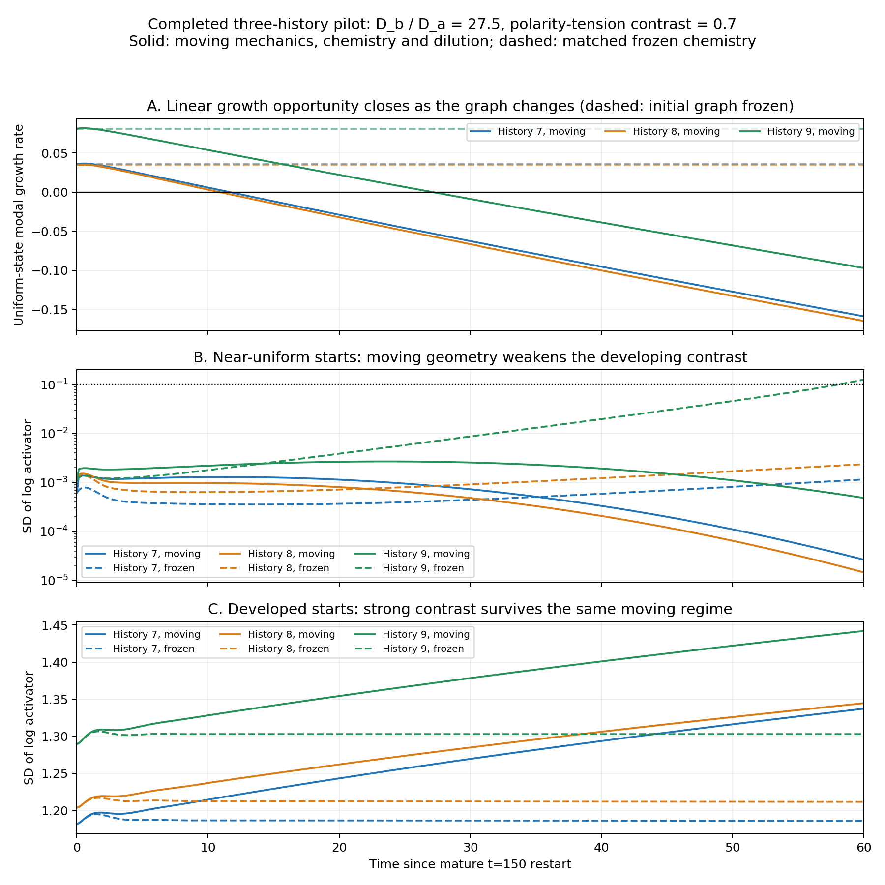

# Completed parameter-robustness assessment

**Method qualification added 2026-10-04:** this assessment reports the original **no-carry moving method** and frozen assays/references that inherit its preparations. Its recorded passes remain unchanged. Outcome-level formation/maintenance/coexistence claims require carry revalidation; trajectory quantities below have not been rederived with carry. This includes spectral crossing times, conductance/area declines, correlations and shape changes, and the history-9 **262.1-fold** frozen/moving contrast ratio. A timestep pass of the old method is not evidence that phase rounding was negligible. See the [claim-level ledger audit](results_ledger.md#phase-update-precision-audit). The completed carry formation test uses a different polarity contrast/window and does not validate this ratio.

All **18 moving continuations, 18 exact-context native/GPU checks, and 18 frozen endpoint assays complete and pass**. Three parameter points were tested, each with near-uniform and developed-pattern chemistry on the same starting geometry within each of **three pre-existing developmental histories**. There are three histories, not eighteen independent replicates. The simulations cover mature $t=150$ to $t=210$; they do not restart from new zygotes.

The main conclusion is consistent across all three histories: **established chemical differences survive geometry that does not permit their formation from the tested small perturbations**. At the combined stronger-transport/stronger-polarity point, evolving geometry removes an initially available linear instability. Developed patterns survive that transition and settle to locally stable patterned states on the frozen endpoint graphs.

## Moving outcomes

Contrast is the across-cell standard deviation of $\log a$. The preregistered moving persistence criterion requires contrast above 0.1 throughout the final 12 model-time units. The table reports history-level results for each chemical start.

| Parameter point $(D_b/D_a,\chi)$ | Near-uniform starts meeting persistence criterion | Developed starts retaining contrast | Final developed contrast range |
|---|---:|---:|---:|
| Baseline $(20,0.35)$ | 0/3 histories | 3/3 histories | 1.274–1.379 |
| Directional-tension ablation $(20,0)$ | 0/3 histories | 3/3 histories | 1.220–1.331 |
| Combined challenge $(27.5,0.70)$ | 0/3 histories | 3/3 histories | 1.337–1.442 |

All nine developed-state continuations retain strong contrast. Initial-to-final volume-weighted correlation of cell log-activator values exceeds **0.99988** in every one; activity ranks have Spearman correlations 0.974–1.000. These are supplementary descriptive measures, not new acceptance thresholds or proof of autonomous identity. Concentrations change during motion, so correlation does not mean exact chemical-state preservation.

Every patterned-start moving endpoint graph supports local uniform/patterned coexistence: the full chemical Jacobian is stable at the patterned equilibrium, uniform chemistry is also stable, and both 1% patterned perturbations return within the original $10^{-4}$ log-RMS criterion. The largest observed return error is $9.14\times10^{-13}$. These tests support local chemical stability on each **frozen** endpoint, not stability of the entire moving system.

The nine uniform-derived endpoints remain uniform-stable in their own frozen assays. Those assays perturb their current near-uniform chemistry; they do not seed a separate prepared pattern on those geometries. Therefore, their `local_bistability_supported=false` values do not prove that patterned attractors are absent. Patterned and uniform moving branches can generate different endpoint graphs.

## Geometry closes the formation opportunity

At $D_b/D_a=27.5$, all initial graphs contain modes in the frozen instability band. During the near-uniform moving runs, those modes leave the band:

| History | Initial largest uniform growth rate | Time when growth becomes negative | Final growth rate | Final largest transport eigenvalue |
|---|---:|---:|---:|---:|
| 7 | +0.03582 | 11.65 | -0.15903 | 3.3074 |
| 8 | +0.03439 | 10.90 | -0.16497 | 3.2788 |
| 9 | +0.08136 | 27.14 | -0.09707 | 3.6406 |

Time is measured from the mature-state restart, with crossing times interpolated between 0.15-spaced observations. For this chemical parameter set, the conservative transport eigenvalues must lie between **4.3250 and 42.0386** for linear growth. By the endpoint, even each graph's largest eigenvalue is below the lower edge. The developed-pattern branches likewise lose linear instability about uniform chemistry, at 10.58, 10.90 and 30.96 units, while retaining strong nonlinear patterns.

Instantaneous modal growth is a frozen-snapshot diagnostic about uniform chemistry. It is not a stability calculation for the coupled nonautonomous mechanics/chemistry system, nor a formula for its exact finite-time amplification. The matched chemical trajectories below provide the additional empirical comparison.

## Matched frozen references resolve the timing concern

The moving and frozen references share the exact initial chemical state, initial contact operator, $D_a$, $D_b$, and 60-unit observation window. Motion also introduces volume-dependent dilution, so this comparison concerns evolving geometry/transport/dilution together.

| History, combined challenge near-uniform start | Frozen contrast at 60 | Moving contrast at 60 | Frozen/moving ratio |
|---|---:|---:|---:|
| 7 | 0.001155 | 0.00002648 | 43.6 |
| 8 | 0.002362 | 0.00001458 | 162.0 |
| 9 | 0.126643 | 0.00048316 | 262.1 |

Histories 7 and 8 need longer observation to develop large contrast even with frozen geometry. Their missing strong moving pattern alone would be inconclusive; the decreasing contrast and spectral-window closure supply the mechanistic evidence. History 9 is more informative within this window: its frozen reference crosses contrast 0.1 near the end, whereas its moving run remains below 0.0005. The frozen reference still does not exceed 0.1 throughout the full final 12-unit window, so it is an observed late onset, not an accepted persistent-pattern result under that criterion.

This result supports **restriction of formation opportunity while established patterns remain stable**. It does not establish an absolute inability to form a pattern for all initial conditions or all later times.

## Weaker contact transport, not universal graph homogenization

The recorded matrices let us reconstruct conductance as $g_{ij}=V_i\Delta_{ij}$ for $i\ne j$. For near-uniform starts, the sum over undirected edges changes as follows:

| History | Baseline conductance decline | Directional-tension ablation decline | Combined challenge decline |
|---|---:|---:|---:|
| 7 | 18.1% | 4.8% | 28.3% |
| 8 | 18.7% | 4.9% | 29.0% |
| 9 | 19.3% | 5.9% | 29.6% |

The baseline-versus-ablation comparison holds chemical diffusivities and the activity–tension/adhesion laws fixed. It supports directional tension changing the transport graph, including when chemistry is near uniform. The combined challenge changes both diffusivity ratio and polarity contrast and therefore does not separately estimate their causal effects.

At the combined challenge, the contact-area proxy $A_{ij}=g_{ij}\ell_{ij}$ declines by 24.9–26.0% in total, while mean centroid distance on retained edges increases by 4.5–4.7%. The proxy is defined by the current phase-field conductance closure; it is **not** an independent physical area measurement or a validated interface reconstruction.

Edge-weight heterogeneity does not consistently decline: its coefficient of variation changes from 0.431 to 0.429 in history 7, 0.755 to 0.648 in history 8, and 0.546 to 0.552 in history 9. Histories 7 and 9 keep their edge counts unchanged. Thus neither more equal edge weights nor contact deletion is a universal explanation. A clearer shared observation is **weaker conductances and a shifted transport spectrum**. General geometric-transport closure remains unresolved, so the mechanism is demonstrated within this calibrated discrete model.

## What this adds and what it does not establish

- The initiation–maintenance distinction survives changes in chemical diffusivity and directional-tension contrast within the tested mature-state pilot. The [completed frozen sweep](parameter_robustness.md) additionally supports local coexistence at every sampled ratio from 10 to 20 across all six original graphs.
- Polarity-dependent geometry can restrict the linear signaling opportunity even when developed nonlinear chemical states remain stable. Uniform-state instability and patterned-state stability answer different questions.
- Eliminating directional tension at an already mature, polarity-conditioned geometry does not restore initiation at ratio 20. This intervention does not reverse prior mechanical history and does not refute an earlier-development polarity control.
- The current three-point moving design is not a dense two-parameter phase diagram. It lacks a matched zero-/baseline-polarity moving comparison at ratio 27.5.
- Chemical-state persistence is not irreversible biological commitment or autonomous cell identity. No downstream fate labels were added, and subsequent division was not tested.
- Aggregate axis ratios change by at most **1.27%** relative to their mature starts. This study does not show a new large global shape axis, despite substantial transport changes.

## Numerical verification and next decision

All eighteen native/GPU context checks pass unchanged tolerances. Maximum short-check chemical log error is $1.89\times10^{-7}$, relative transport error $2.97\times10^{-7}$, and phase-field error $5.97\times10^{-8}$. Across the moving continuations, maximum volume error is **1.160%**, effective radius is at least **5.106 voxels**, clipping is zero, sampled boundary occupancy is below $3.38\times10^{-9}$, and dilution amount error is below $4.45\times10^{-16}$. All frozen endpoint trials are stationary and stable under the declared classification, with maximum solver log disagreement $3.77\times10^{-9}$ and RHS magnitude $4.83\times10^{-12}$.

The changed-parameter GPU gate covers short prefixes, building on the prior full-horizon baseline acceptance. It does not establish full-horizon CPU/GPU equivalence or timestep/spatial convergence for every new parameter. These limits remain necessary, especially near spectral crossings.

The next decisive comparison is to **hold diffusivity ratio fixed at 27.5 and vary polarity contrast alone**, adding $\chi=0$ and $0.35$ to the current $0.70$ branch with matched histories/starts. Use longer matched moving/frozen horizons and a targeted timestep check so slow initiation and numerical shifts of the crossing are distinguishable from genuine loss of the opportunity. No additional scientific jobs were launched during this assessment.

The completed study finished at approximately **9:39 pm EDT on 3 October 2026**, after about **73.1 minutes**. Full verified derived values and source/evidence hashes are in `outputs/parameter-robustness-moving/assessment.json`; original moving summaries and matched references remain in their existing directories. The [interim snapshot](parameter_robustness_interim_2026-10-03.md) and earlier consolidated ledger/manuscript snapshots remain unchanged.
