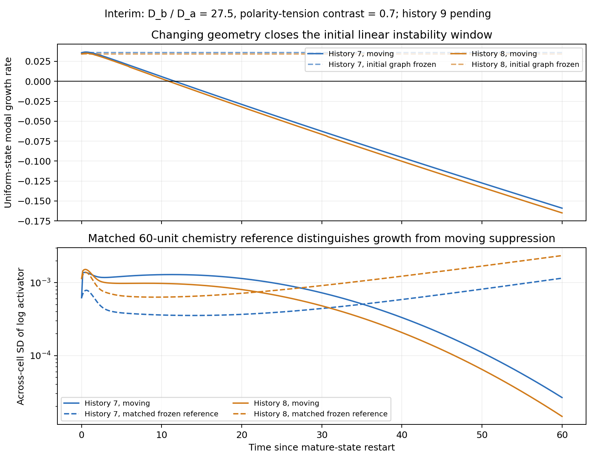

# Parameter robustness — interim assessment, 3 October 2026

Snapshot: 2026-10-03T21:11:54.498876-04:00. Eleven of eighteen moving continuations and their frozen endpoint assays are complete. All 12 completed exact-context native/GPU prefix checks pass; no completed run or endpoint numerical check fails. The worker remains active on the GTX 1080 Ti. These are interventions within three pre-existing histories; history 9 has not yet begun.

| Parameter point (diffusivity ratio, polarity contrast) | Histories with both starts complete | Near-uniform start | Developed-pattern start |
|---|---:|---|---|
| Baseline (20, 0.35) | 2/3 | No strong pattern | Strong contrast retained |
| Directional-tension ablation (20, 0) | 2/3 | No strong pattern | Strong contrast retained |
| Combined challenge (27.5, 0.7) | 1/3 complete pairs; history 8 pattern active | Contrast declines in histories 7 and 8 | History 7 contrast retained |

All five completed developed-pattern starts retain contrast (final log-activator SD 1.22–1.34), and their own frozen endpoint graphs support local uniform/patterned coexistence. All six completed near-uniform starts remain weak. A uniform-derived endpoint assay starts from its current chemistry and perturbations; its failure to find a pattern is not evidence that no other patterned basin exists.

In the history-7 combined challenge, the largest frozen uniform-state growth rate changes from +0.0358 initially to -0.1590 at 60 units, crossing zero near 11.65 units. The largest transport eigenvalue falls from 4.646 to 3.307, below the instability-band lower edge 4.325. Its matched fixed-geometry reference grows to SD 0.00116, whereas the moving trajectory ends at 0.0000265, about 44 times smaller. History 8 now completes the same near-uniform continuation: its growth rate crosses zero at 10.90 units and ends at -0.1650, with final SD 0.0000146 versus 0.00236 on the matched frozen graph (about 162 times smaller). Its developed-pattern continuation remains active.

This supports a geometry-dependent loss of linear formation opportunity alongside persistence of a nonlinear developed state. Instantaneous spectra are diagnostics on frozen snapshots, not full stability analysis of the coevolving system. The combined challenge changes two parameters; without a matched ratio-27.5, zero-polarity moving control it does not isolate polarity as the sole cause. At ratio 20, eliminating directional tension at this late mature state does not reopen initiation; it does not undo earlier mechanical history or refute an earlier-development polarity control.

At 60 units the fixed-geometry references themselves have not established the final-12-unit contrast criterion across all histories. Thus missing strong contrast alone is insufficient to infer suppression; the matched time courses and spectral changes supply the evidence here. Extend matched horizons before making a three-history initiation claim. Aggregate axis ratios change only modestly in the completed continuations (largest relative change about 0.54%); this is not evidence of a new large tissue axis.

Numerical screens remain comfortable: maximum volume error 1.135%, minimum effective radius 5.107 voxels, no clipping, completed-run boundary occupancy below 4e-9, and dilution amount error at most 4.45e-16. Completed endpoint cross-solver log discrepancies remain below 3.77e-9. These are numerical-quality and local-basin results, not new-parameter full-horizon GPU equivalence or spatial convergence.

Measured complete job cost is 236–245 seconds, including the native/GPU prefix and endpoint ODE assay, plus approximately five seconds of coordinator overhead. Projection at the refreshed snapshot: about 28 minutes remaining, central completion time about 9:40 pm EDT on 3 October (allow about 5–10 minutes of variation). The ETA covers all eighteen moving continuations and their scheduled endpoint assays, not additional long-horizon tests.

Source: hashed completed evidence under `outputs/parameter-robustness-moving`, matched references under `outputs/parameter-robustness-reference`, and the [machine-readable interim snapshot](parameter_robustness_interim_2026-10-03.json). Original protocols, solver code, checkpoints and acceptance thresholds are unchanged.
