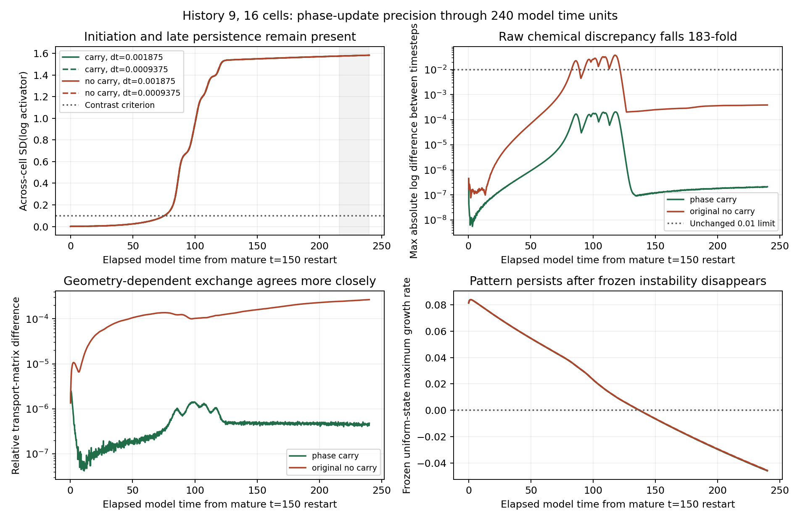

# Phase-carry confirmation through formation

Two matched moving GPU continuations have completed from the original history-9 near-uniform mature restart through **240 elapsed model time units** (physical t=150–390). The phase-carry timestep pair passes the unchanged 0.01 chemical-error limit with a maximum discrepancy of **0.000205**, about **183-fold smaller** than the original no-carry discrepancy of 0.03750. Both form persistent patterns, pass physical quality checks, and support local chemical bistability on their actual frozen endpoints. This extends the [six-unit precision diagnosis](geometry_precision.md) across nonlinear formation. The old method's failures remain failures; this is two numerical paths within one existing history.

## What is held fixed

The same 16-cell geometry, polarity, lineage, random streams and chemical start are used at dt=0.001875 and 0.0009375. Keep the 72³ grid, original interface width, conservative transport, beta=2, D_a=0.02, D_b=0.55, zero directional polarity-tension contrast, and activity-dependent tension/adhesion coefficients 0.25/0.35. Contacts still accumulate in float32. The active model has no prescribed A/B labels or downstream fate switch.

The only numerical intervention is the tested float64 carry of phase increments lost to float32 storage. Visible fields, occupancy, spatial geometry and force arithmetic retain their previous conventions. PyTorch owns resident GPU arrays and matrix products; custom CUDA performs mechanics and spatial geometry/polarity. This is not a full float64 backend.

Reuse the exact elapsed 0–6 histories and physical checkpoints from the completed short phase-carry pair. Re-encode only experiment metadata for the new protocol; preserve every physical array, including the accumulated residual. The first new step is from elapsed 6, **without resetting chemistry or residual**. Both transferred states reproduce two subsequent original-checkpoint steps bit for bit on the actual GPU, including their residuals.

There are **two numerical trajectories within one existing developmental history (9)** and zero new histories. These are mature-state formation tests, not fresh zygote-to-identity experiments. Jobs run sequentially on the scientific GTX 1080 Ti.

## Recorded decisions

- Preserve the original maximum absolute log chemical discrepancy limit **0.01** over every cell, both chemicals and all aligned observations. Do not time-align the paths to accept them.
- Retain the inherited limits for polarity, axis ratio, volume, transport, instantaneous growth, onset timing, growth-band crossing and late contrast agreement. Quantitative agreement and qualitative pattern survival are separate outcomes.
- Observe every 0.15 model time units; save carry-preserving atomic checkpoints every 3. Check volume error below 5%, equivalent radius at least four grid spacings, no clipping, finite positive state, dilution amount error at most 2e-14, and sampled boundary occupancy below 0.01.
- Compare the two carry runs over the first 60 and full 240 units. A pilot discrepancy is retained; these diagnostic runs continue through the authorized full window unless a physical/numerical quality screen fails.
- Compare each carry path with its immutable no-carry baseline at the same timestep. An intervention difference is not itself a numerical failure; only the matched within-method refinement tests agreement.
- Apply the existing independent frozen-endpoint chemical assay to each completed endpoint, retaining local basin/stability evidence separately from moving persistence.

The inherited late window is 24 units, with sustained chemical contrast defined by SD(log activator) above 0.1 throughout that window. All tolerances are copied from the previous long protocol. The original no-carry fine/finer raw discrepancy of 0.03750 remains a failed historical result. The new method's pass strongly implicates small-update precision loss in that sensitivity; it does not retroactively accept the old paths.

## How to interpret the outcome

Passing full-window agreement supports this numerical accumulation method in the tested history and regime. It does not establish full timestep/spatial convergence, full-horizon native/GPU equivalence of the new method, GPU cleavage, arbitrary-parameter acceptance, or autonomous cell identity. Differences from the original method are reported, rather than treating matching qualitative pattern outcomes as identical trajectories.

The [separate prescribed geometry–chemistry replay](geometry_chemistry_coupling.md) tests time coupling against amount-based ODE references. Its geometry is fixed as a function of time and cannot respond to replayed chemistry; the moving confirmation retains reciprocal coupling. Both experiments are needed to distinguish mechanisms from numerical sensitivity.

## Execution and provenance

The [runner](../embryo/phase_carry_formation.py) creates a new protocol and result directory; no pinned historical scientific source is rewritten. Source/input hashes, accepted and experimental CUDA binary hashes, GPU/PyTorch versions, transfer checks and exact-state restart gates are recorded in `outputs/phase-carry-formation/`. An exclusive lock prevents duplicate coordinators. Interrupted jobs resume with their carry from the last complete checkpoint.

```bash
CUDA_DEVICE_ORDER=PCI_BUS_ID CUDA_VISIBLE_DEVICES=1 \
OPENBLAS_NUM_THREADS=1 OMP_NUM_THREADS=1 MKL_NUM_THREADS=1 \
python -m embryo.phase_carry_formation run
```

Root and child `status.json` files show live progress. `summary.json` is written only after both full trajectories and endpoint assays finish. Numerical failures use `completed_with_unresolved_checks`; they are not promoted into the consolidated ledger or manuscript. The user-authorized GPU launch is recorded in `launch.json`.

## Completed formation assessment

**Both full moving continuations pass the original timestep and physical quality screens.** The phase-carry pair passes without time alignment or a relaxed tolerance; both actual endpoints support local chemical bistability. This is one existing developmental history, not two independent histories.



| Comparison | Maximum log chemical discrepancy | Original limit | Decision |
|---|---:|---:|---|
| No carry, original dt pair | 0.03750310 | 0.01 | FAIL, retained |
| Phase carry, same dt pair | 0.00020500 | 0.01 | PASS |

Preserving small phase increments reduces the maximum discrepancy by **182.9-fold**. The new maximum corresponds to about 0.0205% concentration-ratio disagreement and is about 49 times below the declared log-error limit. The original method still fails its recorded gate.

| Quantity | Carry pair discrepancy | Unchanged tolerance |
|---|---:|---:|
| chemical_log_max | 0.00020500449 | 0.01 |
| polarity_abs_max | 2.3943184e-06 | 0.01 |
| relative_axis_max | 2.8120056e-08 | 0.01 |
| relative_volume_max | 4.2215751e-07 | 0.005 |
| relative_transport_max | 2.4723249e-06 | 0.01 |
| growth_abs_max | 1.0610796e-06 | 0.001 |
| onset_time_error | 0.00044899363 | 0.3 |
| crossing_time_error | 0.00046884498 | 0.3 |

## Chemical outcome and endpoint stability

| Timestep | Pattern onset, elapsed | Late minimum SD(log activator) | Final SD(log activator) | Endpoint chemical phase |
|---|---:|---:|---:|---|
| 0.001875 | 75.416267 | 1.5752100 | 1.5831846 | coexistence |
| 0.0009375 | 75.416716 | 1.5752100 | 1.5831846 | coexistence |

Both patterns exceed the 0.1 contrast threshold throughout elapsed 216–240. Formation onset differs by only 0.000449 model units. The frozen uniform-state growth diagnostic changes sign near elapsed 136.968, while the developed pattern persists. Instantaneous spectra describe a held geometry, not stability of the full moving system.

All five frozen starts on each endpoint settle: the developed state and its two small perturbations approach the patterned equilibrium; the two near-uniform starts approach uniform chemistry. The maximum uniform-state eigenvalue is about -0.04603 and the patterned-state eigenvalue about -0.70031. Thus each frozen network supports locally stable uniform and patterned chemistry. These are ten nested chemical trajectories on two endpoint graphs from the same history.

## Numerical mechanism and interpretation

The intervention retains phase increments that would be lost when written to float32 storage, accumulating the residual in float64. Cells, contacts, force arithmetic, and the chemical equations retain their prior conventions. At the final step, roughly 1.9% and 3.8% of voxels with nonzero force would have an unchanged visible phase value without the carry; this is a diagnostic of that step, not a cumulative fraction over the run.

With only this accumulation rule changed, long-window transport disagreement falls from 0.00026651 to 0.0000024723, and chemical disagreement falls about 183-fold. This strongly implicates loss of small mechanical updates as a major contributor to the tested historical timestep sensitivity. It does not identify an exact solution or prove that every remaining precision error is negligible.

The numerical intervention also changes the transient trajectory at a fixed timestep. Maximum carry/no-carry log differences are 0.06657 at dt=0.001875 and 0.10427 at dt=0.0009375. These are method-change effects, not failed carry refinement tests. The old paths are not interchangeable with the corrected paths even though both form patterns and share the endpoint phase classification.

The result strengthens the tested initiation-versus-maintenance account: chemistry organizes from a small perturbation on moving mature geometry and remains patterned when its final frozen network also supports uniform chemistry. It does not establish autonomous or inherited identity, spontaneous aggregate-axis formation, new histories, or formation from a fresh zygote. The tested directional polarity-tension contrast is zero; positive-contrast suppression controls have not been repeated with carry.

## What remains before broader use

A two-timestep pass supports this history, parameter point, grid, and horizon. Add a third carry timestep and an independent high-precision mechanics reference before inferring a convergence trend or admitting the method broadly. Then repeat matched zero/positive-polarity controls across the existing developmental histories. GPU cleavage, geometric conductance closure, and spatial/full developmental convergence remain separate gates.

The [prescribed geometry–chemistry replay](geometry_chemistry_coupling.md) still finds first-order beginning sampling and much more accurate second-order midpoint sampling. Its full-start source-spacing difference 0.00364878 still fails the declared 0.001 screen; obtain denser recorded geometry before stronger full-start attribution. This independent failure is not cleared by the moving carry result. The accepted production solver and earlier ledger/manuscript snapshots are unchanged.

## Completed verification

Assessment recomputes the complete frozen summary without modifying original outputs; verifies 3,202 saved moving graph spectra and contrast values, final physical checkpoints and carry arrays, exact reused prefixes, all ten frozen endpoints and 1,210 frozen observations, aligned clocks, original tolerances, and all pinned source/input hashes.

The raw chemical maximum occurs at elapsed 117.90 with carry and 117.75 without carry. These profile locations are descriptive and do not change the acceptance window.

```bash
OPENBLAS_NUM_THREADS=1 OMP_NUM_THREADS=1 MKL_NUM_THREADS=1 \
MPLCONFIGDIR=/tmp/embryo-mpl python -m embryo.phase_carry_formation_assessment
```

The [verification record](phase_carry_formation_completed_verification.json) preserves old failures, new method decisions, provenance, and descriptive intervention effects separately.
